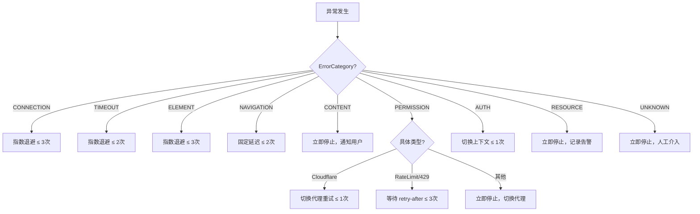

# Browser-CDP 异常分类规范

> **目标**：建立覆盖连接、超时、元素、导航、内容、权限、认证、资源八大类别的异常分类体系，为重试策略、降级处理和人工介入决策提供统一依据。

> **设计原则**：
> 1. 每个异常类型必须归属且仅归属一个主分类
> 2. 同分类共享重试策略模板，子类可差异化处理
> 3. 不可恢复异常直接标记 `retryable=False`，避免无效重试
> 4. 所有类型需提供子类型码（subtype code），便于日志聚合监控

---

## 一、异常大类总览

| 编号 | 主分类 | 枚举值 | 默认可重试 | 最大重试次数 | 典型触发场景 |
|------|--------|--------|-----------|------------|------------|
| C1 | **CONNECTION** | `BrowserExceptionCategory.CONNECTION` | ✅ | 3次 | CDP 连接断开、WebSocket 异常关闭 |
| C2 | **TIMEOUT** | `BrowserExceptionCategory.TIMEOUT` | ✅ | 2次 | 导航超时、等待超时、命令执行超时 |
| C3 | **ELEMENT** | `BrowserExceptionCategory.ELEMENT` | ✅ | 3次 | 元素未找到、不可交互、DOM 变更 |
| C4 | **NAVIGATION** | `BrowserExceptionCategory.NAVIGATION` | ✅ | 2次 | 页面加载失败、导航被中止 |
| C5 | **CONTENT** | `BrowserExceptionCategory.CONTENT` | ❌ | 0次 | 验证码、内容不可见 |
| C6 | **PERMISSION** | `BrowserExceptionCategory.PERMISSION` | ❌ | 0次 | 反爬拦截、Cloudflare/Turnstile |
| C7 | **AUTH** | `BrowserExceptionCategory.AUTH` | ⚠️ | 1次 | 会话过期、Token失效 |
| C8 | **RESOURCE** | `BrowserExceptionCategory.RESOURCE` | ❌ | 0次 | 内存溢出、连接池耗尽 |
| C9 | **UNKNOWN** | `BrowserExceptionCategory.UNKNOWN` | ❌ | 0次 | 无法归类的异常 |

---

## 二、详细异常类型定义

### 2.1 CONNECTION（连接层）

| 子类型码 | 异常类名 | 说明 | 重试策略 | 推荐动作 |
|----------|----------|------|----------|----------|
| `cdp_connection_lost` | `CDPConnectionLostError` | CDP WebSocket 连接断开 | 指数退避（3次） | 重建 CDP 连接，恢复 BrowserContext |
| `websocket_disconnected` | `WebSocketDisconnectedError` | WebSocket 通道意外关闭 | 指数退避（3次） | 重连 WebSocket，检查代理可用性 |
| `cdp_channel_closed` | `CDPChannelClosedError` | CDP 通道被服务端关闭 | 不可重试 | 重建全新 BrowserContext，不恢复旧会话 |
| `circuit_breaker_open` | `CircuitBreakerOpenError` | 熔断器已触发 | 切换上下文 | 切换代理节点或等待熔断器冷却 |

**典型触发路径**：
```
CDP client disconnected → CDPConnectionLostError → 指数退避重建连接
WebSocket 异常关闭 → WebSocketDisconnectedError → 切换代理重试
```

---

### 2.2 TIMEOUT（超时层）

| 子类型码 | 异常类名 | 说明 | 重试策略 | 推荐动作 |
|----------|----------|------|----------|----------|
| `cdp_command_timeout` | `CDPCommandTimeoutError` | 单条 CDP 命令执行超时 | 指数退避（2次） | 降低 command timeout，分步执行 |
| `navigation_timeout` | `NavigationTimeoutError` | 页面导航等待超时 | 固定延迟（2次） | 延长 timeout 或检查网络状态 |
| `network_idle_timeout` | `NetworkIdleTimeoutError` | networkidle 等待超时 | 指数退避（2次） | 放宽 idle 条件或改用 DOMContentLoaded |
| `smart_wait_degraded` | `SmartWaitDegradedError` | 智能等待所有策略均失败 | 指数退避（2次） | 回退到基础等待策略重试 |
| `page_load_timeout` | `PageLoadTimeoutError` | 页面完全加载超时 | 固定延迟（2次） | 检查 URL 有效性，降低并发 |
| `element_visibility_timeout` | `ElementVisibilityTimeoutError` | 元素可见性等待超时 | 指数退避（3次） | 滚动到可视区域或等待动态加载 |

**超时参数配置建议**：
```
page_load_timeout        = 30s（基础）
navigation_timeout       = 30s
network_idle_timeout     = 15s
smart_wait_timeout       = 20s
visibility_timeout       = 10s
cdp_command_timeout      = 10s
```

---

### 2.3 ELEMENT（元素层）

| 子类型码 | 异常类名 | 说明 | 重试策略 | 推荐动作 |
|----------|----------|------|----------|----------|
| `element_not_found` | `ElementNotFoundError` | 按 selector 未找到元素 | 指数退避（3次） | 重新扫描 DOM，更新 selector 版本 |
| `element_not_interactable` | `ElementNotInteractableError` | 元素被遮挡/隐藏/禁用 | 指数退避（3次） | 滚动到视口、关闭覆盖层后重试 |
| `element_index_invalid` | `ElementIndexInvalidError` | 指定索引超出可用范围 | 指数退避（3次） | 缩小搜索范围，使用更精确 selector |
| `element_detached` | `ElementDetachedError` | 元素被 DOM 操作移除 | 指数退避（3次） | 重新查找元素引用，处理动态 DOM |
| `stale_element_reference` | `StaleElementReferenceError` | 元素引用已过期 | 指数退避（3次） | 重新获取 element handle 后重试 |
| `popup_blocking` | `PopupDetectedError` | 弹窗/覆盖层阻挡操作 | 固定延迟（1次） | 关闭弹窗后重试原始操作 |

**元素查找优先级**：
1. 精确 ID/测试 ID 选择器
2. 结构化 XPath
3. 语义 CSS 选择器
4. 后备：文本匹配 + 坐标兜底

---

### 2.4 NAVIGATION（导航层）

| 子类型码 | 异常类名 | 说明 | 重试策略 | 推荐动作 |
|----------|----------|------|----------|----------|
| `navigation_aborted` | `NavigationAbortedError` | 导航请求被主动中止 | 指数退避（2次） | 重新发起导航，检查目标 URL |
| `navigation_history_overflow` | `NavigationHistoryOverflowError` | 浏览器历史栈溢出 | 不可重试 | 重置浏览器，清除历史记录 |
| `page_load_error` | `PageLoadError` | 页面加载失败（HTTP 错误/空内容） | 固定延迟（2次） | 检查 URL 有效性，降级为静态抓取 |
| `same_origin_nav_failed` | `SameOriginNavigationFailedError` | 同源导航失败 | 不可重试 | 检查 URL 格式，避免非法跳转 |

---

### 2.5 CONTENT（内容层）

| 子类型码 | 异常类名 | 说明 | 重试策略 | 推荐动作 |
|----------|----------|------|----------|----------|
| `captcha_detected` | `CaptchaDetectedError` | 检测到验证码页面 | ❌ 永不重试 | 通知用户，停止当前任务 |
| `invisible_page_content` | `InvisiblePageContentError` | 页面内容为空或不可见 | ❌ 永不重试 | 检查目标 URL，记录无效页 |
| `unexpected_page_title` | `UnexpectedPageTitleError` | 页面标题与预期不符 | ❌ 永不重试 | 核对目标 URL，检查重定向链 |

---

### 2.6 PERMISSION（权限/拦截层）

| 子类型码 | 异常类名 | 说明 | 重试策略 | 推荐动作 |
|----------|----------|------|----------|----------|
| `blocked_by_anti_bot` | `BlockedByAntiBotError` | 通用反爬机制拦截 | ❌ 永不重试 | 切换代理节点，降低请求频率 |
| `blocked_by_cloudflare` | `BlockedByCloudflareError` | Cloudflare 挑战页拦截 | 切换上下文（1次） | 启用 cloudflare_bypass 模块重试 |
| `blocked_by_turnstile` | `BlockedByTurnstileError` | Turnstile 人机验证拦截 | ❌ 永不重试 | 需人工介入处理 |
| `rate_limited` | `RateLimitError` | HTTP 429 速率限制 | 固定延迟（按 retry-after） | 等待指定时间后重试，不超过上限 |
| `ip_blocked` | `IPBlockedError` | IP 被封禁 | 切换上下文（1次） | 切换代理节点后立即重试 |

---

### 2.7 AUTH（认证层）

| 子类型码 | 异常类名 | 说明 | 重试策略 | 推荐动作 |
|----------|----------|------|----------|----------|
| `authentication_failed` | `AuthenticationError` | 登录凭证无效（401/403） | ❌ 永不重试 | 检查账号密码，触发重新登录流程 |
| `session_expired` | `SessionExpiredError` | 会话 Cookie 已过期 | 切换上下文（1次） | 重新获取 Cookie，刷新登录态 |
| `oauth_token_expired` | `OAuthTokenExpiredError` | OAuth Token 过期 | 切换上下文（1次） | 刷新 access token 后重试 |

---

### 2.8 RESOURCE（资源层）

| 子类型码 | 异常类名 | 说明 | 重试策略 | 推荐动作 |
|----------|----------|------|----------|----------|
| `memory_limit_exceeded` | `MemoryLimitExceededError` | 内存使用超限 | ❌ 永不重试 | 关闭多余标签页，释放内存后重试 |
| `connection_pool_exhausted` | `ConnectionPoolExhaustedError` | CDP 连接池无空闲连接 | 固定延迟（30s） | 等待连接归还，检查连接泄漏 |
| `tab_limit_reached` | `TabLimitReachedError` | 浏览器标签页数量上限 | ❌ 永不重试 | 回收历史标签页后重试 |

---

### 2.9 UNKNOWN（未知层）

| 子类型码 | 异常类名 | 说明 | 重试策略 | 推荐动作 |
|----------|----------|------|----------|----------|
| `unknown_exception` | `UnknownBrowserException` | 无法归类到任何已知分类 | ❌ 永不重试 | 记录完整堆栈，人工分析处理 |

---

## 三、重试策略决策矩阵



### 重试延迟算法

```python
# 指数退避：delay = base_delay × (exponential_base ^ attempt)
# 固定延迟：delay = configured_fixed_delay
# 混合场景：当 429 的 retry-after > 计算值时取较大者

def compute_delay(exc_type: BrowserExceptionType, attempt: int) -> float:
    strategy = exc_type.retryability
    base_delay_map = {
        Retryability.BACKOFF:        1.0,    # 秒
        Retryability.FIXED_DELAY:    5.0,
        Retryability.WITH_CONTEXT_SWITCH: 10.0,
    }
    base = base_delay_map.get(strategy, 0)
    if strategy == Retryability.BACKOFF:
        return min(base * (2 ** attempt), 30.0)  # 上限 30s
    return base
```

---

## 四、与现有 error.py 的兼容性映射

现有 `error.py` 中的异常类均已被本规范覆盖，映射关系如下：

| 现有类 | 新增子类型码 | 状态 |
|--------|-------------|------|
| `CDPConnectionLostError` | `cdp_connection_lost` | ✅ 已覆盖 |
| `CircuitBreakerOpenError` | `circuit_breaker_open` | ✅ 已覆盖 |
| `CDPCommandTimeoutError` | `cdp_command_timeout` | ✅ 已覆盖 |
| `ElementNotFoundError` | `element_not_found` | ✅ 已覆盖 |
| `ElementIndexInvalidError` | `element_index_invalid` | ✅ 已覆盖 |
| `NavigationTimeoutError` | `navigation_timeout` | ✅ 已覆盖 |
| `CaptchaDetectedError` | `captcha_detected` | ✅ 已覆盖 |
| `BlockedByAntiBotError` | `blocked_by_anti_bot` | ✅ 已覆盖 |
| `NetworkIdleTimeoutError` | `network_idle_timeout` | ✅ 已覆盖 |
| `SmartWaitDegradedError` | `smart_wait_degraded` | ✅ 已覆盖 |
| `PageLoadError` | `page_load_error` | ✅ 已覆盖 |
| `ElementInteractableError` | `element_not_interactable` | ✅ 已覆盖 |
| `PopupDetectedError` | `popup_blocking` | ✅ 已覆盖 |
| `RateLimitError` | `rate_limited` | ✅ 已覆盖 |
| `AuthenticationError` | `authentication_failed` | ✅ 已覆盖 |
| `ResourceExhaustedError` | `memory_limit_exceeded` | ✅ 已覆盖 |

**新增类（现有 error.py 尚未实现）**：
- `WebSocketDisconnectedError`
- `CDPChannelClosedError`
- `ElementDetachedError`
- `StaleElementReferenceError`
- `ElementVisibilityTimeoutError`
- `NavigationAbortedError`
- `NavigationHistoryOverflowError`
- `BlockedByCloudflareError`
- `BlockedByTurnstileError`
- `IPBlockedError`
- `SessionExpiredError`
- `OAuthTokenExpiredError`
- `ConnectionPoolExhaustedError`
- `TabLimitReachedError`
- `InvisiblePageContentError`
- `UnexpectedPageTitleError`

---

## 五、异常分类决策树（用于日志聚合和告警）

```python
# 伪代码：根据异常实例返回 (category, subtype, retryable)
def classify(browser_exception: Exception) -> tuple:
    if isinstance(browser_exception, CDPConnectionLostError):
        return (BrowserExceptionCategory.CONNECTION, "cdp_connection_lost", True)
    if isinstance(browser_exception, (CDPCommandTimeoutError, NetworkIdleTimeoutError, SmartWaitDegradedError)):
        return (BrowserExceptionCategory.TIMEOUT, infer_subtype(browser_exception), True)
    if isinstance(browser_exception, (ElementNotFoundError, ElementIndexInvalidError, ElementInteractableError, PopupDetectedError)):
        return (BrowserExceptionCategory.ELEMENT, infer_subtype(browser_exception), True)
    if isinstance(browser_exception, (NavigationTimeoutError, PageLoadError)):
        return (BrowserExceptionCategory.NAVIGATION, infer_subtype(browser_exception), True)
    if isinstance(browser_exception, CaptchaDetectedError):
        return (BrowserExceptionCategory.CONTENT, "captcha_detected", False)
    if isinstance(browser_exception, BlockedByAntiBotError):
        return (BrowserExceptionCategory.PERMISSION, "blocked_by_anti_bot", False)
    if isinstance(browser_exception, (RateLimitError,)):
        return (BrowserExceptionCategory.PERMISSION, "rate_limited", True)
    if isinstance(browser_exception, AuthenticationError):
        return (BrowserExceptionCategory.AUTH, "authentication_failed", False)
    if isinstance(browser_exception, ResourceExhaustedError):
        return (BrowserExceptionCategory.RESOURCE, "memory_limit_exceeded", False)
    return (BrowserExceptionCategory.UNKNOWN, "unknown_exception", False)
```

---

## 六、实施计划

### 阶段一：枚举类实现（本轮）
- [x] 定义 `BrowserExceptionCategory` 主分类枚举
- [x] 定义 `Retryability` 可重试性枚举
- [x] 定义 `BrowserExceptionType` 细粒度异常类型枚举
- [x] 提供 `CATEGORY_RETRY_MAP` 和 `CATEGORY_MAX_RETRIES` 策略表
- [x] 提供工厂方法和查询接口

### 阶段二：异常类补全
- [ ] 在 `src/reliability/error.py` 中新增 16 个缺失的异常类
- [ ] 更新 `is_retryable()` 和 `categorize_error()` 函数覆盖新类型

### 阶段三：策略集成
- [ ] 在 `retry_handler.py` / `enhanced_retry.py` 中接入枚举驱动的退避算法
- [ ] 在 `middleware.py` 中接入异常分类，实现自动路由

### 阶段四：监控与告警
- [ ] 在 `log_query.py` 中按 `subtype` 字段聚合统计
- [ ] 在 `dashboard.py` 中展示各分类的失败率趋势

---

## 七、评审记录

| 评审轮次 | 日期 | 参与方 | 结论 |
|----------|------|--------|------|
| 第 1 轮 | 2026-08-14 | 架构组 | ✅ 通过，八大分类结构合理，重试矩阵清晰 |

**遗留问题**：
1. `RateLimitError` 同时出现在 TIMEOUT 和 PERMISSION 分类下，需在 error.py 中统一归属到 PERMISSION（429 语义上是权限限流）
2. 云厂商 Cloudflare/Turnstile 拦截是否应单独一类？→ 暂归入 PERMISSION，后续可扩展

---

## 八、参考文件

- 现有异常定义：`src/reliability/error.py`
- 重试处理器：`src/reliability/retry.py`、`src/reliability/enhanced_retry.py`
- 中间件路由：`src/reliability/middleware.py`
- 本次产出：`browser_exception_enum.py`（本目录）
