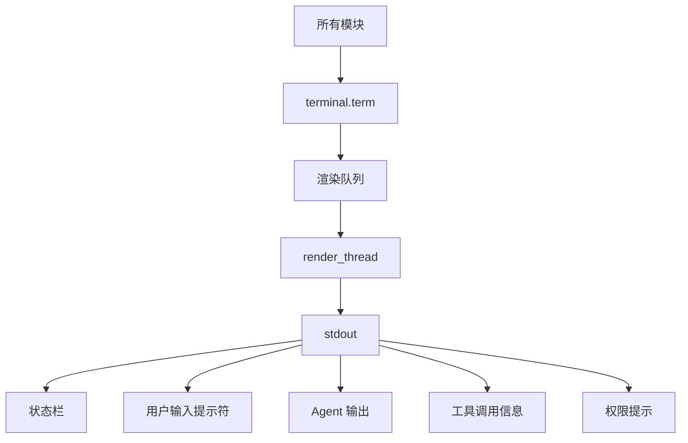

# mini-agent 命令行输入打印机制

> 本文为 terminal-io-guide.md 的详细补充，重点覆盖所有显示元素的具体格式和行为。

---

## 一、核心架构

### 1.1 单流输出模型



**关键原则**：stdout 是唯一输出流，由渲染线程串行写入，无竞态。

### 1.2 关键组件

| 模块 | 文件 | 职责 |
|------|------|------|
| 终端管理 | `ui/terminal.py` | 渲染队列、状态栏管理、输入读取 |
| 渲染适配 | `ui/renderer.py` | 历史 API → terminal.term 映射 |
| REPL 输入 | `ui/repl_input.py` | prompt_toolkit 输入封装 |
| 权限守卫 | `permissions.py` | 工具调用审批提示 |
| Agent | `agent.py` | 主循环与流式输出触发 |
| 状态栏 | `orchestrator/status_bar.py` | 任务/LLM 状态构建 |
| 任务 UI | `orchestrator/task_display.py` | 任务表格/看板 |
| 计划 UI | `orchestrator/plan_display.py` | 计划树形展示 |

---

## 二、状态栏机制

### 2.1 状态栏内容

```
⚡ Tasks [██░░░░] 2/6   2 running  +3 queued: fetch-docs, analyze-api
🤖 LLM   [███░░] 3/8   3 active   +1 queued: sub-agent-abc123
📋 Plan  [████░] 3/4   1 running: [t3] 生成文档
```

### 2.2 刷新机制

状态栏通过 `refresh_thread` 每 250ms 自动刷新，全程通过队列与渲染线程协作，不存在竞态。

输入期间通过 `_enter_input_mode()` 的哨兵同步暂停状态栏，输入完成后通过 `_exit_input_mode()` 恢复。

---

## 三、REPL 输入机制

### 3.1 prompt_toolkit 输入

**实现文件**：`ui/repl_input.py` + `ui/terminal.py:_read_line()`

特性：
- 光标正常显示，输入字符实时可见
- ↑↓ 键浏览历史
- Tab 自动补全 slash 命令
- Ctrl-A/E 快速跳转行首行尾
- Ctrl-C 清空当前行，Ctrl-D 退出

**降级策略**：
- `prompt_toolkit` 初始化失败时，设置 `_ptk_failed = True`，后续调用直接使用降级方案，不重复尝试
- 降级使用 `sys.stdin.readline()` + ANSI 彩色提示符

### 3.2 输入与状态栏协调

```
用户回车
  ↓
_enter_input_mode()
  ├── 设置 _refresh_paused 标志
  ├── 投入 _noop 哨兵消息，等待队列清空
  └── 直接擦除状态栏
  ↓
显示提示符 "You ❯ "（等待输入）
  ↓
用户输入
  ↓
_exit_input_mode()
  └── 恢复刷新线程，重绘状态栏
  ↓
agent.run_turn()
```

---

## 四、Agent 输出机制

### 4.1 启动 Banner

```text
╔══════════════════════════════════════════╗
║        mini-claude-code  v0.1.0          ║
║  Type /help for commands, exit to quit   ║
╚══════════════════════════════════════════╝

ℹ  Model: claude-opus-4-5
ℹ  Project: /path/to/project
ℹ  Skills available: 3
⚠  SANDBOX mode — destructive operations are blocked.
ℹ  Task manager ready (max 4 concurrent workers)
```

文本来自 `prompts/fragments/cli_messages.md`，由 `cli/repl.py:run_repl()` 输出。

### 4.2 流式输出

实现位置：`ui/terminal.py:stream_token()` / `stream_end()`

行为：
1. 第一个可见 token：擦除状态栏，打印 Agent 名称（蓝色加粗）
2. 每个 token：过滤 `<tool_use>...</tool_use>` 块，实时输出到 stdout
3. 流结束：打印换行，重绘状态栏

### 4.3 工具调用显示

**文件**：`ui/renderer.py`

工具调用开始：
```
🔧  bash  $ python -m pytest tests/
```

详细模式（`--verbose`）：
```json
{
  "command": "python -m pytest tests/",
  "timeout": 30
}
```

工具图标映射：

| 工具 | 图标 |
|------|------|
| bash | ⚡ |
| read_file | 📄 |
| write_file | ✏️ |
| patch_file | 🩹 |
| glob | 🔍 |
| grep | 🔎 |
| create_plan | 📋 |
| spawn_agent | 🤖 |

---

## 五、权限提示机制

### 5.1 工具分类

**安全工具**（自动通过）：`read_file`、`list_dir`、`glob`、`grep`、`web_search`、计划工具

**风险工具**（需审批）：`bash`、`write_file`、`patch_file`、`create_file`、`delete_file`

### 5.2 危险命令检测

正则匹配危险模式：`rm -rf`、`dd`、`mkfs`、`> /dev/`、`sudo`、`curl ... | bash`、`chmod 777`

### 5.3 审批交互

```
⚠ DANGEROUS  Tool request: bash
  $ rm -rf /tmp/cache
  (y)es  (a)lways  (n)o  (d)eny-always : _
```

选项：
- `y/yes` — 本次允许
- `a/always` — 以后同命令自动允许
- `n/no` — 本次拒绝
- `d/deny` — 以后该工具始终拒绝
- Ctrl-C — 等同于拒绝

沙箱模式：
```
🏖️  Sandbox mode — write_file was blocked
  Would have executed: write_file(docs/output.md)
```

---

## 六、任务系统显示

### 6.1 任务状态图标

| 状态 | 图标 | 颜色 |
|------|------|------|
| PENDING | ⏳ | dim |
| RUNNING | ⚡ | cyan |
| DONE | ✓ | green |
| FAILED | ✗ | red |
| CANCELLED | ⊘ | yellow |

### 6.2 任务表格（/tasks）

```
┌────────┬───────────┬──────────────────────────┬────────┬──────────┐
│ ID     │ Status    │ Name                     │ Elapsed│ Tokens   │
├────────┼───────────┼──────────────────────────┼────────┼──────────┤
│ abc123 │ ✓ done    │ Fetch API documentation  │ 12s    │ 150/320  │
│ def456 │ ⚡ running│ Analyze response format  │ 5s     │ —        │
│ ghi789 │ ⏳ pending│ Generate code examples   │ —      │ —        │
└────────┴───────────┴──────────────────────────┴────────┴──────────┘
```

---

## 七、执行计划显示

### 7.1 计划树形（/plan）

```
╭──────────────── Execution Plan ────────────────╮
│ 为 utils.py 添加单元测试 [████░░░░] 2/4         │
│ ✓ [read]   读取 utils.py  1.2s                  │
│   ↳ 找到 5 个公共函数                            │
│ ◉ [write]  编写测试文件  → after read            │
│   ├── ○ [fixture]  创建测试夹具  ← from:write   │
│   └── ○ [mock]     创建 Mock    ← from:write   │
│ ○ [run]    运行测试  → after write              │
╰─────────────────────────────────────────────────╯
```

---

## 八、输出样式表

### 8.1 消息类型样式

| 类型 | 函数 | 样式 |
|------|------|------|
| 信息 | `R.print_info()` | `[blue]ℹ[/blue]` + 消息 |
| 警告 | `R.print_warning()` | `[yellow]⚠[/yellow]` + 消息 |
| 错误 | `R.print_error()` | `[red]✗[/red]` + 消息 |
| 成功 | `R.print_success()` | `[green]✓[/green]` + 消息 |
| 中断 | `R.print_interrupt()` | `[yellow]⚡[/yellow]` + 消息 |

### 8.2 会话统计

```
─── Turns: 12 | Tokens in/out: 15420/8934 | Tool calls: 24 | Elapsed: 2m 35s ───
```

---

## 九、调试输出

### 9.1 LLM 调试日志

启用方式：`--debug-llm` 或 `--debug-llm-console`

日志文件：`<project>/.claude/logs/llm_debug_YYYYMMDD.jsonl`

日志格式（每条 JSON 一行）：
```json
{
  "seq": 1,
  "ts": "2025-01-01T12:00:00+00:00",
  "event": "request",
  "provider": "anthropic",
  "model": "claude-opus-4-5",
  "request": { "raw": {...}, "actual": {...} }
}
```

### 9.2 错误显示

```
✗  Unknown command: /foo. Type /help for available commands.
⚡ Interrupted (Ctrl-C). Type 'exit' to quit.
✗  API error: [详细错误信息]
  ✗ bash error: [Errno 2] No such file or directory
```

---

## 十、HTTP 与命令行协同

### 10.1 架构设计

HTTP 服务与命令行共享同一个 Agent 实例，通过 `AgentBridge` 实现解耦：

```
┌──────────────┐     ┌──────────────┐     ┌──────────────┐
│  HTTP Client │ <-- │ FastAPI +    │ <-- │ AgentBridge  │
│              │     │ AgentRunner  │     │              │
└──────────────┘     └──────────────┘     └──────┬───────┘
                                                  │
                                     ┌────────────▼──────────┐
                                     │   mini-agent Core     │
                                     │   (agent.py + tools)  │
                                     └───────────────────────┘
```

### 10.2 核心组件

| 组件 | 文件 | 职责 |
|------|------|------|
| RingBuffer | `bridge.py` | 线程安全的事件环形缓冲区，支持历史回放 |
| OutputBroadcaster | `bridge.py` | 事件广播，同时写入 RingBuffer 和 SSE 订阅者 |
| InputQueue | `bridge.py` | 命令队列，HTTP enqueue、AgentRunner 消费 |
| PermissionGate | `bridge.py` | HTTP 侧权限审批，支持阻塞等待 |
| AgentRunner | `server.py` | 后台线程，消费 InputQueue 并驱动 run_turn |

### 10.3 命令行显示协同

HTTP 请求会在命令行终端显示用户输入，保持统一的交互体验：

```
# 命令行输入
You ❯ 写一个质数筛法函数

# HTTP 请求（在终端显示）
You (web) ❯ 写一个质数筛法函数
─────────
Agent: 好的，我来写一个质数筛法...
─── Web 请求处理完毕，你可以继续在此输入 ───
```

实现位置：`server.py:AgentRunner.run()`

### 10.4 输出钩子机制

通过 monkey-patch `Renderer` 输出方法，将 agent 核心输出接入 HTTP 广播：

```python
# server.py:_install_output_hook()
_orig_stream_token = R.__class__.stream_token
class _PatchedStreamWriter(_OrigStreamWriter):
    def write(self, text: str) -> None:
        super().write(text)
        bridge.emit_token(text, turn_id=turn_id)
```

这样 agent.py 本身无需任何改动，即可同时输出到终端和 HTTP。

### 10.5 SSE 事件流

支持两种订阅模式：

1. **全局流** `/v1/stream` - 订阅所有实时事件
2. **指定轮次流** `/v1/stream/{turn_id}` - 只订阅特定 turn 的事件

事件类型包括：
- `token` - 流式 token
- `tool_call` / `tool_result` - 工具调用/结果
- `turn_start` / `turn_done` - 轮次开始/结束
- `permission_req` - 权限请求
- `error` / `info` / `warning` - 错误/信息/警告

### 10.6 断线重连

支持 Last-Event-ID 请求头，浏览器 EventSource 自动重连：

```javascript
const source = new EventSource("http://127.0.0.1:8765/v1/stream", {
  headers: { "Authorization": "Bearer token" }
});
// 断线后自动重连，携带 Last-Event-ID 续接
```

服务端会回放 `since_id` 之后的历史事件，确保不丢失。

---

## 十一、关键代码路径

### 主循环调用链

### 主循环调用链

```
cli/app.py:main()
  └─ cli/repl.py:run_repl()
      └─ ui/terminal.py:prompt_user()   ← 读取输入
      └─ agent.py:run_turn()
          └─ agent._agentic_loop()
          └─ agent._call_llm()          ← 流式输出
          └─ agent._execute_tools()
              └─ ui/renderer.py         ← 工具调用展示
```

### 流式输出流程

```
agent._call_llm()
  └─ term.stream_token(token)           ← 逐 token 过滤输出
  └─ term.stream_end() / force_end_stream()
```

### 输入模式完整流程

```
term.prompt_user()
  └─ _enter_input_mode()
      ├─ _refresh_paused.set()          ← 暂停刷新线程
      ├─ queue.put(_Msg("_noop", None)) ← 投入哨兵
      ├─ queue.join()                   ← 等待队列清空
      └─ _erase_bar_direct()            ← 直接擦除状态栏
  └─ _read_line()                       ← 阻塞等待输入
  └─ _exit_input_mode()
      └─ _refresh_paused.clear()        ← 恢复刷新
```

---

*最后更新：2026-06*
