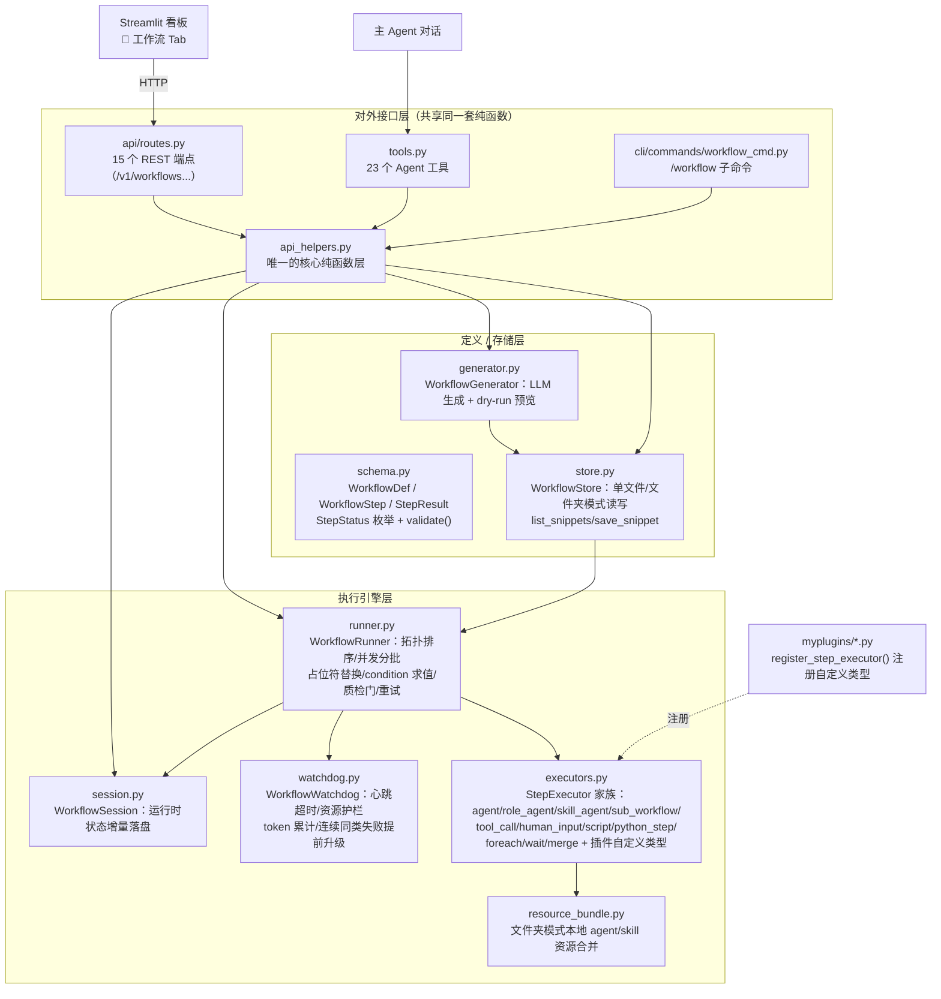
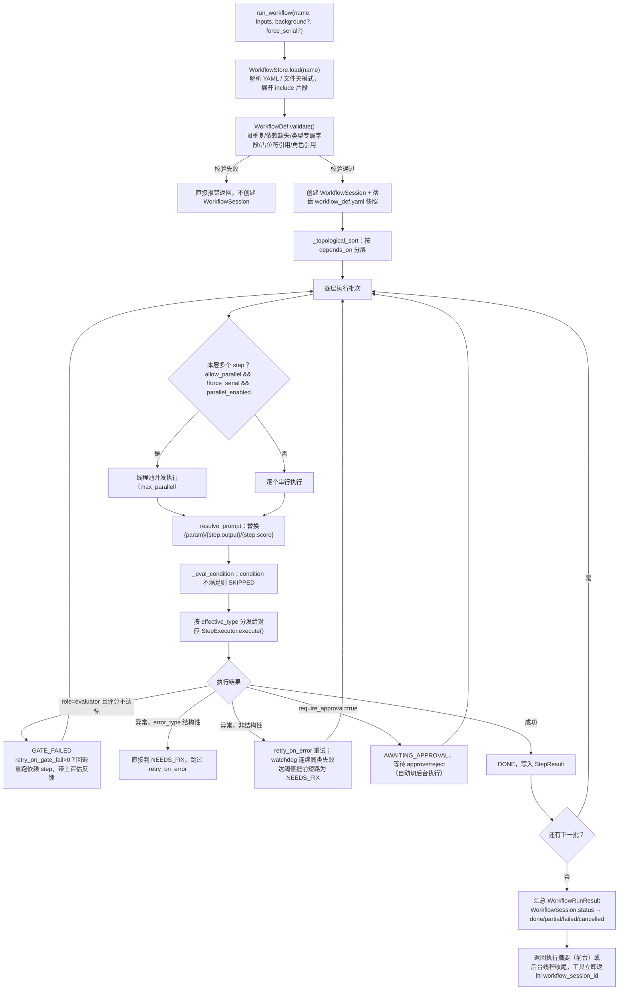
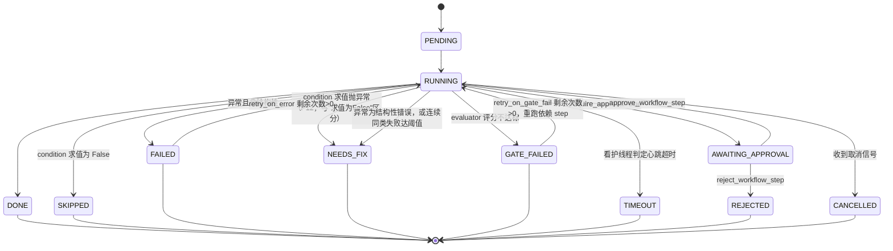
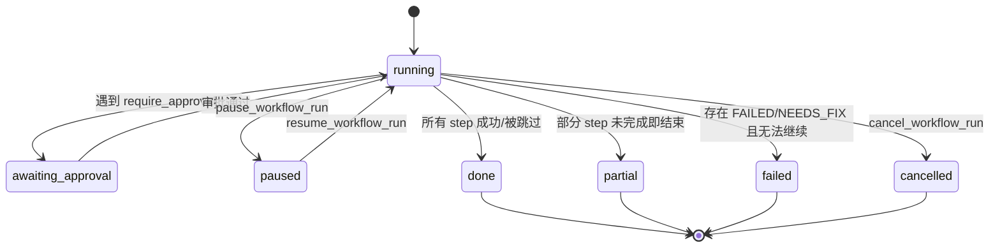

# 工作流系统（Workflow System）

mini_agent 内置了一套轻量的工作流引擎，支持将多步 AI 任务固化为可复用的流程定义。
工作流可以通过 LLM 自动生成，也可以手动编写 YAML 文件，保存后随时执行。

---

## 系统架构与设计理念

### 设计理念

工作流系统从 P1 一路演进到 P15（详见文末各节标注的编号），贯穿始终的几条
原则：

1. **纯函数核心 + 薄适配层，三个入口共享同一套状态机**。
   `workflow/api_helpers.py` 是唯一"真正做事"的地方（加载定义、校验、调用
   `WorkflowRunner`、读写 `WorkflowSession`）；Agent 工具
   （`workflow/tools.py`）、REST API（`api/routes.py`）、CLI
   （`cli/commands/workflow_cmd.py`，2026-07 起同时覆盖交互 REPL 的
   `/workflow ...` 斜杠命令和独立命令行 `mini-agent workflow ...` 两种入口，
   详见文末「CLI 命令」一节）都只是把这批纯函数的返回值包装成
   各自需要的格式（Markdown 给 LLM / JSON 给前端 / 文本给终端），不重复
   实现任何一条状态转换逻辑。好处是：Streamlit 看板里点"暂停"、CLI 里敲
   `/workflow pause` 或 `mini-agent workflow pause`、Agent 对话里说"暂停一下"，
   走到的是**同一行代码**，不会出现三处（或四处）行为不一致的情况。
2. **渐进式增量演进，每一轮都保持向后兼容**。新字段一律给合理默认值，
   旧 YAML 不用改就能继续跑（如 `type` 未显式设置时按 `role` 是否非空
   自动推断；`defaults`/`escalate_after_n_same_failures` 等新字段缺省时
   落到硬编码兜底）。只有 `mode: autonomous` 这种"用户主动声明要更严格
   的保证"的场景才会在保存时收紧校验。
3. **断点续跑优先于从头重来**。`WorkflowSession` 把每个 step 的结果增量
   落盘，进程崩溃、主动暂停、甚至只是改了一个 step 的定义，都可以用
   `resume_workflow_run` 从断点继续，已经成功、消耗过 token 的步骤不会
   重来。
4. **沙箱/dry-run 先行，落盘操作谨慎**。改一个 step 前可以先
   `test_workflow_step` 单独验证（不落盘、不接入正式 DAG）；生成/保存前
   可以先 `preview_workflow` 看并发分批和 condition 求值结果；一次性调试
   参数用 `resume_workflow_run(step_overrides=...)`，不必污染正式定义。
5. **高风险操作默认收紧，需要显式打开**。`script` 类型默认关闭
   （`script_step_enabled=false`）；`tool_call` 默认需要人工审批门放行；
   `sub_workflow` 有递归深度保护；这些都是"宁可默认更保守，需要时显式
   打开"的一致取向。

### 分层架构



**各层职责一句话**：
- `schema.py`：数据结构与静态校验，不含任何执行逻辑。
- `store.py`：YAML ↔ `WorkflowDef` 的序列化，单文件/文件夹两种模式、
  片段（`workflow_snippets`）的读写。
- `generator.py`：调用 LLM 把自然语言描述转成 YAML，并在生成后自动跑一次
  `preview_workflow_def` 做 dry-run 校验。
- `runner.py`：真正的执行调度中枢——拓扑排序出执行批次、每批内按
  `allow_parallel` 分发并发/串行、处理质检门重试与普通异常重试、把每个
  step 的执行委托给对应的 `StepExecutor`。
- `executors.py`：每种 `type` 对应一个 `StepExecutor` 子类，`execute()`
  只关心"怎么跑完这一个 step 拿到输出文本"，不关心整体调度。
- `watchdog.py`：独立线程，只做监控与信号上报（超时/护栏/连续失败），不
  直接改变执行流程，通过 `runner` 读取上报结果后自行决定怎么处理。
- `session.py`：`WorkflowSession` 是运行时状态的持久化载体，`runner`
  执行到关键节点就调用其 `save()`，断点恢复靠重新 `load()` 这份状态。
- `api_helpers.py`：把"加载定义 → 校验/组装参数 → 调用 runner/session →
  格式化返回"这条链路封装成一批纯函数，是 Agent 工具、REST 路由、CLI
  三个入口唯一共享的实现。

### 核心执行流程（一次 `run_workflow` 调用）



全程被 `watchdog.py` 的独立线程并行监控：心跳超时、累计时长/token 超限
会主动请求取消；每个 step 的连续同类失败会被计数，达到
`escalate_after_n_same_failures` 阈值时提前把状态改判为 `NEEDS_FIX`（见
下文"看护趋势感知"一节）。

### 状态机

**单个 step 的 `StepStatus`**（`schema.py`，11 种，2 种终态附加语义见下方
"步骤执行状态"一节的完整表格）：



**一次执行整体的 `WorkflowRunStatus`**（`session.py`，7 种）：



---

## 核心概念

```
WorkflowDef（工作流定义）
  ├─ name / description / version
  └─ steps: list[WorkflowStep]
        ├─ id          步骤唯一标识（用于依赖引用和占位符）
        ├─ prompt      Prompt 模板（支持 {step_id.output} 占位符）
        ├─ role        执行角色（null = 主 Agent，"evaluator" = 质检角色）
        ├─ depends_on  依赖的步骤 id 列表（拓扑排序依据）
        ├─ condition   执行条件表达式（如 "evaluate.score >= 60"）
        └─ retry_on_gate_fail  质检不达标时重跑前序步骤的最大次数
```

**关键设计原则**：
- **步骤核心固定**：工作流文件保存后，步骤的 id / 依赖关系 / 角色绑定不会在运行时改变
- **参数动态注入**：步骤 prompt 中的 `{param_name}` 占位符在 `run_workflow` 时传入
- **结果自动传递**：`{step_id.output}` 和 `{step_id.score}` 在执行时自动替换为前序步骤的输出

---

## 文件位置

```
<project_root>/.agent/workflows/*.yaml   # 单文件模式（原有）

<project_root>/.agent/workflows/<name>/  # 文件夹模式（新增，见下方专门章节）
  workflow.yaml                          # 主入口
  agents/*.md                            # 本工作流私有的 agent profile
  skills/*/SKILL.md                      # 本工作流私有的 skill
  prompts/*.md                           # 抽出来的 prompt 模板文件
```

框架启动时不预加载工作流，按需通过 `run_workflow` 工具名称加载。两种模式
可以在同一个 `.agent/workflows/` 目录下共存，`WorkflowStore` 会优先查找
文件夹模式（`<name>/workflow.yaml`），找不到再退回单文件模式。

---

## YAML 格式

### 完整字段说明

```yaml
name: workflow_name        # 工作流唯一名称（英文小写，对应文件名）
description: 描述          # 用于 list_workflows 展示，中文可用
version: "1.0"             # 版本号，纯标识用途
max_total_duration: null   # 该工作流的总时长护栏（秒），覆盖全局配置
max_total_tokens: null     # [P7-②1] 该工作流的总 token 用量护栏，覆盖全局配置
defaults: {}               # [P7-③1] model/timeout/max_turns/retry_on_error/
                            #          allow_parallel 的统一默认值，见 workflow-directions-history.md "workflow 级默认配置" 一节
mode: interactive          # [改进方案 §1] interactive（默认）| autonomous。
                            # autonomous 时，validate()/save_workflow 会拒绝
                            # 保存包含阻塞点（没有 input_key 的 human_input、
                            # require_approval=true）的工作流，见
                            # workflow-directions-history.md "全自动执行模式"一节。

steps:
  - id: step_id            # 步骤唯一标识，英文小写下划线
    name: 步骤名称          # 可读名称
    prompt: |              # Prompt 模板（支持占位符）
      ...
    include: null          # [P7-③2] 引用可复用 step 片段，见 workflow-directions-history.md "可复用 step 片段" 一节
    role: null             # 执行角色：null（主 Agent）或角色 profile name
    type: null             # [P5] 显式类型：null=按role自动推断 / agent / role_agent /
                           #      sub_workflow / tool_call / human_input / script /
                           #      skill_agent / python_step / foreach / wait / merge，
                           #      或插件注册的自定义类型（见 P7-④1/④2）
    workflow_name: null    # [P5] type=sub_workflow 时必填：引用的工作流名称
    tool_name: null        # [P5] type=tool_call 时必填：要调用的工具名称
    tool_args: {}          # [P5，P12 起支持占位符] type=tool_call 时的工具入参
                            #      （为空则用 prompt 作为唯一实参）。值里的字符串
                            #      （含嵌套 dict/list 内的字符串叶子节点）支持
                            #      `{step_id.output}` 等占位符，见下文
                            #      "Prompt 占位符"一节
    input_prompt: null     # [P5] type=human_input 时展示给人类的提示语（为空则用 prompt）
    input_key: null        # [改进方案 §1] type=human_input 时，若启动时的 inputs
                            #      里能通过该 key 找到值，直接使用、不阻塞等待，
                            #      见 workflow-directions-history.md "全自动执行模式"一节
    script: null           # [P5] type=script 时必填：要执行的 shell 命令
    require_approval: false # 是否要求人工审批门放行
    depends_on: []         # 依赖的步骤 id 列表，控制执行顺序
    condition: null        # 执行条件，null 表示无条件执行
    # [P7-③1] 下面几个字段不写（null）时按"本字段 → 顶层 defaults 同名
    # 值 → 硬编码兜底"三层继承，兜底值见括号，详见 workflow-directions-history.md "workflow 级默认
    # 配置"一节。
    max_turns: null        # 该步骤允许的最大 LLM 轮数（硬编码兜底 10）
    model: null            # 覆盖模型（null = 继承 defaults/全局）
    timeout: null          # 超时秒数（硬编码兜底：不限制）
    retry_on_gate_fail: 0  # 质检不达标时重跑次数（0 = 不重跑，不参与 defaults 继承）
    retry_on_error: null   # 普通异常重试次数（硬编码兜底 0）
    allow_parallel: null   # 是否允许与同层步骤并发执行（硬编码兜底 true）
    escalate_after_n_same_failures: null  # [P10] 连续同类失败提前判 NEEDS_FIX
                            #      的阈值（硬编码兜底 2），见 workflow-directions-history.md "看护趋势感知"一节
    prompt_file: null      # [目录模式] 相对 workflow 目录的 prompt 文件路径，
                            #      与 prompt 二选一，都填时 prompt_file 优先，
                            #      占位符语法与内联 prompt 完全相同
    skill_name: null       # [P5] type=skill_agent 时必填：强制加载的 skill 名称
    script_path: null      # [P11 workflow_python_step_and_zhihu_publish_plan.md]
                            #      type=python_step 时必填：脚本文件相对路径
                            #      （规则同 prompt_file），脚本暴露
                            #      `def run(ctx: PyStepContext) -> str|dict`
    params: {}              # [P11] 透传给 python_step 脚本的自定义参数字面量，
                            #      脚本内通过 ctx.params 读取
    output_file: null       # [P11 §A3] 通用输出落盘契约：不论哪种 type，step
                            #      跑完后 runner 统一把输出写到
                            #      session output_dir/output_file，见
                            #      workflow-directions-history.md
                            #      "output_file 输出落盘契约"一节
    result_file: null       # [skill_agent 结果文件契约，P15 起 script 类型
                            #      通用] 期望执行方主动产出的结构化结果文件名，
                            #      见 workflow-directions-history.md
                            #      "结构化结果契约"一节
    result_file_required_keys: []  # 校验 result_file 顶层必须包含的字段列表

    # ── [P13 Phase 1] type=foreach 专用 ──────────────────────────────────
    items: null             # 要遍历的列表：字面量列表，或单个占位符字符串
                            #      （如 "{search.result_file:questions}"，
                            #      解析为原始 Python list）
    foreach_step: {}        # 内层每个元素要执行的 step 定义子集（必须包含
                            #      type），内层 prompt 支持 {item}/{item_index}
    foreach_max_concurrency: 1     # 内层并发度，默认 1（串行）
    foreach_stop_on_error: false   # 单元素失败：false=记入聚合结果继续，
                            #      true=第一个失败即整体抛异常

    # ── [P13 Phase 2] type=wait 专用 ─────────────────────────────────────
    wait_seconds: null       # 要等待的秒数，可被 pause/cancel 信号打断

    # ── [P14 Phase 1] type=merge 专用 ────────────────────────────────────
    merge_sources: []        # 要汇聚的上游 step id 列表（顺序即聚合顺序）
    merge_strategy: concat_text   # concat_text（默认，拼接 output 文本）/
                            #      json_array（组成 JSON 数组）/
                            #      json_merge（按顺序 dict.update）
    merge_separator: "\n\n"  # concat_text 策略下的拼接分隔符
    merge_use_result_file: false  # true 时 json_array/json_merge 从各来源的
                            #      result_file 读取；false 时读 output 文本
```

### Prompt 占位符

| 占位符 | 含义 | 示例 |
|--------|------|------|
| `{param_name}` | 运行时从 `inputs` 注入的动态参数 | `{code}`, `{topic}` |
| `{step_id.output}` | 指定步骤的完整输出文本 | `{analyze.output}` |
| `{step_id.score}` | 指定步骤的评分（0-100 整数字符串）| `{evaluate.score}` |
| `{step_id.output_file}`（P11 §3） | 指定步骤 `output_file` 落盘文件的**绝对路径字符串**（不是内容），供 `agent`/`role_agent` 等类型的 step 提示"请读取该文件" | `{analyze_doc.output_file}` |
| `{step_id.result_file}` | 指定步骤 `result_file` 落盘文件的**绝对路径字符串**（不是内容） | `{search_zhihu.result_file}` |
| `{step_id.result_file:a.b[0].c}`（P12 Phase 3） | 直接从 `result_file` 指向的 JSON 文件里取出某个字段值（支持属性访问 + 数字下标的链式路径，不是完整 JSONPath），取到后 `str()` 转成文本插入 prompt；路径取不到值或文件不是合法 JSON 时，占位符原样保留、不抛异常中断 step | `{search.result_file:questions[0].title}` |

`tool_call` 类型的 `tool_args`（P12 Phase 2 起）同样支持上述全部占位符语法——值是字符串时直接替换，值是嵌套 `dict`/`list` 时会递归替换其中的字符串叶子节点，纯字面量值（不含 `{...}`）不受影响、完全向后兼容：

```yaml
- id: notify_with_summary
  type: tool_call
  tool_name: send_slack_message
  depends_on: [summarize]
  tool_args:
    channel: "#eng"
    text: "本次摘要：{summarize.output}"          # 字符串占位符
    metadata: {source_step: "summarize"}          # 字面量，不受影响
```

`{variable}` 形式的占位符在 `inputs` 里找不到对应 key 时，仍按既有兜底行为原样保留大括号文本、不报错（避免误伤 prompt 模板里本来就有的花括号）；但从 P11 开始，运行时若发生这种"未解析占位符替换"，会被记进 `debug_log.unresolved_placeholders`（见 workflow-directions-history.md "运行时调试日志"一节），保存前也可以用 `preview_workflow` 提前看到同样的清单。

`{step_id.field}` 形式的占位符（`output`/`score`/`output_file`/`result_file`/`result_file:path`）从 P11 起（P12 扩展到 `tool_args` 和 `result_file:path`），`validate()` 会额外检查该 `step_id` 是否在当前 step 的 `depends_on`（直接或传递）范围内，写漏 `depends_on` 会直接报 **error**（而不是运行到一半才因为该 step 还没跑完而报 `KeyError`）——这是本轮改进里少数几个"从运行期报错提前到保存期报错"的一致性校验，建议改动后立刻用 `save_workflow`/`validate()` 确认没有新增报错。`result_file:path` 部分只做**语法级**校验（路径写法是否合法），不读文件、不校验字段是否真的存在。

### condition 表达式

`condition` 支持简单 Python 表达式，变量为步骤 id，属性有：

| 属性 | 类型 | 说明 |
|------|------|------|
| `step_id.score` | int | 该步骤的评分（0-100），未提取到时为 0 |
| `step_id.output` | str | 该步骤的完整输出文本 |
| `step_id.status` | str | `"done"` / `"skipped"` / `"failed"` / `"gate_failed"` |
| `step_id.passed` | bool | `status == "done"` |

```yaml
condition: "evaluate.score >= 60"          # 评分达标才执行
condition: "analyze.passed"                # 分析步骤成功才执行
condition: "evaluate.score >= 60 and analyze.passed"  # 多条件组合
```

**求值异常 vs 求值为 False（P12）**：`condition` 表达式本身写对、只是求值
结果是 `False`（比如分数确实没达标）时，该 step 按既有语义标记为
`SKIPPED`。但如果表达式**求值过程本身抛出异常**（比如引用了一个此刻
`output` 类型不对导致 `AttributeError`、或者引用了一个还没跑完的 step
导致 `KeyError`），说明表达式写错了、不是"业务上不满足"，会被标记为
`NEEDS_FIX`（而不是 `SKIPPED`），`error`/`error_type` 字段会写清楚原始异常
信息，不会被 `retry_on_error` 误判成"重试可能有用"而反复空转。写
condition 时如果不确定某个字段这时候是否已经就绪，可以先用
`preview_workflow`/`test_workflow_step` 提前验证。

---

## 步骤执行状态

`StepStatus`（`schema.py`）共 11 种，覆盖从 P1 基础状态到 P2-P10 各阶段
新增的看护/审批/结构化错误语义：

| 状态 | 值 | 含义 | 引入阶段 |
|------|-----|------|---|
| `PENDING` | `pending` | 尚未开始，或因依赖步骤失败未能执行 | P1 |
| `RUNNING` | `running` | 正在执行 | P1 |
| `DONE` | `done` | 成功完成 | P1 |
| `SKIPPED` | `skipped` | `condition` 不满足，跳过 | P1 |
| `FAILED` | `failed` | 执行抛出异常（瞬时性问题，如网络超时），可用 `retry_on_error` 重试 | P1 |
| `GATE_FAILED` | `gate_failed` | evaluator 角色评分未达 `pass_threshold`，可用 `retry_on_gate_fail` 重跑 | P1 |
| `TIMEOUT` | `timeout` | 看护线程判定心跳超过 `timeout` 未更新，强制标记并继续推进 | P2 |
| `CANCELLED` | `cancelled` | 收到 `cancel_workflow_run` 信号后未开始/被中止 | P3 |
| `AWAITING_APPROVAL` | `awaiting_approval` | `require_approval=true`，等待 `approve_workflow_step`/`reject_workflow_step` | P4 |
| `REJECTED` | `rejected` | 人工审批门被拒绝 | P4 |
| `NEEDS_FIX` | `needs_fix` | 结构性/配置性错误（prompt 占位符写错、`tool_name` 未注册、condition 求值抛异常等），或连续同类失败达阈值（P10），重试无意义，需要先 `patch_workflow_step` | 改进方案§4.3 / P10 / P12 |

`GATE_FAILED`/`FAILED`/`NEEDS_FIX` 三者的区别：
- `FAILED`：系统级瞬时错误，重试大概率有用
- `GATE_FAILED`：内容质量不达标，不是异常，走质检门重跑逻辑
- `NEEDS_FIX`：重试无意义的结构性错误，或者虽然异常类型看起来像瞬时故障，
  但已经连续多次在同一个 step 上失败，大概率也是定义本身有问题，需要人工
  介入修改

---

## 质检门（Evaluator Gate）

当步骤的 `role` 指向一个 `role_type: evaluator` 的 profile 时，
该步骤自动具备质检门能力：

```
执行 evaluator 步骤
  → 提取评分
  → 评分 ≥ profile.pass_threshold → DONE，继续后续步骤
  → 评分 < pass_threshold         → GATE_FAILED
        → retry_on_gate_fail > 0？
              → 是：把评估反馈追加到依赖步骤的 prompt，重跑依赖步骤
                    → 再次运行 evaluator → 循环直到通过或达到重试上限
              → 否：步骤标记为 GATE_FAILED，后续依赖此步骤的步骤被跳过
```

**阈值来源**：`pass_threshold` 从角色 profile 的 frontmatter 读取，
而非工作流 YAML。这样同一个 evaluator profile 在不同工作流中保持一致的质量标准。

---

## 内置工具（主 Agent 可直接调用）

工作流系统目前向主 Agent 注册了 **23 个**工具（`workflow/tools.py` 的
`register_workflow_tools()`）。下面先给出完整清单速查表，再展开每个工具
的详细参数说明——多数工具的行为已经在文末对应的专题章节里详细展开
（表格最后一列给出章节指引）：

| 工具 | 一句话 | 引入阶段 | 详见章节 |
|---|---|---|---|
| `generate_workflow` | 自然语言 → 生成 YAML 预览 | P1 | 本节 |
| `save_workflow` | 保存 YAML 字符串为工作流文件 | P1 | 本节 |
| `patch_workflow_step` | 只改一个 step 的部分字段，不重贴整份 YAML | 改进方案§4.2 | 本节 / 出错定位一节 |
| `test_workflow_step` | 单 step 沙箱测试：mock 上游数据、不落盘 | P10§1 | P10 一节 |
| `run_workflow` | 执行已保存的工作流 | P1（+P2/P3/改进§1/§2） | 本节 |
| `list_workflows` | 列举所有工作流 | P1 | 本节 |
| `show_workflow` | 查看工作流 YAML 定义 | P1 | 本节 |
| `delete_workflow` | 删除工作流定义 | P1 | 本节 |
| `preview_workflow` | dry-run 预览执行计划，不实际执行 | P7 | 本节 |
| `resume_workflow_run` | 从断点续跑；支持一次性 `step_overrides` | P2（+P10§2/改进§4） | Workflow Session 一节 / P10 一节 |
| `list_workflow_runs` | 列举历史/当前执行记录 | P2 | Workflow Session 一节 |
| `get_workflow_run_status` | 查看某次执行详细进度（`verbose`/`wait`） | P2（+改进§4） | 出错定位一节 |
| `get_workflow_stats` | 汇总某工作流历史执行统计（成功率/耗时/重试率） | P9-1a | 本节 |
| `pause_workflow_run` | 暂停一次后台执行 | P3 | 后台执行一节 |
| `cancel_workflow_run` | 取消一次执行 | P3 | 后台执行一节 |
| `approve_workflow_step` | 人工审批门放行 | P4 | 人工审批门一节 |
| `reject_workflow_step` | 人工审批门拒绝 | P4 | 人工审批门一节 |
| `provide_workflow_step_input` | 向等待 human_input 的 step 送入文本 | P5 | Step 类型化一节 |
| `list_workflow_templates` | 列举内置工作流模板 | P6 | 内置模板库一节 |
| `create_workflow_from_template` | 基于内置模板创建并保存新工作流 | P6 | 内置模板库一节 |
| `list_recent_sessions` | 列出最近历史 session，帮助定位 session_id | P8 | session_to_workflow 一节 |
| `summarize_session_for_workflow` | 第①阶段：session → TaskSummary | P8 | session_to_workflow 一节 |
| `build_workflow_from_summary` | 第②阶段：TaskSummary → workflow YAML 预览 | P8 | session_to_workflow 一节 |

> 另有一个 `override_step_output`（改一个已落盘 step 的输出内容）只在
> REST API（`POST /v1/workflow_runs/{run_id}/steps/{step_id}/override`）
> 里暴露，**不是** Agent 工具——它是给 Streamlit 看板"人工改一下这一步的
> 输出内容再继续跑"这个交互场景用的，Agent 对话侧目前没有直接暴露这个
> 能力（避免 Agent 随意篡改历史执行记录）。

### `generate_workflow`

根据自然语言描述生成工作流 YAML，展示预览，用户确认后调用 `save_workflow` 保存。

```
参数：
  description (str)     工作流的自然语言描述
  example_input (str)   可选，运行时需要的输入参数示例

示例调用：
  generate_workflow("做一个技术文档写作流程，包括大纲生成、内容撰写和质量审核")
  generate_workflow("代码审查流程", '{"code": "def foo(): pass", "lang": "python"}')
```

### `save_workflow`

将 YAML 字符串保存为工作流文件。

```
参数：
  yaml_content (str)   完整的工作流 YAML 字符串

保存路径：<project_root>/.agent/workflows/<name>.yaml
```

### `run_workflow`

执行已保存的工作流，按拓扑顺序逐步执行，返回完整的执行摘要。

```
参数：
  name (str)                        工作流名称
  inputs (str)                      JSON 字符串，步骤 prompt 中的动态参数
  background (bool|null)            是否后台执行，见"后台执行、暂停、取消"一节
  force_serial (bool|null)          [改进方案 §2] True 时本次运行强制所有 step
                                     串行执行，忽略各 step 的 allow_parallel，
                                     不修改工作流定义本身
  require_all_inputs_upfront (bool) [改进方案 §1] True 时启动前一次性检查所有
                                     human_input 步骤是否都能从 inputs 中通过
                                     input_key 解析到值，缺失则直接报错列出
                                     缺哪些字段，见"全自动执行模式"一节
  output_export_dir (str|null)      [output_export 功能] 可选的外部导出目录
                                     （绝对路径）。不设置则不做任何额外操作；
                                     设置时，工作流到达终态（成功/失败/部分
                                     完成，`paused` 不算终态）后会把本次执行
                                     `output/` 目录下的所有文件复制到这个目录，
                                     不用再手动 cp。目标目录不存在会自动创建；
                                     复制失败只记 `output_exported` 事件里的
                                     `error` 字段并打印警告，不会让 workflow
                                     本身的执行状态被判定为异常。

示例：
  run_workflow("code_review", '{"code": "def foo(): pass"}')
  run_workflow("article_writer", '{"topic": "大模型应用架构"}')
  run_workflow("nightly_batch", '{"env": "prod"}', force_serial=true)
  run_workflow("report_gen", '{"topic": "x"}', output_export_dir="/data/exports/report_gen")
```

后台执行时，`run_workflow` 的返回文本会提示本次执行的默认输出目录
（产出文件应写入这里，而不是主 Agent 自己的 session output 目录），若设置
了 `output_export_dir` 还会额外提示"完成后会自动复制到 ...”。

### `list_workflows`

列举所有已保存工作流的名称、描述、步骤数和步骤列表。

### `show_workflow`

查看指定工作流的完整 YAML 定义，用于检查或准备编辑。

### `delete_workflow`

删除指定工作流文件。

### `patch_workflow_step`（改进方案 §4.2）

只修改已保存工作流里指定 step 的部分字段，不用重贴整份 YAML，详见
workflow-directions-history.md "出错定位、编辑与重跑"一节。

```
参数：
  name (str)      工作流名称
  step_id (str)   要修改的 step 的 id
  patch (str)     JSON 字符串，只包含要修改的字段，如 '{"prompt": "...", "timeout": 120}'
```

### `provide_workflow_step_input`（P5）

向一个正在等待人工输入（`human_input` 类型 step）的执行送入文本。

```
参数：
  workflow_session_id (str)   正在执行的工作流的执行 ID
  input_text (str)            要送入的文本
```

### `list_workflow_templates`（P6）

列举内置工作流模板（`code_review` / `research_report` / `multi_perspective_debate`）。

### `create_workflow_from_template`（P6）

基于内置模板创建并保存一个新工作流，比 `generate_workflow` 更稳定。

```
参数：
  template_name (str)   模板名称，见 list_workflow_templates 的输出
  new_name (str)        新工作流的名称

示例：
  create_workflow_from_template("code_review", "my_pr_review")
```

### `preview_workflow`（P7）

dry-run 预览工作流的执行计划，**不实际运行**、不产生任何 `WorkflowSession`：
展示并发分批结果、每个 step 占位符替换后的 prompt 预览（运行时才能确定的
`{step_id.output}` 占位符原样保留）、`condition` 表达式的静态求值情况，以及
（P11 §2a）汇总的 `unresolved_placeholders: {step_id: [var, ...]}`——形如
`{xxx}`、不含 `.`、且在给定 `inputs` 里找不到对应 key 的占位符清单，用于在
保存/运行前提前发现"外部参数没传全，prompt 里会原样带着大括号发出去"这类
高频错误。`generate_workflow`/`build_workflow_from_summary` 生成 YAML 后会
自动调用一次同等逻辑的预览（受 `workflow.dry_run_preview_on_generate` 控制）。

```
参数：
  name (str)     工作流名称
  inputs (str)   JSON 字符串，与 run_workflow 的 inputs 含义一致（可省略）

示例：
  preview_workflow("nightly_report", '{"env": "prod"}')
```

### `get_workflow_stats`（P9-1a）

汇总某个工作流的历史执行统计：总执行次数、成功率、每个 step 的出现次数/
成功率/平均耗时/平均评分/平均重试次数、`condition` 命中率（该步骤未被
跳过的比例）。纯粹对已落盘的 `WorkflowSession` 历史数据做聚合，不改动
任何执行逻辑，用于判断"这个工作流长期跑下来靠不靠谱、哪个步骤该调了"。

```
参数：
  name (str)   工作流名称

示例：
  get_workflow_stats("code_review")
```

---

## 从历史 Session 生成 Workflow（`session_to_workflow`，P8）

除了"用自然语言描述一个流程"（`generate_workflow`），还可以把**之前某次
session 里实际做成的一件事**直接沉淀成一个可复用的 workflow，不需要重新
用自然语言把流程描述一遍。

设计文档：`next_doc/session_to_workflow_design.md`。

### 两段式流程

生成过程拆成两个独立阶段，中间产物会先展示给用户确认，避免"总结阶段理解
错了任务"这种错误被直接带进最终 YAML：

```
① 总结：session 历史（压缩后）→ LLM 一次调用 → TaskSummary（结构化摘要）
         │
         ▼ 展示给用户，人工确认/纠正
② 构建：TaskSummary（不是原始 history）→ LLM 一次调用 → workflow YAML 预览
         │
         ▼ 复用 generate_workflow 同一套 "预览 + save_workflow" 交互
```

### Agent 工具

```
list_recent_sessions(limit=10)
    列出最近 N 个 session 的 id、时间、首条用户输入摘要，帮用户定位
    session_id（不确定具体是哪次 session 时先调用这个）。

summarize_session_for_workflow(session_id)
    第①阶段：读取指定 session 的历史，起一个干净的临时 Agent 生成
    TaskSummary（目标、主线阶段、每个阶段是否经历失败重试、建议参数化的
    值、是否有重复的阶段组合），返回人类可读摘要供用户确认。
    对当前正在运行的这个 session 自己生成 workflow 时，session_id 传当前
    session 的 id 即可，逻辑完全一致（总是起临时 Agent 读 history，不借用
    当前 Agent 续调用，避免无关对话内容污染总结质量）。

build_workflow_from_summary(session_id, adjustments="")
    第②阶段：读回上一步生成的 TaskSummary，结合用户对总结提出的调整意见
    （adjustments，如"修复阶段不要做成质检门"），生成 workflow YAML 预览。
    满意后像 generate_workflow 一样调用 save_workflow 保存。
```

三个工具需要按顺序调用，中间等待用户确认（跟 `generate_workflow` →
`save_workflow` 是同一个设计原则的延伸：合并成一个工具会丢失"总结确认"
这个可以打断/纠正的落点）。

### 完整流程示例

```
用户：把刚才那次修 xxx bug 的过程整理成一个 workflow
Agent 调用 summarize_session_for_workflow(session_id="<当前 session_id>")
返回：摘要（目标/主线阶段/是否建议质检门/建议参数化的值），Agent 转述给用户

用户：对，但"修复"那步不需要做成质检门，就是普通重试就行
Agent 调用 build_workflow_from_summary(
    session_id="...",
    adjustments="修复阶段不要做成质检门，用普通 retry_on_error 即可",
)
返回：预览 + YAML

用户：可以，保存吧
Agent 调用 save_workflow(yaml_content=...)
```

### 生成规则要点

- `stages[]` 里每个阶段映射成一个 step，`id` 直接用 `stage.id`；
  `depends_on` 用 `stage.depends_on_stage_ids`。
- 阶段被标记 `gate_candidate=true`（该阶段的失败重试模式值得抽象成质检门）
  时，生成 `role: evaluator` + `condition` + `retry_on_gate_fail`，而不是
  把重试展开成多个 step。
- `candidate_parameters[]` 里"这次实际用的具体值"会被换成 `{参数名}`
  占位符，并据此生成 `example_input`。
- **工具名幻觉防护**：阶段描述默认生成 `type: agent`（让主 Agent 执行时
  自己决定用什么工具），只有确定性很强的阶段才会生成 `tool_call`/`script`
  类型；生成结果里 `tool_name` 若不在已注册工具表里，会被自动降级为
  `type: agent`（prompt 约束是第一道防线，生成后校验降级是兜底）。
- **`python_step` 优先改写**：如果某个阶段从历史 session 看是纯确定性加工
  （解析/过滤/重排数据，或只是调用一次模型拿判断结果），即使原 session
  里当时是靠主 Agent 临场执行的，生成 workflow 时也应该改写成
  `type: python_step`（配合 `ctx.llm.ask_json`），而不是照抄原样生成
  `type: agent`；只有阶段本身确实需要临场应变（工具选择、页面结构等运行时
  才能确定）才保留 `agent`，见"`python_step`：脚本化 step"一节的优先级
  规则。
- 如果原 session 里某几个阶段的组合重复出现（比如对多个文件重复执行了
  同一套"打分→报告"），生成结果末尾会提示"这段可以存成可复用 step 片段"
  （见 workflow-directions-history.md `workflow_snippets`），需要用户确认后手动调用 `save_snippet`。

### CLI 命令

```
/workflow sessions                      列出最近的历史 session
/workflow from-session <session_id>     从指定 session 生成 workflow：
                                         总结→展示确认（回车确认/输入调整意见/q 取消）
                                         →构建→展示确认（y/N 保存）
```

CLI 路径下没有"主 Agent 编排多个工具调用"这一层，`/workflow from-session`
内部直接顺序调用"总结→展示确认→构建→展示确认→保存"，用同步阻塞的方式
做完整个流程。

---

## 示例工作流：Step 类型化全览（`release_pipeline.yaml`）

`.agent/workflows/release_pipeline.yaml`（配套 `notify_summary.yaml` 作为
被引用的子工作流）演示了 P5 新增的全部 6 种 step 类型，可作为编写自定义
工作流时的参考模板：

| step id | type | 说明 |
|---|---|---|
| `inspect_project` | `tool_call` | 直接调用 `list_dir` 工具检查项目结构 |
| `run_smoke_test` | `script` | 执行 shell 命令模拟冒烟测试（需开启 `script_step_enabled`） |
| `collect_release_notes` | `human_input` | 阻塞等待人工输入本次发布要点 |
| `draft_changelog` | `agent`（默认） | 独立主 Agent 撰写正式 changelog |
| `quality_check` | `role_agent` | evaluator 角色打分门，`SCORE < 60` 判 `GATE_FAILED` |
| `notify` | `sub_workflow` | 引用 `notify_summary.yaml` 生成一句话摘要通知 |

试跑（人工审批 + script 默认关闭，需要按需调整 `agent_config.json` 或加
`--background`）：

```
/workflow run release_pipeline --background
# 另开一个终端等 collect_release_notes 步骤挂起后：
/workflow input <workflow_session_id> "1. 新增暗黑模式\n2. 修复登录闪退"
```

> 提示：`sub_workflow` 执行器固定只把已解析占位符的 prompt 文本作为
> `{"input": ...}` 传给子工作流，因此任何打算被 `sub_workflow` 引用的
> 工作流（如 `notify_summary.yaml`），顶层步骤都应该用 `{input}` 接收
> 这唯一的一份文本，而不能像 `code_review.yaml` 那样用 `{code}` 这类
> 自定义参数名（那类工作流只能被 `run_workflow` 直接调用）。

---

## 示例工作流：代码审查（`code_review.yaml`）

框架内置了一个完整示例，位于 `.agent/workflows/code_review.yaml`：

```yaml
name: code_review
description: 代码审查完整流程，包括分析、深度审查、质量评估和报告生成
version: "1.0"
steps:
  - id: analyze
    name: 静态分析
    prompt: |
      请对以下代码进行静态分析：
      {code}

  - id: review
    name: 深度审查
    prompt: |
      基于分析结果：{analyze.output}
      原始代码：{code}
      请进行安全性、性能、可维护性的深度审查。
    depends_on: [analyze]

  - id: evaluate
    name: 质量评估
    prompt: |
      请对审查结论进行质量评估（输出必须包含 SCORE: x/10）：
      分析：{analyze.output}
      审查：{review.output}
    depends_on: [review]
    role: evaluator
    retry_on_gate_fail: 1    # 评分不达标时，重跑 review 步骤一次

  - id: report
    name: 生成审查报告
    prompt: |
      生成正式代码审查报告。
      分析：{analyze.output}  审查：{review.output}  评分：{evaluate.score}/100
    depends_on: [evaluate]
    condition: "evaluate.score >= 40"   # 评分低于 40 不生成报告
```

**运行方式**：
```
run_workflow("code_review", {"code": "def calculate(a, b): return a/b"})
```

---

## 自定义工作流示例

### 技术文章写作流程

```yaml
name: article_writer
description: AI 技术文章写作，包括大纲、正文和润色
version: "1.0"
steps:
  - id: outline
    name: 生成大纲
    prompt: |
      请为主题"{topic}"生成一份详细的技术文章大纲。
      目标读者：{audience}
      文章长度：{length}

  - id: write
    name: 撰写正文
    prompt: |
      基于以下大纲撰写完整的技术文章：
      {outline.output}
      主题：{topic}
    depends_on: [outline]
    max_turns: 20          # 写作可能需要更多轮次

  - id: quality_check
    name: 质量评估
    prompt: |
      对以下文章进行技术准确性和可读性评估：
      {write.output}
      必须在最后输出：SCORE: x/10
    depends_on: [write]
    role: evaluator
    retry_on_gate_fail: 1

  - id: polish
    name: 润色优化
    prompt: |
      基于质检意见对文章进行润色：
      原文：{write.output}
      质检意见：{quality_check.output}
    depends_on: [quality_check]
    condition: "quality_check.score >= 50"
```

**运行**：
```
run_workflow("article_writer", {
  "topic": "大模型 Agent 的记忆系统设计",
  "audience": "高级工程师",
  "length": "2000字"
})
```

---

## 执行摘要格式

`run_workflow` 执行完成后返回标准格式摘要：

```
## 工作流执行结果：code_review
状态：done  耗时：42.3s

✅ **analyze**  (8.1s)
   代码结构较为简单，存在除零风险...
✅ **review**  (12.4s)
   安全问题：未处理 ZeroDivisionError...
✅ **evaluate**  评分：72/100  (6.2s)
   内容较完整，SCORE: 7.2/10
🔄 **evaluate** (retry)  评分：85/100  (5.8s)
   改进后内容良好，SCORE: 8.5/10
✅ **report**  (9.8s)
   ## 代码审查报告...

---
### 最终输出
## 代码审查报告
...
```

状态图标含义：`✅ done` · `⏭️ skipped` · `❌ failed` · `🔄 gate_failed`

---

## 手动编写工作流 YAML

除了通过 `generate_workflow` 自动生成，也可以直接在 `.agent/workflows/` 目录
下创建 YAML 文件。格式同上，保存后无需重启，下次 `run_workflow` 调用时自动加载。

**命名规范**：
- 文件名与 `name` 字段保持一致（如 `code_review.yaml` ↔ `name: code_review`）
- 名称只使用英文小写字母、数字、中划线、下划线

**编辑已有工作流**：
1. `show_workflow("name")` 查看当前 YAML
2. 在文件系统直接编辑 `.agent/workflows/<name>.yaml`
3. 再次 `run_workflow` 时自动加载新版本

---

## 工作流与角色 Agent 的集成

工作流步骤可以通过 `role` 字段直接绑定角色 Agent：

```yaml
# 步骤绑定 evaluator
- id: evaluate
  role: evaluator     # 对应 .agent/agents/evaluator.md
  retry_on_gate_fail: 1

# 步骤绑定自定义角色
- id: compliance_check
  role: compliance-checker   # 对应 .agent/agents/compliance-checker.md
```

绑定规则：
- `role` 的值是角色 profile 的 `name` 字段（文件名去掉 `.md`）
- 框架自动从 profile 读取 `role_type` 和 `pass_threshold`
- `evaluator` 类型的步骤才参与质检门逻辑；`coach` / `custom` 类型只注入输出，不评分

---

## 注意事项

1. **步骤隔离**：每个步骤使用独立的 Agent 实例，历史不互通，只通过占位符传递结果。
   这避免了长上下文累积，但也意味着步骤间不能依赖隐式上下文。

2. **循环依赖检测**：`WorkflowDef.validate()` 会在保存时检测循环依赖，
   `run_workflow` 也会在执行前做拓扑排序，循环依赖会导致执行失败并报错。

3. **condition 安全**：`condition` 表达式在受限环境中执行（`__builtins__` 为空），
   只能访问步骤结果命名空间，不能执行任意 Python 代码。

4. **inputs 参数**：`run_workflow` 的 `inputs` 必须是合法 JSON 字符串。
   工作流 prompt 中没有对应变量的占位符会保持原样（不报错），方便调试。

5. **并发执行**：同一拓扑层内互不依赖的步骤默认并发执行（线程池），
   可通过 `agent_config.json` 的 `workflow.parallel_enabled` / `max_parallel`
   全局控制，或在单个步骤上设置 `allow_parallel: false` 强制串行。

---


> **Workflow Session 数据目录、后台执行/审批门/重试/全自动执行/调试闭环/
> Step 类型化/`python_step`/`foreach`-`wait`-`merge`/output_file 契约/
> 运行时调试日志/`defaults`-`workflow_snippets`/自定义 Step 类型/文件夹
> 模式/生命周期 Hook/引用完整性校验/内置模板库，已迁移到**
> [workflow-directions-history.md](workflow-directions-history.md)，
> 按原章节顺序排列（大致即落地时间先后）。

## workflow 相关配置（`agent_config.json`）

```json
"workflow": {
  "parallel_enabled": true,
  "max_parallel": 4,
  "watchdog_enabled": true,
  "heartbeat_check_interval_seconds": 5.0,
  "max_total_duration_seconds": null,
  "max_total_tokens": null,
  "approval_poll_interval_seconds": 3.0,
  "approval_wait_timeout_seconds": 600.0,
  "retry_on_error_backoff_seconds": 5.0,
  "background_execution_default": false,
  "hooks_enabled": true,
  "max_sub_workflow_depth": 3,
  "script_step_enabled": false,
  "script_step_timeout_seconds": 60.0,
  "tool_call_step_auto_approve": false,
  "human_input_wait_timeout_seconds": 1800.0,
  "validate_placeholders_on_save": true,
  "validate_role_refs_on_save": true,
  "session_to_workflow_enabled": true,
  "condition_static_check_enabled": true,
  "dry_run_preview_on_generate": true,
  "git_hint_enabled": true,
  "python_step_enabled": false,
  "python_step_timeout_seconds": 120.0,
  "placeholder_depends_on_check_enabled": true,
  "python_step_inputs_filtered_by_depends_on": true,
  "debug_log_enabled": false,
  "debug_log_max_chars": 4000,
  "circuit_breaker_distinct_step_threshold": null
}
```

| 配置项 | 默认值 | 说明 |
|---|---|---|
| `parallel_enabled` | `true` | 是否允许同层步骤并发执行；单次运行可用 `run_workflow(..., force_serial=true)` 临时覆盖为全部串行，不用改这里的全局值（见"强制串行执行"一节） |
| `max_parallel` | `4` | 同层并发的最大 worker 数 |
| `watchdog_enabled` | `true` | 是否启用看护线程（心跳超时检测+资源护栏） |
| `heartbeat_check_interval_seconds` | `5.0` | 看护线程轮询间隔（秒） |
| `max_total_duration_seconds` | `null` | 全局总执行时长护栏（秒），`null`=不限制，可被单个工作流的 `max_total_duration` 覆盖 |
| `max_total_tokens`（P7-②1） | `null` | 全局总 token 用量护栏，`null`=不限制，可被单个工作流的 `max_total_tokens` 覆盖，见上文"看护线程"说明 |
| `approval_poll_interval_seconds` | `3.0` | 审批门等待时的轮询间隔（秒） |
| `approval_wait_timeout_seconds` | `600.0` | 审批等待超时（秒），`null`=无限等待 |
| `retry_on_error_backoff_seconds` | `5.0` | `retry_on_error` 重试的基础退避时长（秒） |
| `background_execution_default` | `false` | `run_workflow` 未显式传 `background` 时的默认行为 |
| `hooks_enabled`（P5） | `true` | 是否触发 WorkflowStart/StepStart/StepEnd/GateFailed/WorkflowEnd 生命周期 Hook |
| `max_sub_workflow_depth`（P5） | `3` | `sub_workflow` 类型 step 允许的最大嵌套深度 |
| `script_step_enabled`（P5） | `false` | 是否允许 `script` 类型 step 执行 shell 命令，默认关闭 |
| `script_step_timeout_seconds`（P5） | `60.0` | `script` 类型 step 的默认超时（可被 `step.timeout` 覆盖） |
| `tool_call_step_auto_approve`（P5） | `false` | `tool_call` 类型 step 是否默认跳过审批门 |
| `human_input_wait_timeout_seconds`（P5） | `1800.0` | `human_input` 类型 step 等待人工输入的超时（秒），`null`=无限等待 |
| `validate_placeholders_on_save`（P6） | `true` | 保存工作流时是否校验占位符引用完整性 |
| `validate_role_refs_on_save`（P6） | `true` | 保存工作流时是否校验 `role` 是否为已注册的角色 Agent profile |
| `session_to_workflow_enabled`（P8） | `true` | 是否启用 session→workflow 转换（`list_recent_sessions`/`summarize_session_for_workflow`/`build_workflow_from_summary` 三个工具 + CLI 的 `/workflow sessions`/`/workflow from-session`）。关闭后这些入口会返回明确的"功能已关闭"提示，不影响其余 workflow 功能 |
| `condition_static_check_enabled`（P9-3） | `true` | 保存工作流时是否额外做一轮 condition 表达式的静态一致性检查（引用的 step 是否存在/是否在 depends_on 声明范围内）。关闭后仍会做基本的 ast 语法检查 |
| `dry_run_preview_on_generate`（P9-1b） | `true` | `generate_workflow`/`build_workflow_from_summary` 生成 YAML 后是否自动追加一次 dry-run 预览（并发分批 + condition 求值） |
| `git_hint_enabled`（P9-2） | `true` | `save_workflow` 保存成功后，若项目是 git 仓库，是否追加一句"建议 git commit"的提示（只提示，不自动 commit） |
| `python_step_enabled`（P11） | `false` | 是否允许 `python_step` 类型 step 在子进程里执行外置 `.py` 脚本，默认关闭，语义同 `script_step_enabled` |
| `python_step_timeout_seconds`（P11） | `120.0` | `python_step` 类型的默认超时（秒），可被 `step.timeout` 覆盖 |
| `placeholder_depends_on_check_enabled`（P11 §1） | `true` | 保存工作流时是否额外检查 prompt/条件里 `{step_id.field}` 占位符引用的 step 是否在 `depends_on`（直接或传递）范围内，不在则报 error |
| `python_step_inputs_filtered_by_depends_on`（P11 §4） | `true` | `python_step` 脚本的 `ctx.inputs` 是否按 `depends_on` 过滤，仅传递声明过依赖的上游 step 结果；关闭则回退为传递全部已跑完的 step（不建议，仅用于临时排查） |
| `debug_log_enabled`（P11 §6） | `false` | 是否在每个 step 执行完后填充 `StepResult.debug_log`（resolved_prompt/unresolved_placeholders/时间戳/subprocess 输出等），默认关闭避免 session 目录体积膨胀 |
| `debug_log_max_chars`（P11 §6） | `4000` | `debug_log` 里 `resolved_prompt`/`subprocess_stdout`/`subprocess_stderr` 等长文本字段的截断长度上限 |
| `circuit_breaker_distinct_step_threshold`（P14） | `null` | workflow 级熔断阈值：同一个 `error_type` 导致失败的**不同 step_id** 数量达到该值时提前整体 `request_cancel()`，`null`=不启用，见 workflow-directions-history.md "workflow 级熔断（P14）"一节 |

---

## CLI 命令：`/workflow`（REPL）与 `mini-agent workflow`（独立命令行，2026-07 新增）

Workflow 子命令目前有两种触发方式，**共用同一套子命令实现**
（`cli/commands/workflow_cmd.py::_dispatch`），子命令名和参数完全一致，唯一区别
是前缀和背后取 `cfg` 的方式：

| 方式 | 前缀 | 使用场景 |
|------|------|----------|
| 交互 REPL 内的斜杠命令 | `/workflow ...` | 已经在交互式 Agent 会话里，临时看看/跑一下某个 workflow |
| 独立命令行（`mini-agent workflow ...`） | `mini-agent workflow ...` | cron/systemd timer、CI 流水线、shell 脚本等**不需要**、也不方便先起一整个交互式 Agent 会话的场景 |

在独立命令行这条路径新增之前，即使只是想跑一次已经保存好的 workflow，也必须先
进入交互 REPL 再输入 `/workflow run <name>`，这对自动化场景（定时任务、CI）很
不方便。现在 `mini-agent workflow ...` 在 `cli/app.py::main()` 最前面按
`sys.argv[1] == "workflow"` 短路拦截（与已有的 `daemon`/`user`/`self` 子命令
短路方式一致），只调用一次 `load_config()`，**不构造 Agent、不装配
SkillLoader/PermissionGuard/ToolRegistry**，跑完直接退出——这是它比"起一个完整
交互会话再敲命令"更轻量的地方。

```bash
# 列举已保存的 workflow
mini-agent workflow list

# 执行一个 workflow，带输入参数，后台执行
mini-agent workflow run nightly_release_check \
  '{"release_tag": "v1.4.0"}' --background

# 指定项目根目录（不在项目目录下执行时）
mini-agent workflow run nightly_release_check '{}' --project /path/to/repo

# 查看某次执行的进度 / 从断点续跑
mini-agent workflow status <workflow_session_id>
mini-agent workflow resume <workflow_session_id> --background
```

子命令列表与 `/workflow` 一致（见下方“子命令一览”），这里不重复列两遍。

### 独立命令行的几个关键差异点

1. **`--project`/`-p <path>` 参数（独立 CLI 独有）**：指定项目根目录，默认当前
   工作目录。解析逻辑复用 `cli/app.py::_extract_project_root`，与 `daemon`/
   `user`/`self` 子命令一致——扫描出 `--project`/`-p` 的值后会把这两个 token
   从转发给 `_dispatch` 的 argv 里去掉，不会残留导致后续参数错位。

2. **`--background` 的实现方式不同**：REPL 里进程本来就会长期存活，`run`/
   `resume --background` 直接起一个 daemon 线程即可；独立 CLI 是"跑一次就退出"
   的一次性命令，daemon 线程会随父进程一起被杀掉，因此改为用
   `python -m mini_agent` **重新拉起一个真正独立的 OS 子进程**
   （`_spawn_detached_run`，POSIX 下用 `start_new_session=True`，等价于
   `setsid`），子进程的标准输出/错误重定向到落盘日志文件。父进程（乃至触发它的
   shell/cron/systemd）退出后，子进程仍会独立跑完。命令返回时会打印日志文件
   路径，可用 `mini-agent workflow status <workflow_session_id>` 或直接看日志
   文件确认进度。

3. **退出码语义**：命令行找不到子命令、参数错误等"命令本身没跑起来"的情况返回
   退出码 `1`；正常执行完（哪怕是前台同步执行，且 workflow 本身的最终状态是
   `failed`/`partial`）返回 `0`——"命令有没有跑起来"和"workflow 执行结果好不好"
   是两回事，后者请用 `mini-agent workflow status <id>` 查询，或检查落盘的
   `session.json`，不要用进程退出码判断，这一点与 REPL 里 `/workflow run` 的
   语义保持一致，写 cron/CI 脚本时不要凭退出码做成功/失败判断。

4. **`from-session` 不适合完全无人值守的场景**：该子命令的交互流程是
   "总结→展示确认→构建→展示确认→保存"，会读取 stdin 做交互确认。独立命令行下
   同样支持这个子命令，但只适合在能交互输入的终端里跑，不适合 cron/systemd 这类
   完全无人值守的调度场景。

5. **`pause`/`cancel`/`approve`/`reject`/`input` 仍然是进程内状态**：这几个
   子命令依赖 `workflow/registry.py` 里的进程内控制状态，无论走 REPL 还是独立
   CLI，都只在**触发 `run --background`/`resume --background` 的那个（子）进程
   存活期间**有效。独立 CLI 场景下，由于后台执行已经 spawn 成独立子进程，主进程
   （敲 `run --background` 的那次调用）跑完就退出了，之后如果要 `pause`/
   `cancel` 一次正在跑的后台执行，需要注意这是对**子进程**的控制，具体行为与
   已知限制见本节末尾。

### 子命令一览

除了让主 Agent 调用工具，也可以直接输入 `/workflow`（REPL）或
`mini-agent workflow`（独立命令行）系列命令（REPL 内支持 Tab 补全）：

```
workflow list                              列举所有已保存的工作流
workflow show <name>                       查看工作流 YAML 定义
workflow run <name> [inputs_json] [--background]
                                            执行工作流
workflow runs [name]                       列举执行记录（可按工作流名过滤）
workflow status <workflow_session_id>      查看某次执行的详细进度
workflow resume <workflow_session_id> [--background]
                                            从断点续跑
workflow pause <workflow_session_id>       暂停一次后台执行
workflow cancel <workflow_session_id>      取消一次执行
workflow approve <workflow_session_id>     批准当前等待审批的步骤
workflow reject <workflow_session_id> [reason]
                                            拒绝当前等待审批的步骤
workflow input <workflow_session_id> <text>
                                            向等待人工输入的步骤送入文本（P5）
workflow templates                         列举内置工作流模板（P6）
workflow from-template <template_name> <new_name>
                                            基于内置模板创建工作流（P6）
workflow delete <name>                     删除工作流定义
workflow to-dir <name>                     将单文件工作流升级为文件夹模式
                                            （生成 agents/skills/prompts 子目录）
workflow sessions                          列出最近的历史 session（P8）
workflow from-session <session_id>         从指定 session 生成 workflow，
                                            总结→确认→构建→确认→保存（P8，
                                            需要交互终端，见上面第 4 点）
workflow stats <name>                       汇总历史执行统计：成功率/各步骤
                                            平均耗时评分重试率/condition命中率（P9-1a）
workflow history <name>                     查看该 workflow 定义文件的
                                            git 提交历史（P9-2，需项目是 git 仓库）
workflow diff <name>                        查看该 workflow 定义相对上次
                                            commit 的改动：结构化 step 级别
                                            摘要 + 原始 git diff（P9-2）
workflow debug <workflow_session_id> <step_id>
                                            打印某个 step 的完整 debug_log
                                            （需 debug_log_enabled=true，P11 §6）

# 独立命令行独有参数
--project/-p <path>                        指定项目根目录（默认当前工作目录）
```

以上全部子命令均已加入 REPL 的 Tab 补全列表；独立命令行下不带任何子命令直接跑
`mini-agent workflow` 会打印同样内容的用法说明并以退出码 `1` 结束。

**已知限制**：`pause`/`cancel`/`approve`/`reject`/`input` 依赖进程内的控制状态
（`workflow/registry.py`），只在**同一个进程**里对正在跑的后台执行有效；
若 CLI 进程重启，只能依赖磁盘上 `session.json` 的最终状态，配合
`resume_workflow_run` 重新接续执行。独立命令行场景下，后台执行已经是独立
spawn 出来的子进程（见上面第 2 点），触发 `run --background` 的那次父进程调用
本身跑完即退出，不持有子进程的进程内控制状态，因此对同一次后台执行发起
`pause`/`cancel` 等控制类子命令时，需要确认自己是在能访问到该控制状态的同一
进程环境里调用（例如同一个长期运行的 daemon 服务进程），否则同样只能依赖磁盘
状态 + `resume` 重新接续。