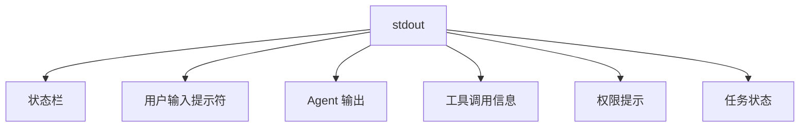
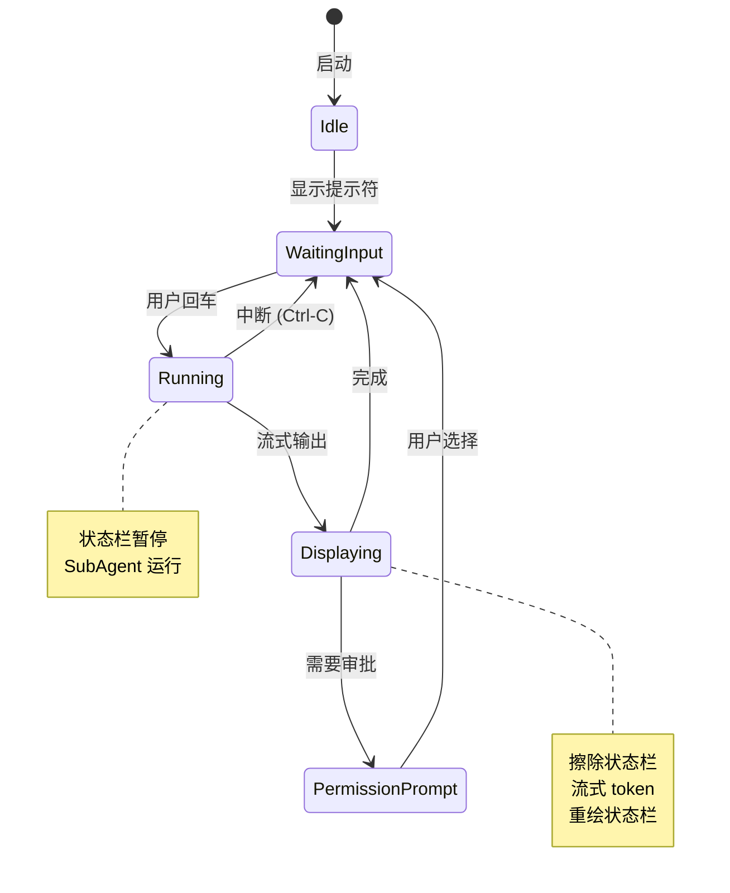

# mini-claude-code 命令行输入打印机制

## 概述

本文档详细说明 mini-claude-code 项目中所有与命令行输入、打印输出相关的功能机制。

---

## 一、核心架构

### 1.1 单流输出模型



**关键原则**：
- stdout 是唯一的输出流，所有显示文本都写在这里
- 单线程顺序写入，无竞态条件
- 状态栏通过 ANSI 转义码实现局部刷新

### 1.2 关键组件

| 模块 | 文件 | 职责 |
|------|------|------|
| 状态栏 | `orchestrator/status_bar.py` | 显示并发任务状态、执行计划 |
| 渲染器 | `renderer.py` | 封装所有富文本输出 |
| REPL 输入 | `repl_input.py` | 用户交互式输入 |
| 权限守卫 | `permissions.py` | 工具调用审批提示 |
| Agent | `agent.py` | 主循环与子 Agent 执行 |
| 任务系统 | `orchestrator/task*.py` | 并发任务管理 |

---

## 二、状态栏机制

### 2.1 状态栏设计

**文件**: `orchestrator/status_bar.py`

状态栏显示内容：
```
⚡ Tasks [██░░░░] 2/6   2 running  +3 queued: fetch-docs, analyze-api, ...
🤖 LLM   [███░░] 3/8   3 active   +1 queued: sub-agent-abc123
```

### 2.2 printing_context() 上下文管理器

**核心机制**：所有有输出的操作都必须用此上下文包裹

```python
from orchestrator.status_bar import printing_context

with printing_context():
    console.print("要显示的内容")
```

**行为**：
1. 进入：擦除状态栏 (`_erase()`)
2. 执行：你的输出代码
3. 退出：重绘状态栏 (`_draw()`)

### 2.3 状态控制

```python
pause()   # 等待用户输入前调用：擦除状态栏 + 禁止重绘
resume()  # 用户开始运行时调用：恢复重绘
_draw()   # 手动重绘
_erase()  # 手动擦除
```

**使用场景**：
- `pause()` 在 `repl_input.py` 显示提示符前调用
- `resume()` 在 `agent.run_turn()` 开始时调用

---

## 三、REPL 输入机制

### 3.1 prompt_toolkit 输入

**文件**: `repl_input.py`

**特性**：
- 光标正常显示，输入字符实时可见
- ↑↓ 键浏览历史
- Tab 自动补全命令（`/help`, `/clear`, `/tasks`, `/skill` 等）
- Ctrl-A/E 快速跳转行首行尾
- Ctrl-C 清空当前行
- Ctrl-D 退出

**降级策略**：
- 若 prompt_toolkit 初始化失败，自动降级为纯终端 `input()`
- 降级后显示简单颜色提示符：`\033[1;32mYou\033[0m❯`

### 3.2 输入与状态栏的分离

**关键点**：
- 输入通过 `prompt_toolkit` 写到 stdout
- 状态栏也写 stdout
- 通过 `pause()`/`resume()` 协调，避免冲突

**流程**：
```
用户回车
  ↓
pause() - 擦除状态栏
  ↓
显示提示符 "You ❯ " (等待输入)
  ↓
用户输入内容
  ↓
resume() - 恢复状态栏
  ↓
agent.run_turn() - 开始运行
```

---

## 四、Agent 输出机制

### 4.1 Agent 启动显示

**文件**: `main.py:run_repl()`

启动时打印：
```text
╔══════════════════════════════════════════╗
║        mini-claude-code  v0.1.0          ║
║  Type /help for commands, exit to quit   ║
╚══════════════════════════════════════════╝

ℹ  Model: claude-opus-4-5
ℹ  Project: E:\codes\mini_claude_code
ℹ  Skills available: 3
⚠  SANDBOX mode — destructive operations are blocked.
ℹ  Task manager ready (max 4 workers max)
```

所有文本来自 `prompts/fragments/cli_messages.md`

### 4.2 流式输出

**文件**: `renderer.py:StreamWriter`

**行为**：
1. 第一个 token 到来：
   - 擦除状态栏 (`_erase()`)
   - 打印 Agent 名称：`orzooo ` (蓝色加粗)
2. 每个 token：
   - 过滤掉 `<tool_use>...</tool_use>` 块（不显示给终端）
   - 实时输出到 stdout
3. 流结束：
   - 打印换行
   - 重绘状态栏 (`_draw()`)

**过滤器逻辑**：
```python
def _filter(self, token: str) -> str:
    # 过滤掉 <tool_use> 块，只显示纯文本响应
    # 保持 10 字符缓冲区防止跨 chunk 的标签被错误分割
```

### 4.3 推理内容显示

**文件**: `agent.py:_call_llm()`

推理块显示（按 LLM provider 支持情况）：

**情况 1: 支持 on_reasoning 回调（如 NVIDIA）**
```
── Reasoning ──────────────────────────────
<thinking>...</thinking> 内容逐个字符打印
───────────────────────────────────────────
```

**情况 2: 不支持流式推理**
- 非流式处理时统一显示：
```text
── Reasoning ──────────────────────────────
[dim]推理内容（淡色）[/dim]
───────────────────────────────────────────
```

**文件**: `renderer.py` 相关函数：
- `print_reasoning_header()` - 打印 "── Reasoning ───────────────"
- `print_reasoning(token)` - 逐字符打印推理 token
- `print_reasoning_footer()` - 打印分隔线

### 4.4 工具调用显示

**文件**: `renderer.py`

**工具调用开始** (`print_tool_call`):
```
⚡  bash  $ python -m uvicorn main:app --reload
```

**详细模式（--verbose）**：
```json
{
  "command": "python -m uvicorn main:app --reload",
  "timeout": 30
}
```

**工具执行结果** (`print_tool_result`):
- 自动检测内容类型（JSON/Diff/文本）
- 语法高亮
- 超长结果截断（默认 2000 字符）

**工具错误** (`print_tool_error`):
```
  ✗ bash error: [error details]
```

**工具图标映射**：
| 工具 | 图标 |
|------|------|
| bash | ⚡ |
| read_file | 📄 |
| write_file | ✏️ |
| patch_file | 🩹 |
| glob | 🔍 |
| grep | 🔎 |
| create_plan | 📋 |
| start_task | ▶ |
| complete_task | ✓ |

---

## 五、权限提示机制

### 5.1 工具分类

**文件**: `permissions.py`

**安全工具**（自动通过）：
```python
_SAFE_TOOLS = {"read_file", "list_dir", "glob", "grep",
               "web_search", "create_plan", "add_task",
               "start_task", "complete_task", "fail_task"}
```

**风险工具**（需审批）：
```python
_RISKY_TOOLS = {"bash", "write_file", "patch_file",
                "create_file", "delete_file"}
```

### 5.2 危险命令检测

**正则匹配危险模式**：
- `rm -rf` - 递归删除
- `dd` - 磁盘写入
- `mkfs` - 格式化
- `> /dev/` - 设备写入
- `sudo` - 提权
- `curl ... | bash` - 管道执行
- `chmod 777` - 全权限

### 5.3 审批交互

**审批提示** (`permissions.py:_prompt()`):
```
⚠ DANGEROUS  Tool request: bash
  $ rm -rf /tmp/cache
  (y)es  (a)lways  (n)o  (d)eny-always : _
```

**选项**：
- `y/yes` - 本次允许
- `a/always` - 以后同命令自动允许（记录模式）
- `n/no` - 本次拒绝
- `d/deny` - 以后该命令始终拒绝

**沙盒模式**：
```
🏖️  Sandbox mode — write_file was blocked
  Would have executed: write_file(docs/output.md)
```

**已拒绝工具**（会话级）：
```
⛔  bash is denied for this session.
```

---

## 六、任务系统显示

### 6.1 任务状态

**文件**: `orchestrator/task.py`

**状态枚举**：
| 状态 | 图标 | 颜色 |
|------|------|------|
| PENDING | ⏳ | dim |
| RUNNING | ⚡ | cyan |
| DONE | ✓ | green |
| FAILED | ✗ | red |
| CANCELLED | ⊘ | yellow |

### 6.2 任务表格显示

**文件**: `orchestrator/task_display.py`

**命令**: `/tasks list`

```
┌───────────────────────────────────────────────────────────────────┐
│  Tasks                                                            │
├────────┬───────────┬──────────────────────────┬────────┬──────────┤
│ ID     │ Status    │ Name                     │ Elapsed│ Tokens   │
├────────┼───────────┼──────────────────────────┼────────┼──────────┤
│ abc123 │ ✓ done    │ Fetch API documentation  │ 12s    │ 150/320  │
│ def456 │ ⚡ running│ Analyze response format  │ 5s     │ —        │
│ ghi789 │ ⏳ pending│ Generate code examples   │ —      │ —        │
└────────┴───────────┴──────────────────────────┴────────┴──────────┘
```

### 6.3 实时任务看板

**命令**: `/tasks dashboard`

**文件**: `orchestrator/task_display.py:TaskDashboard`

```
╔════════════════════════════════════════════════════════════════════╗
║  Task Dashboard                                                    ║
╠════════════════════════════════════════════════════════════════════╣
║  Tasks: 3  Running: 1  Pending: 1  Done: 1                        ║
║                                                                     ║
║   ⚡ abc123  Fetch API documentation  12s                           ║
║      [dim][12:34:56] Starting task...[/dim]                         ║
║      [dim][12:34:57] Making HTTP request...[/dim]                   ║
║   ⏳ def456  Analyze response format  —                              ║
║   ✓ ghi789  Generate code examples   8s                             ║
╚════════════════════════════════════════════════════════════════════╝
```

**刷新频率**: 4 次/秒（可配置）

### 6.4 任务日志

**命令**: `/tasks log <task_id>`

**文件**: `orchestrator/task_display.py:print_task_log`

```
⚡ [RUNNING]  Fetch API documentation  (abc123)  12s
┌─────────────────────────────────────────┐
│ Log                                      │
│ [dim][12:34:56] Starting task...[/dim]   │
│ [dim][12:34:57] Fetching from URL...[/dim]
│ ... (最多 50 行)                           │
└─────────────────────────────────────────┘
┌─────────────────────────────────────────┐
│ Output                                   │
│ (任务最终输出，最多 2000 字符)              │
└─────────────────────────────────────────┘
```

---

## 七、执行计划显示

### 7.1 执行计划树

**文件**: `orchestrator/plan.py`, `orchestrator/plan_display.py`

**命令**: `/plan`

```
╔══════════════════════════════════════════════════════════════╗
║  Execution Plan                                              ║
╠══════════════════════════════════════════════════════════════╣
║  Goal: Implement user authentication                         ║
║  Progress: 3/5 done, 1 running                               ║
║                                                               ║
║  ○ [a1] Setup database (after: a0)                           ║
║    ✓ [a1.1] Create users table                               ║
║    ✓ [a1.2] Add password hashing                             ║
║    ◉ [a1.3] Implement login endpoint (from:a1)               ║
║  ○ [a2] Add API routes (after: a1)                           ║
║      [user]                                                  ║
╚══════════════════════════════════════════════════════════════╝
```

### 7.2 来源标注

**来源徽章**：
- `[user]` - 用户手动追加（`/plan add`）
- `[from:abc123]` - 由任务 abc123 动态创建
- 无标注 - 计划初始化时创建

---

## 八、调试输出

### 8.1 LLM 调试日志

**文件**: `llm/debug_logger.py`

**启用方式**：
- 命令行：`--debug-llm` 或 `--debug-llm-console`
- 环境变量：`LLM_DEBUG=1` 或 `LLM_DEBUG_CONSOLE=1`

**日志文件位置**：`<project>/.claude/logs/llm_debug_YYYYMMDD.jsonl`

**日志格式**（每条 JSON 一行）：
```json
{
  "seq": 1,
  "ts": "2025-01-01T12:00:00+00:00",
  "event": "request",
  "provider": "nvidia",
  "model": "stepfun-ai/step-3.5-flash",
  "request": {
    "raw": {"system": "...", "messages": [...], "tools": [...]},
    "actual": {"system": "...（注入工具协议后）...", "messages": [...], "api_tools": []}
  }
}
```

**控制台输出**（`LLM_DEBUG_CONSOLE=1`）：
```
── LLM REQUEST #1  nvidia/step-3.5-flash @ 2025-01-01T12:00:00
  ▸ raw input
    (高亮 JSON 格式化)
  ▸ actual to API
    (黄色高亮，显示差异)
```

### 8.2 会话统计

**命令**: `/stats`

**文件**: `renderer.py:print_stats`

```
─── Turns: 12 | Tokens in/out: 15420/8934 | Tool calls: 24 | Elapsed: 2m 35s ───
```

---

## 九、错误与中断

### 9.1 命令错误

**文件**: `main.py:_handle_slash()`

```
✗  Unknown command: /foo. Type /help for available commands.
```

### 9.2 快捷键中断

**文件**: `main.py:run_repl()`

```
⚡ Interrupted (Ctrl-C). Type 'exit' to quit.
```

### 9.3 API 错误

```
✗  API error: [详细错误信息]
```

### 9.4 工具错误

```
  ✗ bash error: [Errno 2] No such file or directory: 'nonexistent'
```

---

## 十、会话管理输出

### 10.1 Session 命令

**命令**: `/session`

```
Current session:
  ID   : abc123def456
  File : E:\projects\myapp\sessions\abc123.json
  Turns: 15  Tokens: 20150/12300
```

### 10.2 Session 列表

**命令**: `/session list`

表格显示最近 20 个会话：
| ID | Title | Age | Model | Turns | Tokens |
|----|-------|-----|-------|-------|--------|
| abc123 | Implement auth | 5min | claude-opus-4-5 | 15 | 20150/12300 |
| def456 | Fix bug in API | 1h | claude-opus-4-5 | 8 | 8900/5600 |

### 10.3 Session 操作

```
✓  Saved → E:\projects\myapp\sessions\abc123.json
✓  Resumed [def456] — 42 messages loaded
✓  New session started.
✓  Deleted session 'xyz789'.
```

---

## 十一、Skills 系统输出

### 11.1 Skills 列表

**命令**: `/skills`

```
Available skills:
  python-expert
  browser-use
  database-tools
```

### 11.2 Skill 激活/切换

```
📚 Skill loaded: python-expert
✓  Skill 'python-expert' activated.
✓  Skill 'browser-use' deactivated.
```

**自动激活**：根据用户输入关键词自动加载相关技能

---

## 十二、并发控制显示

### 12.1 并发状态

**命令**: `/concurrency`

```
Concurrency status:
  Tasks  : [cyan]2 running[/cyan] / 6 max  (+3 queued)
  LLM    : [blue]3 active[/blue] / 8 max  (+1 queued)
  Queued tasks: fetch-docs (5s), analyze-api (3s), generate-test (1s)
  Queued LLM : sub-agent-abc123 (7s)
```

### 12.2 设置并发限制

```text
✓  Max concurrent tasks → 8
✓  Max concurrent LLM calls → 12
```

---

## 十三、Provider 管理

### 13.1 Provider 信息

**命令**: `/provider info`

```
ℹ  Current LLM: <LLMClient: provider=anthropic, model=claude-opus-4-5>
```

### 13.2 Provider 列表

```
Registered providers:
  anthropic
  openai
  ollama
  nvidia
```

### 13.3 切换 Provider

```
ℹ  Switched to openai / gpt-4-turbo
```

---

## 十四、输出样式表

### 14.1 文本样式

**文件**: `renderer.py`

| 类型 | 函数 | 样式 |
|------|------|------|
| 信息 | `print_info()` | [blue]ℹ[/blue] + 消息 |
| 警告 | `print_warning()` | [yellow]⚠[/yellow] + 消息 |
| 错误 | `print_error()` | [red]✗[/red] + 消息 |
| 成功 | `print_success()` | [green]✓[/green] + 消息 |
| 中断 | `print_interrupt()` | [yellow]⚡[/yellow] + 消息 |

### 14.2 代码高亮

**文件**: `renderer.py`

```python
# JSON 代码
console.print(Syntax(json_str, "json", theme="ansi_dark"))

# Diff 格式
console.print(Syntax(diff_str, "diff", theme="ansi_dark"))

# Markdown
console.print(Markdown(md_content))
```

### 14.3 表样式

**Rich Box 样式**：
- `box.ROUNDED` - 圆角边框
- `box.SIMPLE` - 简单横线
- `box.HEAVY` - 粗边框

**列对齐**：
- 文本左对齐（默认）
- 数字右对齐 (`justify="right"`)

---

## 十五、状态流转图



---

## 十六、关键代码路径

### 16.1 主循环调用链

```
main.py:main()
  └─ load_config()
  └─ init_concurrency()
  └─ start_status_bar()
  └─ run_repl()
      └─ get_repl_input().prompt()
      └─ agent.run_turn()
          └─ _call_llm()
          └─ _execute_tools()
              └─ R.print_tool_call()
              └─ R.print_tool_result()
```

### 16.2 状态栏完整流程

```
status_bar.py
  _erase() → 发送 ANSI 转义码：\x1b[{n}A\x1b[0J
  _draw()  → 重建状态栏内容并写入 stdout
  printing_context() → 上下文管理器，确保 erase → 输出 → draw
```

### 16.3 流式输出完整流程

```
agent.py:_call_llm()
  └─ R.print_assistant_prefix() → 擦除状态栏 + 打印 "orzooo "
  └─ R.StreamWriter.write() → 逐个 token 过滤输出
  └─ R.StreamWriter.flush() → 换行 + 重绘状态栏
```

---

## 十七、环境检测

### 17.1 TTY 检测

```python
def _is_tty() -> bool:
    return hasattr(sys.stdout, "isatty") and sys.stdout.isatty()
```

**用途**：
- 非 TTY 环境（管道/重定向）：禁用状态栏
- TTY 环境：完整富文本输出

### 17.2 Windows 兼容性

- Windows 11 + bash (WSL2 或 Git Bash)
- ANSI 转义码支持：Windows 10+
- 使用 `forward slashes` 路径分隔符

---

## 十八、可配置项

### 18.1 命令行参数

| 参数 | 说明 |
|------|------|
| `--verbose / -v` | 显示工具调用 JSON |
| `--sandbox` | 沙盒模式（禁止破坏性操作） |
| `--yes / -y` | 自动审批所有工具调用 |
| `--no-stream` | 禁用流式输出 |
| `--debug-llm` | 启用 LLM 调试日志 |
| `--debug-llm-console` | 同时在控制台打印调试信息 |
| `--workers <n>` | 最大并发子 Agent 数 |
| `--max-llm-calls <n>` | 最大并发 LLM 调用数 |

### 18.2 环境变量

| 变量 | 说明 |
|------|------|
| `ANTHROPIC_API_KEY` | API 密钥 |
| `LLM_PROVIDER` | LLM 提供商（anthropic/openai/ollama/nvidia） |
| `LLM_DEBUG` | 启用调试日志（1/true/yes） |
| `LLM_DEBUG_CONSOLE` | 控制台调试输出（1/true/yes） |
| `LLM_DEBUG_LOG_DIR` | 调试日志目录 |
| `CLAUDE_MODEL` | 默认模型 |
| `MAX_LLM_CALLS` | LLM 并发限制 |
| `SESSION_DIR` | Session 文件目录 |

### 18.3 运行时切换

```python
# 切换 verbose 模式
/verbose  # Toggle

# 切换模型
/model claude-haiku-4-5

# 切换 provider
/provider switch openai gpt-4-turbo

# 修改并发限制
/concurrency tasks 8
/concurrency llm 12
```

---

## 十九、总结

### 19.1 设计原则

1. **单流输出** - 所有显示文本通过 stdout，无竞态
2. **状态栏分离** - 通过 ANSI 转义码局部刷新，不影响主输出
3. **上下文管理** - 所有输出通过 `printing_context()` 保证一致性
4. **富文本支持** - 利用 Rich 库提供颜色、图标、表格
5. **降级兼容** - prompt_toolkit 失败时自动降级为简单 input()
6. **模块化输出** - 所有显示文本通过 PromptManager 统一管理

### 19.2 文件清单

| 文件 | 主要功能 |
|------|----------|
| `orchestrator/status_bar.py` | 状态栏管理 |
| `renderer.py` | 输出渲染 |
| `repl_input.py` | 用户输入 |
| `agent.py` | Agent 输出逻辑 |
| `permissions.py` | 权限提示 |
| `orchestrator/task_display.py` | 任务 UI |
| `orchestrator/plan_display.py` | 计划 UI |
| `llm/debug_logger.py` | 调试日志 |
| `prompts/fragments/*.md` | 文本模板 |

### 19.3 扩展点

- 新工具：在 `tools/builtin.py` 中添加，自动注册图标
- 新提示文本：在 `prompts/fragments/` 中添加条目
- 新显示样式：在 `renderer.py` 中添加辅助函数
- 新状态栏内容：在 `status_bar.py` 中扩展 `_build_status_lines()`

---

**文档版本**: 1.0
**最后更新**: 2026-05-31
**作者**: auto-generated
