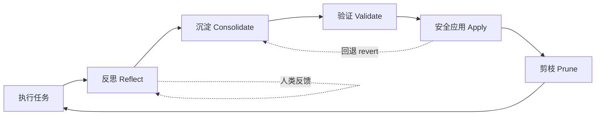

# mini_agent 自我进化设计文档

> 本文档整合了关于 mini_agent "自我进化"能力的整体设计讨论，覆盖：经验反思、技能沉淀、评估反馈、SubAgent 协作、安全网（风险分级 + 版本化 + 副本化运行），以及若干补充机制。定位是**架构设计稿**，用于指导后续分阶段实施，不是最终代码规范。

---

## 1. 核心理念：一个闭环

自我进化不是某个单点功能，而是一个闭环：



- **反思（Reflect）**：从一次任务执行中提炼"经验信号"——可能是自我反思生成的，也可能是用户的直接纠正（后者质量更高）。
- **沉淀（Consolidate）**：当某类经验反复出现/置信度足够高时，把它变成可复用资产——新的 skill、调整后的 profile 偏好、甚至代码改动。
- **验证（Validate）**：在副本环境里验证"沉淀的东西是否真的有用"，不影响主体。
- **安全应用（Apply）**：通过分级门槛后，把改动合并回主体，全程可追溯、可回退。
- **剪枝（Prune）**：定期清理过时/冗余/冲突的经验与技能，对抗系统熵增——**没有这一步，前面四步做得越好，系统越快变臃肿**。

两条关键原则贯穿全文：

1. **风险分级，而非一刀切**：改动的对象不同（数据 / 声明式配置 / 代码 / 治理代码本身），验证强度和合并门槛应该不同。
2. **安全网代码自身受最高级保护**：agent 不能在没有最高级人工确认的情况下，修改用来约束自己的那部分代码/规则。

---

## 2. 分阶段路线图总览

| Phase | 主题 | 产出 | 依赖 |
|---|---|---|---|
| A | 基础设施清债 | history `_type` 字段化、SubAgent 输出去截断、config 拆分 | 无 |
| B | 反思层：Lesson Memory | 结构化 lesson 条目 + SessionEnd/规则触发 | A |
| F | 安全网：风险分级 + 版本化 + 副本化运行 | StateRepo / EvolutionWorkspace、risk tier 门控 | B（lesson 作为 commit 元数据来源） |
| C | 沉淀层：skill_propose | evolve 分支形式的 skill 草稿 | B, F |
| D | 验证层：Eval 反馈环 | 副本内 eval 对比报告 | F |
| E | 协作层：SubAgent 信息继承 | inherited_skills、共享缓存、lesson 回流 | B |
| G | 自主/后台循环 | 定期 consolidation、剪枝、能力地图刷新 | A–F 全部 |
| H | 自主运行时 | daemon 化、AgentSelfProfile、Goal Backlog、调度器、活动摘要 | A–G 全部（前述机制是 daemon 自主行为的"内容来源"），且受 7.9 节分级开关约束 |

> **建议起步顺序**：A → B（先做规则触发，成本低见效快）→ F（趁早搭安全网，C 直接依赖它）→ C → D → E → G → H（H 是否启用、启用到哪一档由 7.9 节的分级开关决定，不是"做完 G 就自动进入 H"）。
> 这一顺序与此前讨论一致，本文档不再重复展开 A/B/D/E 的细节背景，重点放在 F（安全网）、H（自主运行时）以及若干补充机制。

---

## 3. Phase B 回顾：Lesson Memory（作为后续所有机制的输入）

在 `MemoryEntry` 基础上新增 `entry_type` 字段：

```python
@dataclass
class MemoryEntry:
    ...
    entry_type: str = "summary"        # "summary" | "lesson" | "capability_map"
    # lesson 专属字段
    trigger: str = ""                  # 触发场景描述
    outcome: str = ""                  # 实际发生了什么
    root_cause: str = ""               # 根因（如有）
    suggested_action: str = ""         # 下次该怎么做
    confidence: float = 0.5            # 0-1
    occurrence_count: int = 1          # 同类 lesson 重复出现次数
    source: str = "self_reflection"    # "self_reflection" | "human_feedback" | "revert_record"
```

**触发机制（两条线）**：

1. **SessionEnd hook**（目前是预留未接的事件）：会话结束时跑一次反思 LLM 调用，基于 `tool_stats` + 最后若干轮 history（依赖 Phase A 的 `_type` 字段精确截取"用户意图轮"），输出结构化 lesson 候选。
2. **规则触发（不等会话结束）**：同一工具连续失败 ≥ N 次、或"权限拒绝后重试成功"这类纠错过程出现时，立即用模板生成轻量 lesson，成本低、响应快。

`source` 字段是本文档新增的关键维度——见第 6.2 节。

---

## 4. Phase F：安全网详细设计

### 4.1 范围：单一 repo，按"改动对象"分风险等级

早期方案曾尝试把"agent 自身状态"（`.agent/` 下的 skill/memory/profile/config）和"项目代码"分成两个独立版本域。**这个划分已被否定**：如果"一切都可能被改"（包括项目代码、甚至安全网代码本身），分域就站不住——一次有意义的改进往往是跨这些文件的组合（新工具代码 + 配套 skill + CLAUDE.md 更新本就该是一个 commit）。

**结论**：全部纳入项目自身的 git 仓库管理（`.agent/sessions/`、`cache/`、原始 `memory.jsonl` 等纯日志数据继续 `.gitignore`，不算"资产"）。区分点从"放在哪个目录"变为"改动的是什么"——即风险分级（Risk Tier）：

| Tier | 改动对象 | 验证方式 | 合并门槛 |
|---|---|---|---|
| **T0** 数据 | lesson/memory 条目、profile 偏好、工具调用统计 | schema 校验 | 自动 apply，靠 revert 兜底 |
| **T1** 声明式资产 | `SKILL.md`、`CLAUDE.md`、自定义 subagent 配置、`permissions.json` | 加载校验 + eval 场景对比 | eval 通过可自动合并，否则人审 |
| **T2** 普通代码 | 新工具实现、非核心模块 | lint + 类型检查 + 单测 + 副本进程内 smoke test + eval 对比 | **强制人审**，eval 数据作参考 |
| **T3** 治理/安全核心 | `agent.py` 主循环、权限系统、hooks loader、**安全网自身代码** | 同 T2，且 diff 必须显式标红 | **强制人审 + 不可被 agent 自我批准**，无论 eval 结果如何 |

**T3 是最关键的一条**：风险分级逻辑、merge 门槛判定、worktree 隔离逻辑本身都属于 T3。维护方式是一份**写死在 agent 可写范围之外**的"受保护路径清单"（可以是单独的小脚本/CI 配置），凡是触及这些路径的分支，无论 eval 结果如何都标记为"需要人工最终确认"，且这个标记逻辑本身也不在受保护路径之外的代码里——避免"一次看起来合理的自我改进"悄悄把 T3 门槛改成 T1。

### 4.2 安全更新：StateRepo.apply() 作为唯一写入入口

```python
class StateRepo:
    """对项目 git 仓库的封装。所有"自我修改"必须经过 apply()，
    不允许任何模块绕过它直接写文件。"""

    def __init__(self, root: Path):
        self.root = root
        self._ensure_initialized()

    def apply(
        self,
        changes: dict[Path, str | None],   # path -> 新内容（None 表示删除）
        message: str,
        meta: dict,                        # entry_type, source_lessons, session_id, confidence...
        tier: str,                         # "T0" | "T1" | "T2" | "T3"
        validators: list[Callable] = (),
    ) -> str:
        """原子写入 + 按 tier 校验 + commit，返回 commit hash。
        校验失败则不落盘、不 commit。"""

    def log(self, limit: int = 20) -> list[CommitInfo]: ...
    def diff(self, ref_a="HEAD~1", ref_b="HEAD", path=None) -> str: ...
    def revert(self, commit: str) -> str: ...
    def checkout_file(self, commit: str, path: Path) -> None: ...
```

**commit message 结构化规范**：

```
[T1][skill_propose] Add bash-rm-safety skill

source_lessons: lesson_2026061501, lesson_2026061203
session_id: sess_xxxxx
confidence: 0.82
occurrence_count: 4
proposed_by: evolution-agent
```

任何"自我修改"都必须能从 commit message 反查到它来自哪些 lesson、哪个角色提出——这是第 6.4 节"剪枝/冲突检测"和第 6.6 节"能力地图"的数据基础。

### 4.3 版本回退

- `/evolution log` → `StateRepo.log()`，每条 commit 都带结构化元信息，人能直接看出"这是哪次反思触发、改了什么"。
- `/evolution revert <commit>` → 默认 `git revert`（生成新 commit 撤销改动），**不用 `git reset --hard`**——"试过 X、效果不好、已回退"本身是历史的一部分。
- 支持**文件级回退**：`checkout_file(commit, path)` 只撤销某次修改里的一个文件，不影响同次 commit 的其他改动。
- **回退记录反哺 lesson 库**：每次 revert 生成一条 `source="revert_record"` 的 lesson（"曾提案 X 方向的改动，eval 显示 token 消耗上升 30%，已回退，不建议同方向再尝试"），形成闭环（见第 1 节图中的虚线）。

### 4.4 分支与合并：evolve 分支取代"pending 目录"

**统一洞察**：Phase C 原本设想的"`skills/pending/` 待审目录"，可以直接用 git branch 替代——不需要额外约定。

- 一次"进化尝试" = 创建分支 `evolve/<date>-<short-desc>`，agent 在分支上正常 `apply()`。
- **审核 = `git diff main..evolve/xxx`**；**批准 = merge**；**拒绝 = 删分支**，main 不受影响。
- 多个并行尝试天然互不干扰（不同 skill 各自一个目录、不同代码模块）。

**冲突处理**：

- T2/T3（代码）：标准 `git merge` 即可——文本级 diff/merge 对代码的成熟度远高于对结构化配置，不需要额外发明机制。
- T0/T1（结构化文件，如 `profile.json`、`permissions.json`）：降低冲突概率的设计原则是"新增优先于改写"（profile 的 derived 部分追加键值而非重写 section；每个 skill 独立目录）。真正冲突时，走**语义合并**：把 base/ours/theirs 三份内容 + 各自 commit message 喂给 LLM 生成合并版本，**合并结果仍需过 4.6 节的验证流水线**才能 commit；过不了校验则降级为传统 git 冲突标记，丢给人工。

### 4.5 副本化运行：进程级隔离

T2/T3 改动涉及代码，"副本"不能只是换数据路径，必须是**独立进程**：

```
EvolutionWorkspace.create(branch="evolve/xxx")
  → git worktree add /tmp/evolve/xxx -b evolve/xxx     # 完整代码+资产副本，共享对象库，近零成本
  → 若依赖文件有变化，建独立 venv
  → subprocess: python -m mini_agent --cwd /tmp/evolve/xxx \
       --eval-scenarios test_cases/ \
       --sandbox-permissions strict \
       → 结果写入 /tmp/evolve/xxx/.agent/eval_result.json
```

- 主进程只读 `eval_result.json` 做对比，不与副本进程直接交互（最小化通信面）。
- `--sandbox-permissions strict`：副本里跑的是未经验证的代码，工具权限应比主进程更严格，即使代码有问题，破坏面也限制在 worktree 目录内。
- **代码改动天然延迟生效**：主进程已加载旧版本模块，文件改动不影响当前运行实例，这本身是一层天然的安全边界（不同于 `permissions.json` 这类"立即影响正在跑的会话"的改动）。
- 多个 evolve 分支可以并行创建多个 worktree，互不干扰，最后只 merge 验证通过的那个，其余直接 `git worktree remove --force` + 删分支，不留痕迹。

### 4.6 验证流水线：随 tier 升级

| Tier | 验证内容 |
|---|---|
| T0 | schema 校验 |
| T1 | schema/加载校验 + eval 场景对比（tool 失败率 / turns / token） |
| T2 | lint + 类型检查 → 现有单测全过 → 副本进程 smoke boot（能跑起来、完成最简对话不崩）→ eval 场景对比 |
| T3 | 同 T2，且 diff 必须显式标红展示，强制人审 |

任意一层失败即标记"未通过"，**不进入人审队列**（避免低质量提案淹没人工审核）；全部通过后，T0/T1 可自动合并，T2/T3 进入人审队列，T3 额外触发"受保护路径"标记。

### 4.7 操作可逆性分级（独立于代码风险 tier）

某些操作即使在副本进程里跑，副作用也是真实的——发邮件、调用外部 API、改 git remote、删真实文件。"在副本里跑一遍看效果"本身可能造成不可逆影响。

| 操作类型 | 副本中的处理方式 |
|---|---|
| 纯本地可逆（读文件、改本地代码、跑测试） | 直接真实执行 |
| 有外部副作用但支持 dry-run | 强制 dry-run，只验证"参数是否合理"，不验证真实业务结果 |
| 不可逆且无 dry-run（发邮件、删远程资源） | 自动 mock，eval 报告标注"此项未经真实验证"，留给人工判断 |

---

## 5. Phase C/D/E 回顾（与安全网的衔接）

- **Phase C（skill_propose）**：本质是在 evolve 分支上调用 `StateRepo.apply()` 写入 `skills/<name>/SKILL.md`，tier=T1。触发条件：lesson 的 `occurrence_count` 超过阈值（阈值随 `source` 不同，见 6.2）。
- **Phase D（eval 反馈环）**：复用 `test_cases/` 作为回归集，提供 `mini-agent eval --scenario ... --with-skill/--without-skill` 对比命令；4.5 节的副本化运行天然产出 eval 数据。
- **Phase E（SubAgent 信息继承）**：`spawn_agent` 时把 `active_skills` 写入 `Task`，SubAgent 按名称激活；共享带锁的 `ToolResultCache`；**新增**：SubAgent 触发的规则型 lesson 也汇总回主 agent memory，而不是只存在 `TaskRecord.log_lines` 里随任务结束被遗忘。

---

## 6. 补充机制

### 6.1 角色分离：专职的"进化者" subagent

复用现有的 `agent_profiles.py` 自定义子 agent 机制（`.agent/agents/*.md`，frontmatter 定义 `tools`/`inputs`，正文是 prompt 模板），定义一个 `evolution-agent` profile：

- 工具集：仅暴露"读 lesson memory、聚类、`skill_propose`、`StateRepo` 操作、eval 跑分"，不暴露普通任务工具。
- Prompt：专注于"给定一批 lesson，判断是否值得提案、生成 SKILL.md 草稿、写 eval 报告"。
- 触发：`/evolve review`（人工）或 SessionEnd hook 里"待处理 lesson 数量超过阈值"时异步 spawn。

好处：日常任务 agent 的 prompt/工具集保持精简，不需要常年背着"管理自我进化"的指令；进化角色独立、可审计、可单独限速。**几乎不需要新框架代码**，主要是新增几个工具供该 profile 调用。

### 6.2 人类反馈：最高质量、最低成本的信号源

用户在对话中常给出直接纠正（"不对，应该用 patch_file"、"下次记得先跑测试"），这是 ground truth，可信度远高于自我反思，产生成本几乎为零。

- 加一个轻量"纠正检测"（规则式：识别"不对/不要/应该/下次记住"等短语；或低成本小模型分类），识别出的纠正立即转成 `entry_type="lesson"`、`source="human_feedback"`、较高 `confidence`。
- **`source="human_feedback"` 的 lesson，触发 `skill_propose` 的 `occurrence_count` 阈值应明显低于自反思 lesson**——一次明确的人类纠正，价值上可能等于三次自我猜测的 lesson。

### 6.3 Eval set 自我扩充：lesson → test_cases

`test_cases/` 目前是静态手写场景集，覆盖面不会自动跟上 agent 实际遇到的新坑。

- 每条达到 `skill_propose` 门槛的 lesson，同时生成一条 `test_cases/lesson_<id>.md`：内容是 `trigger` 描述的场景 + `outcome` 中记录的"要避免的失败模式"。
- 该场景先用于验证对应提案是否解决问题，验证通过后**永久留在 eval 集里作为回归测试**——eval 集和经验库同步生长。

### 6.4 熵增对抗：剪枝、去重、冲突检测

只长不剪必然导致：skill 过多 → context 膨胀 → "lost in the middle"，整体表现下降；lesson 重复/过时/互相矛盾，检索时同时召回会让 agent 行为摇摆。建议作为 Phase G 后台循环的**核心**内容：

- 定期对语义相近的 lesson 聚类——`outcome` 一致的合并（提高 `occurrence_count`，保留最新 `suggested_action`）；`suggested_action` 冲突的标记"冲突待审"，交给 evolution-agent。
- 结合 `skill_usage_stats`（现有调用次数统计）与 eval 结果，长期"激活但无可衡量改善、且很久未被实际触发"的 skill，降级到 `skills/deprecated/`（不删除，可恢复）。

> 优先级评估：本文档建议将 6.2（人类反馈通道）和 6.4（剪枝/去重）列为**第一批补充机制**——前者几乎零成本但信号质量最高，后者是防止系统长期"变笨"的必要条件，且当前设计完全未覆盖这一面。

### 6.5 Scope 晋升：workdir → global

某条 workdir 级 skill 经 eval 验证有效、使用次数足够、且内容不依赖该项目特有的路径/技术栈名词（可由 evolution-agent 检查），可提案"复制到 `~/.agent/skills/`（global scope）"——本身也是一次 evolve 分支，走同样的 T1 门槛。使自我进化的成果跨项目复利。

### 6.6 能力地图（Capability Map）

`entry_type="capability_map"`，scope=global，定期由 evolution-agent 派生生成（不需要额外采集）：把 lesson 按 `trigger` 类别（git 操作/权限相关/MCP 调用/长文件编辑……）聚合，结合各工具错误率统计。

用途：
- **指导委托**——spawn SubAgent 时，对历史错误率高的任务类型主动多塞相关 lesson/skill，或采用更谨慎的执行路径；
- **指导求助时机**——遇到能力地图标记"高错误率"的任务，更早向用户确认而非反复试错。

### 6.7 演化节奏治理

证据门槛随 tier 递增 + 频率限速，避免提案过多导致审核疲劳或行为不稳定：

| Tier | 触发条件 |
|---|---|
| T0 | `occurrence_count ≥ 1` 即自动 apply（影响小，revert 成本低） |
| T1 | `occurrence_count ≥ 3` 且来自不止一个 session |
| T2/T3 | `occurrence_count ≥ 5`，且至少一条来源为 `human_feedback` |

另设每周提案数上限，超出的 lesson 继续累积计数但不立即触发分支。

### 6.8 远期备选：模型层微调

"一切都能进化"的终极形态是模型本身的微调，但需要训练 infra，超出 agent 框架范畴。现阶段不需要为此特别设计——本文档强调 commit message 携带 `source_lessons`、lesson 结构化存储，本身就是在积累未来可用的种子数据集，届时数据已经就位。

---

## 7. Phase H：自主运行时

> 这一阶段是性质上的跃迁：前面 A–G 都是"agent 能不能改进自己"，Phase H 是"agent 能不能**有自己的事要做**"——从"被调用才存在"变成"持续存在，用户交互是其中一个输入通道"。A–G 设计的机制（lesson、skill、eval、安全网、剪枝、能力地图）是 Phase H 自主行为的"内容来源"；Phase H 提供的是让这些内容**在没有用户触发的情况下也能跑起来**的运行时。

### 7.1 运行形态：daemon 作为主体，现有接口降级为通道

`api/bridge.py` 里的 `AgentBridge` + `InputQueue` + `OutputBroadcaster` 已经是"长驻进程 + 队列"的雏形，只是目前队列里只有"用户发来的消息"。daemon 化的核心改动：**`InputQueue` 支持塞入"自主产生的任务"**，CLI/Web demo/HTTP API 全部降级为连接到这个常驻进程的"客户端"——角色从"驱动 agent 运行"变成"观察 agent 在做什么 + 偶尔插一句话"。

没有任何客户端连接时，daemon 也在跑：处理 goal backlog、跑周期性任务、做 memory consolidation。用户打开任意客户端，看到的是"daemon 现在在做什么 + 最近做了什么"，而不是"启动一个新会话"。

### 7.2 自我模型（AgentSelfProfile）

与现有 `profile.py`（关于*用户*的画像）平行存在，但内容完全不同——是 agent 关于"自己"的结构化档案，每次"醒来"（daemon tick 或被用户唤起）时用来回答"我是谁、我现在该做什么、我手头有多少预算"：

```json
{
  "identity": {
    "purpose": "Otz 的 mini_agent 项目协作者：日常协助开发，同时维护和演进项目自身",
    "constraints_ref": "CLAUDE.md + safety net risk tiers（见第 4 节）"
  },
  "current_focus": "实现 Phase B 的 lesson memory 反思机制",
  "goal_backlog_ref": ".agent/goals.json",
  "capability_map_ref": "memory entry_type=capability_map（见 6.6）",
  "resource_budget": {
    "daily_token_budget": 200000,
    "used_today": 45000
  },
  "autonomy_level": "passive",        // 见 7.9
  "recent_activity_log": [...]
}
```

`identity.constraints_ref` 显式引用约束来源（而不是把约束散落在各处）；`autonomy_level` 是 7.9 节分级开关的落点。这份档案是"自我意识"在工程上的对应物——一份持久的、结构化的自我状态，不涉及也不需要涉及哲学意义上的意识讨论。

### 7.3 长期目标管理：Goal Backlog

现有 `orchestrator/task_manager.py` 的调度是**会话内**的任务依赖图，session 结束这个图就消失。自主 agent 需要一个**跨会话、跨时间持久存在**的目标层级，比现有 TaskManager 的 DAG 高一层：

```
Goal（长期，周/月级，用户设定或经反思 derived）
 └─ Objective（中期，天级，agent 自主拆解）
      └─ Task（具体可执行，复用现有 TaskManager/SubAgent 机制）
```

持久化为 `.agent/goals.json`，每个节点有 `status`（active/blocked/done/abandoned）、`progress_notes`、`last_touched_at`。daemon 的自主 tick 主要就是在操作这棵树：检查有没有 active 但长期没进展的 Objective，决定要不要拆出新 Task 去推进。

**关键区分**：Goal 按来源分"硬目标"（用户直接设定）和"软目标"（agent 自己 derive，比如"我发现自己在 X 类任务上经常出错，应该专门解决"）。软目标在执行前应在 7.6 节的活动摘要里给用户一次轻量可见性——不一定要打断，但不能在用户完全不知情的情况下持续推进数周（避免"目标漂移"）。

### 7.4 调度器：tick 循环与周期性任务

```python
class AutonomousLoop:
    def tick(self):
        # 1. 检查到期的周期性任务（cron 风格）
        for job in self.scheduler.due_jobs():
            self.input_queue.push(SyntheticTask(job, initiator="scheduled"))

        # 2. 检查 goal backlog，决定是否需要新建 Objective/Task
        if self.input_queue.is_idle() and self.goal_backlog.has_actionable_work():
            task = self.goal_backlog.next_task()
            self.input_queue.push(task)  # initiator="autonomous"

        # 3. 否则空转，等待用户消息或下一次 tick
```

典型周期性任务，把 A–G 已设计的后台机制接上触发时机：每天跑一次 memory consolidation（6.4 剪枝去重）；每周跑一次 evolution-agent review（6.1，聚合 lesson、生成 evolve 分支提案）；定期刷新 capability map（6.6）；`file_watcher.py` 从被动轮询变为 tick 驱动的主动检查。这些机制本身在前面章节已经设计好，Phase H 只是给它们一个不依赖用户在场的触发时机。

### 7.5 并发与资源仲裁

daemon 同时承载"自主任务"和"用户对话"会产生冲突——用户在改一个文件，自主任务恰好也想改同一个文件；或者用户发消息时，daemon 正在跑耗时的自主任务，占着 LLM 调用配额。仲裁规则：

- **用户交互优先**：`InputQueue` 里用户消息永远插队到自主任务前面；自主任务正在执行且涉及和当前用户请求重叠的文件/资源时**暂停**（不杀掉，状态保存回 goal backlog，标记"被用户交互打断，下次 tick 继续"）。
- **资源锁**：自主任务执行前检查将要触碰的路径是否和"最近 N 分钟内有用户活动"的路径重叠，重叠则该 Task 回到 backlog 排队。
- **预算硬限制**：`resource_budget.daily_token_budget` 是自主任务的硬上限——用户交互不受此限制（用户请求总要响应），但自主 tick 发现"今日自主预算已用尽"时，跳过本次 tick 的自主部分，只处理周期性轻量任务（如成本低的 consolidation）。

### 7.6 主动汇报：活动摘要

agent 自主干的事，用户得知道，但不能每完成一个 Task 就推送一条消息（审核疲劳问题见 6.7）。daemon 维护一个"活动摘要"（`.agent/activity_digest.jsonl`，每条自主 Task 完成后追加一条精简记录），用户下次打开任意客户端时，第一屏展示"自上次交互以来，我做了这些事"——形式类似"晨报"。

涉及 evolve 分支的自主提案（第 4 节 Phase F）应在晨报里单独列出"有 N 个待审的进化提案"，不与普通活动混在一起——这部分天然对应人审队列。7.3 节提到的"软目标"创建，也应出现在晨报里。

### 7.7 对安全网的影响：initiator 字段与 tier 上浮

A–G 设计的安全网（风险分级、evolve 分支、副本化运行）在"agent 只在用户主动请求时行动"的世界里是一层很扎实的保护。但**一旦 agent 能自主创建和执行任务，安全网从"重要"变成"前提"**——没有用户实时在场做最后一道把关。具体调整：

- `StateRepo.apply()`（4.2 节）新增 `initiator: "user" | "autonomous" | "scheduled"` 参数。**自主/调度发起的改动，tier 整体上浮一级**：用户主动要求的 T0 改动可以直接 apply；同等改动若由自主 tick 发起，至少要走 evolve 分支留痕——区别只在"是否需要人审"，但"是否留痕、是否可 revert"不能因发起方是自主而降低标准。
- 7.3 节"软目标"的创建本身建议视为一种轻量提案——不需要走完整 evolve 流程，但必须出现在 7.6 节的活动摘要里。
- T3"安全网代码自身受保护"这条规则的重要性进一步提升：daemon 持续运行意味着"自主修改安全网代码"一旦发生，影响的不是某一次会话，而是之后所有自主周期——这进一步说明 T3 清单和判定逻辑必须在 agent 可写范围之外维护（见 4.1）。

### 7.8 实现路径：复用与新增对照表

| 模块 | 现状 | Phase H 需要做的 |
|---|---|---|
| `AgentBridge`/`InputQueue` | 已有长驻进程+队列雏形 | 队列支持"自主产生的合成任务"，区分 `initiator`（见 7.7） |
| `TaskManager._scheduler_loop` | session 内 DAG 调度 | 上层加一个跨 session 的 `AutonomousLoop`（7.4），定期把 Objective 拆解出的 Task 推给现有调度器 |
| `agent_profiles.py` 自定义子 agent | 已支持定义角色 | 定义"autonomous-worker"角色，执行自主 Task 时用，权限默认更严格（呼应 7.7） |
| `file_watcher.py` | 被动轮询 | 接入 `AutonomousLoop` 的 tick，作为一种周期性任务 |
| `profile.py` | 用户画像 | 平行新增 `AgentSelfProfile`（7.2），独立存储、独立 schema |

### 7.9 自主性分级开关

Phase H 做完，mini_agent 在行为上接近"持续运行、有自己议程的实体"——这和最初"AI agent framework / 编程助手"的产品定位之间，用户的信任模型和期望是不一样的。"帮我改个 bug"和"你自己决定花三天时间研究怎么改进自己"，风险容忍度完全不同。

因此 Phase H **不是非全有或全无**，`AgentSelfProfile.autonomy_level` 设三档：

| 档位 | 行为范围 |
|---|---|
| `passive` | 完全被动响应，daemon 仅做最轻量的周期性维护（如 memory consolidation），不创建 Goal/Objective，goal_backlog 为空 |
| `maintenance` | 在 `passive` 基础上启用 7.4 的周期性任务（evolution-agent review、capability map 刷新、file watcher），但不自主 derive 新 Goal |
| `autonomous` | 完全启用 Goal Backlog 的软目标 derive 与执行 |

默认建议 `passive` 起步，逐档开放。修改 `autonomy_level` 本身属于 T1（声明式配置），但**影响面大，建议即使 eval 通过也强制走人审**——不应被 6.7 节的"T1 eval 通过可自动合并"规则覆盖,这是 4.1 节风险分级表之外需要单独标注的一条特例。

---

## 8. 实施优先级建议

```
A（基础设施清债）
  └─ B（lesson memory，先做规则触发）
       └─ F（安全网：StateRepo + risk tier + worktree 副本）
            ├─ C（skill_propose，evolve 分支形式）
            │     └─ D（eval 反馈环）
            ├─ 6.2（人类反馈通道）—— 可与 B 同步做，成本低
            └─ E（SubAgent 信息继承）
                 └─ G（后台循环：consolidation + 6.4 剪枝 + 6.6 能力地图）
                      └─ H（自主运行时：daemon + AgentSelfProfile + Goal Backlog）
                           　 ← 是否进入 H、进入到哪一档由 7.9 节 autonomy_level 决定
```

6.1（角色分离）建议在 C 落地后引入，作为"进化者"角色的载体；6.5、6.7、6.8 属于治理层面的精细化，可在 G 阶段逐步补充。H 不应被当作"做完 G 自动顺延"的下一步，而是一次独立的、需要 Otz 显式决策"是否要让 mini_agent 变成一个持续运行的实体"的产品方向选择。

---

## 9. 开放问题 / 后续需要决策的点

1. **T1 自动合并的边界**：eval 通过就自动合并 T1 改动，门槛设多严？是否需要"观察期"（合并后先在主体上跑 N 个 session，确认无负面影响才算"稳定"）？
2. **语义合并的可靠性**：4.4 节的 LLM 语义合并本身也需要验证流水线把关，但"用 LLM 合并配置，再用同一套验证检查合并结果"是否存在系统性盲点（两者用同一个模型，可能有相同的认知盲区）？
3. **受保护路径清单的维护**：T3 清单本身如何随项目演进而更新？这本身是不是也该是一个"完全由人主导、agent 只能建议、不能修改"的特例流程？
4. **副本运行的资源成本**：每个 evolve 分支跑一次 worktree + venv + 副本进程，长期累积的计算/存储成本如何控制（特别是 6.7 节频率治理是否足够）？
5. **自主性分级开关的默认与切换流程**（7.9）：`passive → maintenance → autonomous` 的升级，除了"修改配置走人审"，是否还需要一个"观察期"（类似问题1，但对象是整个 daemon 的自主行为而非单次改动）？降级（`autonomous → passive`）是否需要更轻量的流程，作为"紧急刹车"？
