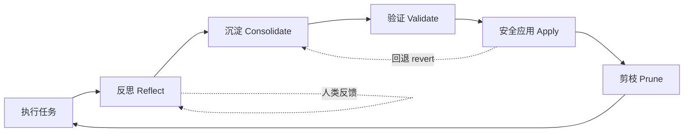

# mini_agent 自我进化设计文档

> 本文档整合了关于 mini_agent "自我进化"能力的整体设计讨论，覆盖：经验反思、技能沉淀、评估反馈、SubAgent 协作、安全网（风险分级 + 版本化 + 副本化运行），以及若干补充机制。定位是**架构设计稿**，用于指导后续分阶段实施，不是最终代码规范。

---

## 1. 核心理念：一个闭环

自我进化不是某个单点功能，而是一个闭环：



- **反思（Reflect）**：从一次任务执行中提炼"经验信号"——可能是自我反思生成的，也可能是用户的直接纠正（后者质量更高）。
- **沉淀（Consolidate）**：当某类经验反复出现/置信度足够高时，把它变成可复用资产——新的 skill、调整后的 profile 偏好、甚至代码改动。
- **验证（Validate）**：在副本环境里验证"沉淀的东西是否真的有用"，不影响主体。
- **安全应用（Apply）**：通过分级门槛后，把改动合并回主体，全程可追溯、可回退。
- **剪枝（Prune）**：定期清理过时/冗余/冲突的经验与技能，对抗系统熵增——**没有这一步，前面四步做得越好，系统越快变臃肿**。

两条关键原则贯穿全文：

1. **风险分级，而非一刀切**：改动的对象不同（数据 / 声明式配置 / 代码 / 治理代码本身），验证强度和合并门槛应该不同。
2. **安全网代码自身受最高级保护**：agent 不能在没有最高级人工确认的情况下，修改用来约束自己的那部分代码/规则。

---

## 2. 分阶段路线图总览

| Phase | 主题 | 产出 | 依赖 |
|---|---|---|---|
| A | 基础设施清债 | history `_type` 字段化、SubAgent 输出去截断、config 拆分、task manifest / plan_snapshot | 无 |
| B | 反思层：Lesson Memory | 结构化 lesson 条目 + SessionEnd/规则触发 | A |
| F | 安全网：风险分级 + 版本化 + 副本化运行 | StateRepo / EvolutionWorkspace、risk tier 门控 | B |
| C | 沉淀层：skill_propose | evolve 分支形式的 skill 草稿 | B, F |
| D | 验证层：Eval 反馈环 | 副本内 eval 对比报告 | F |
| E | 协作层：SubAgent 信息继承 | inherited_skills、共享缓存、lesson 回流 | B |
| G | 自主/后台循环 | 定期 consolidation、剪枝、能力地图刷新 | A–F 全部 |
| W | 知识层补全 | Task manifest、Workdir 知识层（timeline/work_index/open_threads/knowledge.md）、Global 知识层（self_profile/projects_index/cross_project_index/activity_log） | A，可与 B–G 并行推进；H 强依赖 W |
| H | 自主运行时 | daemon 化、AgentSelfProfile、Goal Backlog、调度器、活动摘要 | A–G + **W**（W 是 daemon 感知跨项目状态的基础） |

> **建议起步顺序**：A（含 task manifest）→ B → F → C → D → E，W 可在 B 落地后并行推进（W1 Task/Workdir 层先做，W2 Global 层紧跟），G → H（H 强依赖 W 全部就绪）。
> H 不应被当作"做完 G 自动顺延"的下一步，而是一次需要 Otz 显式决策"是否要让 mini_agent 变成持续运行实体"的方向选择。

**第 11–16 章**是在第 6 章补充机制之外，围绕"感知层"、"记忆层"、"执行层"、"协作层"、"架构层"、"时间维度"的系统性深化，聚焦自我进化闭环的数据质量和鲁棒性，不是独立 Phase，而是对已有各 Phase 的横向加固。

---

## 3. Phase B 回顾：Lesson Memory（作为后续所有机制的输入）

在 `MemoryEntry` 基础上新增 `entry_type` 字段：

```python
@dataclass
class MemoryEntry:
    ...
    entry_type: str = "summary"        # "summary" | "lesson" | "capability_map"
    # lesson 专属字段
    trigger: str = ""                  # 触发场景描述
    outcome: str = ""                  # 实际发生了什么
    root_cause: str = ""               # 根因（如有）
    suggested_action: str = ""         # 下次该怎么做
    confidence: float = 0.5            # 0-1
    occurrence_count: int = 1          # 同类 lesson 重复出现次数
    source: str = "self_reflection"    # "self_reflection" | "human_feedback" | "revert_record"
```

**触发机制（两条线）**：

1. **SessionEnd hook**（目前是预留未接的事件）：会话结束时跑一次反思 LLM 调用，基于 `tool_stats` + 最后若干轮 history（依赖 Phase A 的 `_type` 字段精确截取"用户意图轮"），输出结构化 lesson 候选。
2. **规则触发（不等会话结束）**：同一工具连续失败 ≥ N 次、或"权限拒绝后重试成功"这类纠错过程出现时，立即用模板生成轻量 lesson，成本低、响应快。

`source` 字段是本文档新增的关键维度——见第 6.2 节。

---

## 4. Phase F：安全网详细设计

### 4.1 范围：单一 repo，按"改动对象"分风险等级

早期方案曾尝试把"agent 自身状态"（`.agent/` 下的 skill/memory/profile/config）和"项目代码"分成两个独立版本域。**这个划分已被否定**：如果"一切都可能被改"（包括项目代码、甚至安全网代码本身），分域就站不住——一次有意义的改进往往是跨这些文件的组合（新工具代码 + 配套 skill + CLAUDE.md 更新本就该是一个 commit）。

**结论**：全部纳入项目自身的 git 仓库管理（`.agent/sessions/`、`cache/`、原始 `memory.jsonl` 等纯日志数据继续 `.gitignore`，不算"资产"）。区分点从"放在哪个目录"变为"改动的是什么"——即风险分级（Risk Tier）：

| Tier | 改动对象 | 验证方式 | 合并门槛 |
|---|---|---|---|
| **T0** 数据 | lesson/memory 条目、profile 偏好、工具调用统计 | schema 校验 | 自动 apply，靠 revert 兜底 |
| **T1** 声明式资产 | `SKILL.md`、`CLAUDE.md`、自定义 subagent 配置、`permissions.json` | 加载校验 + eval 场景对比 | eval 通过可自动合并，否则人审 |
| **T2** 普通代码 | 新工具实现、非核心模块 | lint + 类型检查 + 单测 + 副本进程内 smoke test + eval 对比 | **强制人审**，eval 数据作参考 |
| **T3** 治理/安全核心 | `agent.py` 主循环、权限系统、hooks loader、**安全网自身代码** | 同 T2，且 diff 必须显式标红 | **强制人审 + 不可被 agent 自我批准**，无论 eval 结果如何 |

**T3 是最关键的一条**：风险分级逻辑、merge 门槛判定、worktree 隔离逻辑本身都属于 T3。维护方式是一份**写死在 agent 可写范围之外**的"受保护路径清单"（可以是单独的小脚本/CI 配置），凡是触及这些路径的分支，无论 eval 结果如何都标记为"需要人工最终确认"，且这个标记逻辑本身也不在受保护路径之外的代码里——避免"一次看起来合理的自我改进"悄悄把 T3 门槛改成 T1。

### 4.2 安全更新：StateRepo.apply() 作为唯一写入入口

```python
class StateRepo:
    """对项目 git 仓库的封装。所有"自我修改"必须经过 apply()，
    不允许任何模块绕过它直接写文件。"""

    def __init__(self, root: Path):
        self.root = root
        self._ensure_initialized()

    def apply(
        self,
        changes: dict[Path, str | None],   # path -> 新内容（None 表示删除）
        message: str,
        meta: dict,                        # entry_type, source_lessons, session_id, confidence...
        tier: str,                         # "T0" | "T1" | "T2" | "T3"
        validators: list[Callable] = (),
    ) -> str:
        """原子写入 + 按 tier 校验 + commit，返回 commit hash。
        校验失败则不落盘、不 commit。"""

    def log(self, limit: int = 20) -> list[CommitInfo]: ...
    def diff(self, ref_a="HEAD~1", ref_b="HEAD", path=None) -> str: ...
    def revert(self, commit: str) -> str: ...
    def checkout_file(self, commit: str, path: Path) -> None: ...
```

**commit message 结构化规范**：

```
[T1][skill_propose] Add bash-rm-safety skill

source_lessons: lesson_2026061501, lesson_2026061203
session_id: sess_xxxxx
confidence: 0.82
occurrence_count: 4
proposed_by: evolution-agent
```

任何"自我修改"都必须能从 commit message 反查到它来自哪些 lesson、哪个角色提出——这是第 6.4 节"剪枝/冲突检测"和第 6.6 节"能力地图"的数据基础。

### 4.3 版本回退

- `/evolution log` → `StateRepo.log()`，每条 commit 都带结构化元信息，人能直接看出"这是哪次反思触发、改了什么"。
- `/evolution revert <commit>` → 默认 `git revert`（生成新 commit 撤销改动），**不用 `git reset --hard`**——"试过 X、效果不好、已回退"本身是历史的一部分。
- 支持**文件级回退**：`checkout_file(commit, path)` 只撤销某次修改里的一个文件，不影响同次 commit 的其他改动。
- **回退记录反哺 lesson 库**：每次 revert 生成一条 `source="revert_record"` 的 lesson（"曾提案 X 方向的改动，eval 显示 token 消耗上升 30%，已回退，不建议同方向再尝试"），形成闭环（见第 1 节图中的虚线）。

### 4.4 分支与合并：evolve 分支取代"pending 目录"

**统一洞察**：Phase C 原本设想的"`skills/pending/` 待审目录"，可以直接用 git branch 替代——不需要额外约定。

- 一次"进化尝试" = 创建分支 `evolve/<date>-<short-desc>`，agent 在分支上正常 `apply()`。
- **审核 = `git diff main..evolve/xxx`**；**批准 = merge**；**拒绝 = 删分支**，main 不受影响。
- 多个并行尝试天然互不干扰（不同 skill 各自一个目录、不同代码模块）。

**冲突处理**：

- T2/T3（代码）：标准 `git merge` 即可——文本级 diff/merge 对代码的成熟度远高于对结构化配置，不需要额外发明机制。
- T0/T1（结构化文件，如 `profile.json`、`permissions.json`）：降低冲突概率的设计原则是"新增优先于改写"（profile 的 derived 部分追加键值而非重写 section；每个 skill 独立目录）。真正冲突时，走**语义合并**：把 base/ours/theirs 三份内容 + 各自 commit message 喂给 LLM 生成合并版本，**合并结果仍需过 4.6 节的验证流水线**才能 commit；过不了校验则降级为传统 git 冲突标记，丢给人工。

### 4.5 副本化运行：进程级隔离

T2/T3 改动涉及代码，"副本"不能只是换数据路径，必须是**独立进程**：

```
EvolutionWorkspace.create(branch="evolve/xxx")
  → git worktree add /tmp/evolve/xxx -b evolve/xxx     # 完整代码+资产副本，共享对象库，近零成本
  → 若依赖文件有变化，建独立 venv
  → subprocess: python -m mini_agent --cwd /tmp/evolve/xxx \
       --eval-scenarios test_cases/ \
       --sandbox-permissions strict \
       → 结果写入 /tmp/evolve/xxx/.agent/eval_result.json
```

- 主进程只读 `eval_result.json` 做对比，不与副本进程直接交互（最小化通信面）。
- `--sandbox-permissions strict`：副本里跑的是未经验证的代码，工具权限应比主进程更严格，即使代码有问题，破坏面也限制在 worktree 目录内。
- **代码改动天然延迟生效**：主进程已加载旧版本模块，文件改动不影响当前运行实例，这本身是一层天然的安全边界（不同于 `permissions.json` 这类"立即影响正在跑的会话"的改动）。
- 多个 evolve 分支可以并行创建多个 worktree，互不干扰，最后只 merge 验证通过的那个，其余直接 `git worktree remove --force` + 删分支，不留痕迹。

### 4.6 验证流水线：随 tier 升级

| Tier | 验证内容 |
|---|---|
| T0 | schema 校验 |
| T1 | schema/加载校验 + eval 场景对比（tool 失败率 / turns / token） |
| T2 | lint + 类型检查 → 现有单测全过 → 副本进程 smoke boot（能跑起来、完成最简对话不崩）→ eval 场景对比 |
| T3 | 同 T2，且 diff 必须显式标红展示，强制人审 |

任意一层失败即标记"未通过"，**不进入人审队列**（避免低质量提案淹没人工审核）；全部通过后，T0/T1 可自动合并，T2/T3 进入人审队列，T3 额外触发"受保护路径"标记。

### 4.7 操作可逆性分级（独立于代码风险 tier）

某些操作即使在副本进程里跑，副作用也是真实的——发邮件、调用外部 API、改 git remote、删真实文件。"在副本里跑一遍看效果"本身可能造成不可逆影响。

| 操作类型 | 副本中的处理方式 |
|---|---|
| 纯本地可逆（读文件、改本地代码、跑测试） | 直接真实执行 |
| 有外部副作用但支持 dry-run | 强制 dry-run，只验证"参数是否合理"，不验证真实业务结果 |
| 不可逆且无 dry-run（发邮件、删远程资源） | 自动 mock，eval 报告标注"此项未经真实验证"，留给人工判断 |

---

## 5. Phase C/D/E 回顾（与安全网的衔接）

- **Phase C（skill_propose）**：本质是在 evolve 分支上调用 `StateRepo.apply()` 写入 `skills/<name>/SKILL.md`，tier=T1。触发条件：lesson 的 `occurrence_count` 超过阈值（阈值随 `source` 不同，见 6.2）。
- **Phase D（eval 反馈环）**：复用 `test_cases/` 作为回归集，提供 `mini-agent eval --scenario ... --with-skill/--without-skill` 对比命令；4.5 节的副本化运行天然产出 eval 数据。
- **Phase E（SubAgent 信息继承）**：`spawn_agent` 时把 `active_skills` 写入 `Task`，SubAgent 按名称激活；共享带锁的 `ToolResultCache`；**新增**：SubAgent 触发的规则型 lesson 也汇总回主 agent memory，而不是只存在 `TaskRecord.log_lines` 里随任务结束被遗忘。

---

## 6. 补充机制

### 6.1 角色分离：专职的"进化者" subagent

复用现有的 `agent_profiles.py` 自定义子 agent 机制（`.agent/agents/*.md`，frontmatter 定义 `tools`/`inputs`，正文是 prompt 模板），定义一个 `evolution-agent` profile：

- 工具集：仅暴露"读 lesson memory、聚类、`skill_propose`、`StateRepo` 操作、eval 跑分"，不暴露普通任务工具。
- Prompt：专注于"给定一批 lesson，判断是否值得提案、生成 SKILL.md 草稿、写 eval 报告"。
- 触发：`/evolve review`（人工）或 SessionEnd hook 里"待处理 lesson 数量超过阈值"时异步 spawn。

好处：日常任务 agent 的 prompt/工具集保持精简，不需要常年背着"管理自我进化"的指令；进化角色独立、可审计、可单独限速。**几乎不需要新框架代码**，主要是新增几个工具供该 profile 调用。

### 6.2 人类反馈：最高质量、最低成本的信号源

用户在对话中常给出直接纠正（"不对，应该用 patch_file"、"下次记得先跑测试"），这是 ground truth，可信度远高于自我反思，产生成本几乎为零。

- 加一个轻量"纠正检测"（规则式：识别"不对/不要/应该/下次记住"等短语；或低成本小模型分类），识别出的纠正立即转成 `entry_type="lesson"`、`source="human_feedback"`、较高 `confidence`。
- **`source="human_feedback"` 的 lesson，触发 `skill_propose` 的 `occurrence_count` 阈值应明显低于自反思 lesson**——一次明确的人类纠正，价值上可能等于三次自我猜测的 lesson。

### 6.3 Eval set 自我扩充：lesson → test_cases

`test_cases/` 目前是静态手写场景集，覆盖面不会自动跟上 agent 实际遇到的新坑。

- 每条达到 `skill_propose` 门槛的 lesson，同时生成一条 `test_cases/lesson_<id>.md`：内容是 `trigger` 描述的场景 + `outcome` 中记录的"要避免的失败模式"。
- 该场景先用于验证对应提案是否解决问题，验证通过后**永久留在 eval 集里作为回归测试**——eval 集和经验库同步生长。

### 6.4 熵增对抗：剪枝、去重、冲突检测

只长不剪必然导致：skill 过多 → context 膨胀 → "lost in the middle"，整体表现下降；lesson 重复/过时/互相矛盾，检索时同时召回会让 agent 行为摇摆。建议作为 Phase G 后台循环的**核心**内容：

- 定期对语义相近的 lesson 聚类——`outcome` 一致的合并（提高 `occurrence_count`，保留最新 `suggested_action`）；`suggested_action` 冲突的标记"冲突待审"，交给 evolution-agent。
- 结合 `skill_usage_stats`（现有调用次数统计）与 eval 结果，长期"激活但无可衡量改善、且很久未被实际触发"的 skill，降级到 `skills/deprecated/`（不删除，可恢复）。

> 优先级评估：本文档建议将 6.2（人类反馈通道）和 6.4（剪枝/去重）列为**第一批补充机制**——前者几乎零成本但信号质量最高，后者是防止系统长期"变笨"的必要条件，且当前设计完全未覆盖这一面。

### 6.5 Scope 晋升：workdir → global

某条 workdir 级 skill 经 eval 验证有效、使用次数足够、且内容不依赖该项目特有的路径/技术栈名词（可由 evolution-agent 检查），可提案"复制到 `~/.agent/skills/`（global scope）"——本身也是一次 evolve 分支，走同样的 T1 门槛。使自我进化的成果跨项目复利。

### 6.6 能力地图（Capability Map）

`entry_type="capability_map"`，scope=global，定期由 evolution-agent 派生生成（不需要额外采集）：把 lesson 按 `trigger` 类别（git 操作/权限相关/MCP 调用/长文件编辑……）聚合，结合各工具错误率统计。

用途：
- **指导委托**——spawn SubAgent 时，对历史错误率高的任务类型主动多塞相关 lesson/skill，或采用更谨慎的执行路径；
- **指导求助时机**——遇到能力地图标记"高错误率"的任务，更早向用户确认而非反复试错。

### 6.7 演化节奏治理

证据门槛随 tier 递增 + 频率限速，避免提案过多导致审核疲劳或行为不稳定：

| Tier | 触发条件 |
|---|---|
| T0 | `occurrence_count ≥ 1` 即自动 apply（影响小，revert 成本低） |
| T1 | `occurrence_count ≥ 3` 且来自不止一个 session |
| T2/T3 | `occurrence_count ≥ 5`，且至少一条来源为 `human_feedback` |

另设每周提案数上限，超出的 lesson 继续累积计数但不立即触发分支。

### 6.8 远期备选：模型层微调

"一切都能进化"的终极形态是模型本身的微调，但需要训练 infra，超出 agent 框架范畴。现阶段不需要为此特别设计——本文档强调 commit message 携带 `source_lessons`、lesson 结构化存储，本身就是在积累未来可用的种子数据集，届时数据已经就位。

---

## 7. Phase H：自主运行时

> 这一阶段是性质上的跃迁：前面 A–G 都是"agent 能不能改进自己"，Phase H 是"agent 能不能**有自己的事要做**"——从"被调用才存在"变成"持续存在，用户交互是其中一个输入通道"。A–G 设计的机制（lesson、skill、eval、安全网、剪枝、能力地图）是 Phase H 自主行为的"内容来源"；Phase H 提供的是让这些内容**在没有用户触发的情况下也能跑起来**的运行时。

### 7.1 运行形态：daemon 作为主体，现有接口降级为通道

`api/bridge.py` 里的 `AgentBridge` + `InputQueue` + `OutputBroadcaster` 已经是"长驻进程 + 队列"的雏形，只是目前队列里只有"用户发来的消息"。daemon 化的核心改动：**`InputQueue` 支持塞入"自主产生的任务"**，CLI/Web demo/HTTP API 全部降级为连接到这个常驻进程的"客户端"——角色从"驱动 agent 运行"变成"观察 agent 在做什么 + 偶尔插一句话"。

没有任何客户端连接时，daemon 也在跑：处理 goal backlog、跑周期性任务、做 memory consolidation。用户打开任意客户端，看到的是"daemon 现在在做什么 + 最近做了什么"，而不是"启动一个新会话"。

### 7.2 自我模型（AgentSelfProfile）

与现有 `profile.py`（关于*用户*的画像）平行存在，但内容完全不同——是 agent 关于"自己"的结构化档案，每次"醒来"（daemon tick 或被用户唤起）时用来回答"我是谁、我现在该做什么、我手头有多少预算"：

```json
{
  "identity": {
    "purpose": "Otz 的 mini_agent 项目协作者：日常协助开发，同时维护和演进项目自身",
    "constraints_ref": "CLAUDE.md + safety net risk tiers（见第 4 节）"
  },
  "current_focus": "实现 Phase B 的 lesson memory 反思机制",
  "goal_backlog_ref": ".agent/goals.json",
  "capability_map_ref": "memory entry_type=capability_map（见 6.6）",
  "resource_budget": {
    "daily_token_budget": 200000,
    "used_today": 45000
  },
  "autonomy_level": "passive",        // 见 7.9
  "recent_activity_log": [...]
}
```

`identity.constraints_ref` 显式引用约束来源（而不是把约束散落在各处）；`autonomy_level` 是 7.9 节分级开关的落点。这份档案是"自我意识"在工程上的对应物——一份持久的、结构化的自我状态，不涉及也不需要涉及哲学意义上的意识讨论。

### 7.3 长期目标管理：Goal Backlog

现有 `orchestrator/task_manager.py` 的调度是**会话内**的任务依赖图，session 结束这个图就消失。自主 agent 需要一个**跨会话、跨时间持久存在**的目标层级，比现有 TaskManager 的 DAG 高一层：

```
Goal（长期，周/月级，用户设定或经反思 derived）
 └─ Objective（中期，天级，agent 自主拆解）
      └─ Task（具体可执行，复用现有 TaskManager/SubAgent 机制）
```

持久化为 `.agent/goals.json`，每个节点有 `status`（active/blocked/done/abandoned）、`progress_notes`、`last_touched_at`。daemon 的自主 tick 主要就是在操作这棵树：检查有没有 active 但长期没进展的 Objective，决定要不要拆出新 Task 去推进。

**关键区分**：Goal 按来源分"硬目标"（用户直接设定）和"软目标"（agent 自己 derive，比如"我发现自己在 X 类任务上经常出错，应该专门解决"）。软目标在执行前应在 7.6 节的活动摘要里给用户一次轻量可见性——不一定要打断，但不能在用户完全不知情的情况下持续推进数周（避免"目标漂移"）。

### 7.4 调度器：tick 循环与周期性任务

```python
class AutonomousLoop:
    def tick(self):
        # 1. 检查到期的周期性任务（cron 风格）
        for job in self.scheduler.due_jobs():
            self.input_queue.push(SyntheticTask(job, initiator="scheduled"))

        # 2. 检查 goal backlog，决定是否需要新建 Objective/Task
        if self.input_queue.is_idle() and self.goal_backlog.has_actionable_work():
            task = self.goal_backlog.next_task()
            self.input_queue.push(task)  # initiator="autonomous"

        # 3. 探索预算未耗尽时，按固定比例分配给 Experiment（见 7.10）
        elif self.input_queue.is_idle() and self.exploration_budget.has_remaining():
            experiment = self.experiment_log.next_candidate()
            if experiment:
                self.input_queue.push(experiment)  # initiator="autonomous", lowest priority

        # 4. 否则空转，等待用户消息或下一次 tick
```

典型周期性任务，把 A–G 已设计的后台机制接上触发时机：每天跑一次 memory consolidation（6.4 剪枝去重）；每周跑一次 evolution-agent review（6.1，聚合 lesson、生成 evolve 分支提案）；定期刷新 capability map（6.6）；`file_watcher.py` 从被动轮询变为 tick 驱动的主动检查。这些机制本身在前面章节已经设计好，Phase H 只是给它们一个不依赖用户在场的触发时机。第 3 类（探索）是本节新增的 tick 类型，优先级低于周期性任务和 goal backlog 任务，详见 7.10。

### 7.5 并发与资源仲裁

daemon 同时承载"自主任务"和"用户对话"会产生冲突——用户在改一个文件，自主任务恰好也想改同一个文件；或者用户发消息时，daemon 正在跑耗时的自主任务，占着 LLM 调用配额。仲裁规则：

- **用户交互优先**：`InputQueue` 里用户消息永远插队到自主任务前面；自主任务正在执行且涉及和当前用户请求重叠的文件/资源时**暂停**（不杀掉，状态保存回 goal backlog，标记"被用户交互打断，下次 tick 继续"）。
- **资源锁**：自主任务执行前检查将要触碰的路径是否和"最近 N 分钟内有用户活动"的路径重叠，重叠则该 Task 回到 backlog 排队。
- **预算硬限制**：`resource_budget.daily_token_budget` 是自主任务的硬上限——用户交互不受此限制（用户请求总要响应），但自主 tick 发现"今日自主预算已用尽"时，跳过本次 tick 的自主部分，只处理周期性轻量任务（如成本低的 consolidation）。`daily_token_budget` 内部进一步切分出一份**探索预算**（7.10），固定比例、独立核算——goal backlog 任务紧张时不会挪用探索预算去"赶进度"，探索预算闲置时也不会被 goal backlog 借用，避免"探索"在资源紧张时总是第一个被牺牲到归零。

### 7.6 主动汇报：活动摘要

agent 自主干的事，用户得知道，但不能每完成一个 Task 就推送一条消息（审核疲劳问题见 6.7）。daemon 维护一个"活动摘要"（`.agent/activity_digest.jsonl`，每条自主 Task 完成后追加一条精简记录），用户下次打开任意客户端时，第一屏展示"自上次交互以来，我做了这些事"——形式类似"晨报"。

涉及 evolve 分支的自主提案（第 4 节 Phase F）应在晨报里单独列出"有 N 个待审的进化提案"，不与普通活动混在一起——这部分天然对应人审队列。7.3 节提到的"软目标"创建，也应出现在晨报里。

### 7.7 对安全网的影响：initiator 字段与 tier 上浮

A–G 设计的安全网（风险分级、evolve 分支、副本化运行）在"agent 只在用户主动请求时行动"的世界里是一层很扎实的保护。但**一旦 agent 能自主创建和执行任务，安全网从"重要"变成"前提"**——没有用户实时在场做最后一道把关。具体调整：

- `StateRepo.apply()`（4.2 节）新增 `initiator: "user" | "autonomous" | "scheduled"` 参数。**自主/调度发起的改动，tier 整体上浮一级**：用户主动要求的 T0 改动可以直接 apply；同等改动若由自主 tick 发起，至少要走 evolve 分支留痕——区别只在"是否需要人审"，但"是否留痕、是否可 revert"不能因发起方是自主而降低标准。
- 7.3 节"软目标"的创建本身建议视为一种轻量提案——不需要走完整 evolve 流程，但必须出现在 7.6 节的活动摘要里。
- T3"安全网代码自身受保护"这条规则的重要性进一步提升：daemon 持续运行意味着"自主修改安全网代码"一旦发生，影响的不是某一次会话，而是之后所有自主周期——这进一步说明 T3 清单和判定逻辑必须在 agent 可写范围之外维护（见 4.1）。

### 7.8 实现路径：复用与新增对照表

| 模块 | 现状 | Phase H 需要做的 |
|---|---|---|
| `AgentBridge`/`InputQueue` | 已有长驻进程+队列雏形 | 队列支持"自主产生的合成任务"，区分 `initiator`（见 7.7） |
| `TaskManager._scheduler_loop` | session 内 DAG 调度 | 上层加一个跨 session 的 `AutonomousLoop`（7.4），定期把 Objective 拆解出的 Task 推给现有调度器 |
| `agent_profiles.py` 自定义子 agent | 已支持定义角色 | 定义"autonomous-worker"角色，执行自主 Task 时用，权限默认更严格（呼应 7.7） |
| `file_watcher.py` | 被动轮询 | 接入 `AutonomousLoop` 的 tick，作为一种周期性任务 |
| `profile.py` | 用户画像 | 平行新增 `AgentSelfProfile`（7.2），独立存储、独立 schema |

### 7.9 自主性分级开关

Phase H 做完，mini_agent 在行为上接近"持续运行、有自己议程的实体"——这和最初"AI agent framework / 编程助手"的产品定位之间，用户的信任模型和期望是不一样的。"帮我改个 bug"和"你自己决定花三天时间研究怎么改进自己"，风险容忍度完全不同。

因此 Phase H **不是非全有或全无**，`AgentSelfProfile.autonomy_level` 设三档：

| 档位 | 行为范围 |
|---|---|
| `passive` | 完全被动响应，daemon 仅做最轻量的周期性维护（如 memory consolidation），不创建 Goal/Objective，goal_backlog 为空，**不分配探索预算，不产生 Experiment** |
| `maintenance` | 在 `passive` 基础上启用 7.4 的周期性任务（evolution-agent review、capability map 刷新、file watcher）以及 7.10 的探索机制（小比例探索预算），但不自主 derive 新 Goal |
| `autonomous` | 完全启用 Goal Backlog 的软目标 derive 与执行，探索预算比例可调高 |

默认建议 `passive` 起步，逐档开放。修改 `autonomy_level` 本身属于 T1（声明式配置），但**影响面大，建议即使 eval 通过也强制走人审**——不应被 6.7 节的"T1 eval 通过可自动合并"规则覆盖,这是 4.1 节风险分级表之外需要单独标注的一条特例。

### 7.10 探索与实验机制

> 前面的 Phase B（反思）是"被动遭遇"——agent 在真实任务执行中撞到问题才产生 lesson。本节补上"主动式"的另一半：agent 不等坑出现，自己提出假设、设计实验去验证。两者最终都汇入同一套 lesson/skill/evolve 体系，本节不是新起一套体系,而是给已有体系加一个**主动入口**。

**Experiment 实体**：与 Lesson 的区分在于"主动设计 vs 被动遭遇"。

```python
@dataclass
class Experiment:
    id: str
    hypothesis: str          # "若启用 X，则 Y 指标改善" —— 跑之前就写好，跑完不可改
    motivation: str          # 关联的 capability_map 条目 / 半成形 lesson / 新增能力
    method: str              # 实验设计：control vs treatment、场景来源、试验次数、判定阈值
    status: str              # designed | running | completed
    trials: list[dict]       # 多次试验的原始指标
    outcome: str             # confirmed | rejected | inconclusive
    conclusion: str          # 验证后写的结论，即使 rejected 也要写
    follow_up: str | None    # confirmed 时关联到的 evolve 分支 / skill_propose id
```

**假设来源**（按优先级）：① capability_map（6.6）里的低置信度区域——agent 知道自己在某类任务上不稳定但还没归因；② 还没攒够 `occurrence_count` 的半成形 lesson——主动设计场景**重现** trigger，比干等真实任务再撞上更快；③ 新接入但未充分使用的能力（新 MCP server、新工具、新激活 skill）——"还没被实战检验过的失败模式"是天然的探索起点，相当于在沙箱里先探边界，比第一次在真实任务里用时才发现问题更安全；④ 用户在对话中提出的"我好奇 X 会不会更好"，可直接转 Experiment，不需要统计门槛。

**预注册（pre-registration）**：`hypothesis` 和 `method`（包括试验次数、判定指标、confirmed/rejected 的阈值）必须在执行前写入并冻结，**验证阶段不允许根据结果反过来修改判定标准**——LLM 擅长为任何结果找到看起来合理的解释，先写后跑是防止"事后圆场"的唯一办法,这一原则与第 4.2 节"commit message 携带元数据、不可事后篡改叙事"是同一种纪律。同时，`method` 必须明确多次试验（如同场景跑 5 次）看指标分布，而不是单点对比——这是 4.6 节 eval 对比在"验证单个改动"场景下够用、但"验证一个假设"时需要补的统计严谨性。

**反事实重放（counterfactual replay）**：相比 6.3 节"lesson → 生成全新合成 test_cases"，更有价值的场景来源是 `.agent/sessions/` 里**真实发生过的历史会话**——选一个产生过 lesson 或落在 capability_map 低置信度类别里的历史 session，用修改后的 skill/config/prompt 重放其关键节点，判断"如果当时启用了这个改动，结果会不会更好"。这比纯合成场景更贴近真实分布。confirmed 的实验，其重放所用的历史片段可沉淀为新的 `test_cases/`（呼应 6.3），形成"真实数据 → 实验 → 永久回归场景"的闭环。

**执行规格：探索是最高不确定性活动，应配最严格的执行规格**。复用 4.5 的 worktree 副本和 Phase D 的 eval 对比作为执行/验证环境，但在 4.7 的操作可逆性分级和 7.5 的资源仲裁上，Experiment **始终取最保守一档**——外部副作用类操作全部 mock，被用户交互或 goal backlog 任务抢占资源时直接挂起且不计入"打断"统计（探索本身就是"有空才做"的活动）。

**总结：confirmed / rejected / inconclusive 都要写**：
- **confirmed**（显著改善）→ 触发 `skill_propose` 或开 evolve 分支（走 Phase C/F 既有 tier 判定，不因为"来自实验"而改变门槛），并更新 capability_map 相关条目的置信度。
- **rejected**（验证后无改善甚至更差）→ 生成 `entry_type="lesson"`、`source="experiment"` 的**负面 lesson**："曾验证 X 方向，结果 Y，短期内不建议重试"，并设置**冷却期**——第 2 节"假设生成"挑选候选前，先查 experiment log 是否有相近方向的近期 rejected 记录，避免在同一个死胡同里反复"重新发现"同一个否定结论。
- **inconclusive**（方差过大/数据不足）→ 记录但不设冷却期，标记"优先级低、值得在资源充裕时用更大试验量重跑"。

所有 Experiment 记录（无论 outcome）构成一个可检索的**实验记录簿**，是假设生成阶段的第一道查询入口。

**与已有机制的关系**：本节真正新增的只有三样——① 带预注册纪律的 Experiment 实体；② 反事实重放这一场景来源；③ AutonomousLoop 里独立核算的探索预算 + rejected 结果的冷却期。其余（worktree 副本、eval 对比、skill_propose/evolve 分支、capability_map、lesson memory）全部复用前述章节，不重复建设。

---

---

## 8. Phase W：知识层补全

> 前面 A–G 以及 H 设计的机制都需要在"启动时能快速获得准确的上下文"这个前提下才能发挥价值。W 的目标是补全三个层级（Task / Workdir / Global）的结构化知识积累，让 agent 在任何一次 session 启动时都能从三个粒度感知自己的状态——**我整体是什么状态**（Global）、**这个项目现在在哪**（Workdir）、**上次这个任务做到哪**（Task/Session）。没有这一层，daemon（H）再强也只是"有任务来才动"的进程，谈不上跨时间、跨项目的连续性。

### 8.1 W1：Task 与 Session 知识层

在已有的 `task_dir(sid, tid)` 路径下新增两个文件，作为"任务叙事层"：

**`task_manifest.json`**（Task 级，新增）——任务全生命周期的结构化叙事，在 `output.log`（原始流）、`events.jsonl`（工具事件）、`result.json`（最终摘要）之上增加一层"人和 agent 都能直接读懂"的叙事文件：

```json
{
  "id": "a3f7c2",
  "name": "Fix token budget bug in context_builder",
  "initiator": "user",
  "goal": "修复 context_builder.py 里 token 预算计算溢出导致截断错误的问题",
  "acceptance_criteria": [
    "所有现有单测通过",
    "token 预算超限时 warning 而非 silent truncate",
    "新增至少一个覆盖 edge case 的测试"
  ],
  "context_snapshot": {
    "related_files": ["src/mini_agent/perception/context_builder.py"],
    "related_lessons": ["lesson_2026061501"],
    "parent_goal_id": "goal_weekly_phase_a",
    "parent_task_id": null
  },
  "progress": {
    "current_step": "写新测试",
    "steps_done": ["定位根因", "修改计算逻辑"],
    "steps_remaining": ["写新测试", "跑测试套件"],
    "blockers": [],
    "last_updated": 1718000300.0
  },
  "decision_log": [
    {
      "at": 1718000100.0,
      "decision": "选择修改 _calc_budget() 而非 _trim_history()",
      "rationale": "前者是根因，后者是症状，修症状会掩盖问题",
      "alternatives_considered": ["修改 _trim_history", "调整 token_limit 常量"]
    }
  ],
  "outcome": {
    "status": "done",
    "summary": "修复了 _calc_budget() 里整数溢出，新增 2 个 edge case 测试",
    "artifacts": [
      {"type": "file_modified", "path": "src/mini_agent/perception/context_builder.py"},
      {"type": "test_added", "path": "tests/test_context_builder.py"}
    ],
    "unresolved": [],
    "lessons_generated": ["lesson_2026061801"],
    "token_cost": {"input": 12000, "output": 3400}
  }
}
```

`progress` 和 `decision_log` 通过新增工具 `update_task_progress(task_id, current_step, blockers, note)` 由 agent **主动写入**，不是从 `events.jsonl` 被动推导——这强迫 agent 在长任务里定期"停下来想一想自己在做什么"，本身对执行质量有正向影响。`outcome.unresolved` 是把"发现了但没处理的问题"结构化的关键字段，SessionEnd hook 会自动把这里的条目推到 Workdir 层的 `open_threads.json`。

**`plan_snapshot.json`**（Session 级，新增）——`ExecutionPlan`（`plan.py`）目前是纯内存，session 崩了计划就丢了。加持久化快照，每次 `PlanTask` 状态变更时更新，支持 session 意外中断后"续跑"（重启时读取，恢复 DONE 步骤，从第一个 non-terminal 步骤继续）：

```json
{
  "goal": "完成 Phase A 基础设施清债",
  "created_at": 1718000000.0,
  "last_updated": 1718000500.0,
  "tasks": [
    {"id": "t1", "title": "history 条目加 _type 字段", "status": "done", "result": "已完成，见 commit abc123"},
    {"id": "t2", "title": "SubAgent 输出去截断", "status": "running", "result": ""},
    {"id": "t3", "title": "config.py 拆分", "status": "pending", "result": ""}
  ]
}
```

完整后的 Session/Task 目录结构：

```
.agent/sessions/<session_id>/
  meta.json                 # 已有
  history.json              # 已有
  llm_debug.jsonl           # 已有
  memory_delta.jsonl        # 已有
  plan_snapshot.json        # 新增：ExecutionPlan 持久化快照
  tasks/<task_id>/
    manifest.json           # 新增：任务叙事文件
    output.log              # 已有
    events.jsonl            # 已有
    result.json             # 已有
```

`AgentPaths` 对应新增：`session_plan_snapshot(sid)`、`task_manifest(sid, tid)` 两个路径方法。

### 8.2 W2：Workdir 知识层

在 `.agent/`（workdir 根）下新增四个文件，填补"跨 session 项目知识"的空白：

**`project.json`**——项目身份证，相对静态，每次 session 启动时作为"项目自我介绍"注入 context：

```json
{
  "name": "mini_agent",
  "description": "Python-based AI agent framework",
  "root_language": "python",
  "entry_points": ["src/mini_agent/agent.py"],
  "key_modules": {
    "orchestrator": "SubAgent 调度与任务管理",
    "perception": "Memory、工具缓存、Context 构建",
    "hooks": "Pre/PostToolUse 生命周期钩子",
    "mcp": "MCP server 集成"
  },
  "created_at": 1718000000.0,
  "last_active": 1718500000.0,
  "total_sessions": 47
}
```

**`timeline.jsonl`**——所有 session 的时序骨架，每次 session 结束追加一行（append-only）。刻意精简，只记"这次做了什么方向"，细节留在 session 自己的 meta.json 里：

```jsonl
{"sid":"sess_089","at":1718000000,"duration_min":45,"theme":"设计 lesson memory schema","key_outcomes":["确定 MemoryEntry 新字段"],"task_count":2,"status":"done"}
{"sid":"sess_090","at":1718100000,"duration_min":30,"theme":"实现 SessionEnd hook 触发","key_outcomes":["hooks/loader.py 接入 SessionEnd 事件"],"task_count":0,"status":"done"}
```

**`work_index.json`**——最有价值的一个。把跨 session 相关的任务聚合成 **WorkThread**（工作线），由 evolution-agent 或 SessionEnd hook 定期更新：

```json
{
  "last_updated": 1718500000.0,
  "work_threads": [
    {
      "id": "wt_self_evolution",
      "title": "自我进化机制实现",
      "status": "active",
      "started_at": 1718000000.0,
      "related_sessions": ["sess_085", "sess_089", "sess_090"],
      "cumulative_progress": "Phase B lesson memory 结构已定，SessionEnd 触发已实现，StateRepo 尚未开始",
      "open_questions": ["T1 自动合并的观察期怎么定"],
      "next_suggested": "实现 StateRepo.apply() 作为安全写入入口",
      "related_goal_id": "goal_phase_f"
    },
    {
      "id": "wt_webdemo",
      "title": "Streamlit Web Demo 稳定性修复",
      "status": "done",
      "related_sessions": ["sess_070", "sess_071"],
      "cumulative_progress": "权限面板、实时事件、CLI 输入可见性问题均已解决",
      "open_questions": []
    }
  ]
}
```

WorkThread 是把"跨越多个 session、可能中断再续的工作线索"**显式建模**出来，而不是让它们隐式地散落在 memory 条目里靠检索碰。agent 每次启动时，`active` 的 WorkThread 直接注入 context——"你上次在推进 X，做到了 Y，下一步建议 Z"，比 memory 模糊检索精准得多。WorkThread 同时也是 Phase H（7.3）Goal Backlog 里 Objective 节点的自然前身，可以直接晋升关联。

**`open_threads.json`**——跨 session 的待处理线索池。解决"任务 A 途中发现问题 B，但当时不便处理"的归宿问题：

```json
{
  "items": [
    {
      "id": "ot_001",
      "title": "SubAgent 输出截断问题",
      "discovered_in": "sess_085",
      "type": "bug",
      "priority": "high",
      "description": "output 超 3000 字时直接截断且不通知 orchestrator，orchestration.py L358",
      "work_thread_ref": "wt_self_evolution",
      "status": "open",
      "resolved_in": null
    }
  ]
}
```

类型（`type`）：`bug` / `tech_debt` / `feature` / `question` / `blocker`。通过 agent 主动工具 `add_open_thread()` 随时追加；SessionEnd hook 也会把各 task manifest 里 `outcome.unresolved` 的条目自动推进来。

**`knowledge.md`**——自由 Markdown，记录不适合放进结构化 JSON 的"软知识"：架构决策背景、踩过的坑的细节、"为什么这样设计而不是那样"。与 `CLAUDE.md` 的区别：`CLAUDE.md` 是"给 agent 的操作规范"（应该做什么），`knowledge.md` 是"关于这个项目的认知积累"（这个项目是什么样的）。属于安全网 T1，写入走 `StateRepo.apply()`，留版本记录。

完整后的 Workdir 目录结构：

```
.agent/
  ├── project.json            # 新增：项目元信息
  ├── memory.jsonl            # 已有：项目级 lesson/summary
  ├── permissions.json        # 已有
  ├── hooks.json              # 已有
  ├── goals.json              # Phase H 新增：Goal Backlog
  ├── timeline.jsonl          # 新增：session 时序骨架
  ├── work_index.json         # 新增：跨 session 工作线聚合
  ├── open_threads.json       # 新增：跨 session 待处理线索池
  ├── knowledge.md            # 新增：项目软知识积累
  ├── skills/                 # 已有
  ├── agents/                 # 已有
  ├── prompts/                # 已有
  ├── cache/                  # 已有
  └── sessions/               # 已有，结构见 8.1
```

**维护机制（三条触发路径）**：

- **SessionEnd hook（轻量，每次自动跑）**：追加 `timeline.jsonl`；把各 task manifest `outcome.unresolved` 推入 `open_threads.json`；更新 `project.json` 的 `last_active` 和 `total_sessions`。纯写入无 LLM，每次无条件执行。
- **evolution-agent 周期性扫描（中等成本，低频）**：读取最近若干 `timeline.jsonl` + session manifest，判断是否新建/更新/合并 WorkThread；更新 `work_index.json` 的 `cumulative_progress` 和 `next_suggested`；归档已 resolved 的 `open_threads`。每天一次或每 N 个 session 触发。
- **agent 主动写（随时）**：`add_open_thread()`、`update_knowledge(section, content)` 工具，执行任务途中随时调用，不需要等 SessionEnd。

### 8.3 W3：Global 知识层

Global 层（`~/.agent/`）现有文件：`profile.json`（用户画像）、`memory.jsonl`（跨项目通用 lesson）、`skills/`、`prompts/`、`hooks.json`、`agents/`。**完全没有"agent 自身的全局认知"**——有关于用户的画像，但没有关于 agent 自己的画像；有碎片化的 memory 条目，但没有跨项目的工作全局视图。

新增四个文件：

**`self_profile.json`**——agent 自我模型（对应 Phase H 7.2 节的 `AgentSelfProfile`，是那个设计的全局落地文件）。与 `profile.json`（主语=用户）平行，主语是 agent 自己：

```json
{
  "version": 1,
  "identity": {
    "purpose": "作为 AI agent 协助开发工作，同时持续改进自身能力",
    "core_constraints_ref": "~/.agent/skills/ 中的 safety-net skill + 项目 CLAUDE.md",
    "created_at": 1718000000.0
  },
  "self_assessment": {
    "strengths": ["Python 重构", "架构设计讨论", "文档整理"],
    "weak_areas": ["长文件的精确 patch", "并发 bug 定位"],
    "confidence_by_domain": {
      "python_refactoring": 0.85,
      "bash_file_ops": 0.62,
      "mcp_integration": 0.71
    },
    "last_assessed_at": 1718500000.0
  },
  "operating_state": {
    "autonomy_level": "passive",
    "active_project": "/Users/otz/projects/mini_agent",
    "last_active_at": 1718500000.0,
    "total_sessions_lifetime": 127,
    "total_projects_worked": 3
  },
  "resource_budget": {
    "daily_token_budget": 200000,
    "used_today": 45000,
    "budget_reset_at": "00:00"
  },
  "evolution_state": {
    "pending_evolve_branches": ["evolve/2026-06-10-bash-safety"],
    "last_reflection_at": 1718400000.0,
    "lifetime_lessons_generated": 43,
    "lifetime_skills_proposed": 7,
    "lifetime_skills_approved": 4
  }
}
```

`self_assessment.confidence_by_domain` 是 capability_map（6.6）的 global scope 版本——各 workdir 的 capability_map 跨项目汇总后写这里。`evolution_state` 是"进化仪表盘"——agent 启动时直接看到"总共学到了多少、还有哪些提案在等人审"，而不用扫描 evolve 分支列表。这个文件属于安全网 T1（影响面大，修改强制人审，见 7.9 节说明）。

**`projects_index.json`**——曾经工作过的所有 workdir 的注册表。每次在新目录启动自动注册；每次 session 结束更新 `last_active`：

```json
{
  "projects": [
    {
      "id": "proj_miniagent",
      "path": "/Users/otz/projects/mini_agent",
      "name": "mini_agent",
      "first_seen": 1710000000.0,
      "last_active": 1718500000.0,
      "total_sessions": 89,
      "status": "active",
      "description": "Python AI agent framework，当前在实现自我进化机制",
      "tags": ["python", "ai-agent"]
    },
    {
      "id": "proj_other",
      "path": "/Users/otz/projects/other_project",
      "name": "other_project",
      "first_seen": 1715000000.0,
      "last_active": 1716000000.0,
      "total_sessions": 12,
      "status": "dormant",
      "tags": ["python"]
    }
  ],
  "active_project_id": "proj_miniagent"
}
```

这是 daemon（7.4）能做"跨项目巡视"的基础数据——没有注册表，daemon 就不知道该巡视哪些目录。`status: dormant` 的项目可以触发"30 天没活动，是否做一次 consolidation"的自动提醒。

**`cross_project_index.json`**——跨项目层面涌现的模式与能力图谱。这是 6.5 节"Scope 晋升"的数据支撑：

```json
{
  "last_updated": 1718500000.0,
  "cross_project_patterns": [
    {
      "id": "cpp_bash_rm_danger",
      "title": "bash rm 操作在任何项目里都高危",
      "observed_in_projects": ["proj_miniagent", "proj_other"],
      "occurrence_count": 6,
      "confidence": 0.91,
      "pattern_type": "risk",
      "derived_from_lessons": ["lesson_001", "lesson_008", "lesson_021"],
      "global_skill_candidate": true,
      "promoted_to_skill": "bash-safety",
      "promoted_at": 1717000000.0
    },
    {
      "id": "cpp_test_before_refactor",
      "title": "重构前跑一遍现有测试可以显著减少回归",
      "observed_in_projects": ["proj_miniagent"],
      "occurrence_count": 2,
      "confidence": 0.55,
      "pattern_type": "best_practice",
      "global_skill_candidate": false
    }
  ],
  "skill_promotion_history": [
    {
      "skill_name": "bash-safety",
      "promoted_from": "proj_miniagent",
      "promoted_at": 1717000000.0,
      "trigger_pattern": "cpp_bash_rm_danger",
      "status": "active_global"
    }
  ],
  "cross_project_capability_map": {
    "python_refactoring": {"confidence": 0.85, "sample_projects": 2},
    "bash_file_ops": {"confidence": 0.62, "sample_projects": 2}
  }
}
```

skill 从 workdir 晋升到 global 的依据：`observed_in_projects` 数量 ≥ 2 且 `confidence` 超过阈值。`cross_project_capability_map` 是各 workdir capability_map 的汇总，写回 `self_profile.json` 的 `confidence_by_domain`，形成闭环。

**`activity_log.jsonl`**——全局活动时序，比任何单个 workdir 的 `timeline.jsonl` 都高一层。每次 session 结束追加一行，不区分项目：

```jsonl
{"at":1718000000,"project_id":"proj_miniagent","sid":"sess_089","theme":"设计 lesson memory schema","duration_min":45}
{"at":1718200000,"project_id":"proj_other","sid":"sess_012","theme":"修复登录流程 bug","duration_min":25}
```

用途：① `self_profile.json` 里 `total_sessions_lifetime` 的数据来源；② daemon 在跨项目切换时快速重建"上次在 proj_other 做什么"的上下文，不需要加载那个项目的完整 session 历史；③ 未来跨时间跨度的活动分析（此时数据已就位，不需要追溯补采集）。

完整后的 Global 目录结构：

```
~/.agent/
  ├── profile.json                # 已有：用户画像（主语=用户）
  ├── memory.jsonl                # 已有：跨项目通用 lesson/summary
  ├── self_profile.json           # 新增：agent 自我模型（主语=agent 自己）
  ├── projects_index.json         # 新增：workdir 注册表
  ├── cross_project_index.json    # 新增：跨项目模式与能力图谱
  ├── activity_log.jsonl          # 新增：全局活动时序流水
  ├── skills/                     # 已有：全局技能库
  ├── prompts/                    # 已有
  ├── hooks.json                  # 已有
  └── agents/                     # 已有
```

**维护机制（三条触发路径，与 Workdir 层对称）**：

- **SessionEnd hook（轻量，每次自动跑）**：更新 `self_profile.json` 的 `operating_state`（`last_active_at`、`total_sessions_lifetime`、`resource_budget.used_today`）；更新 `projects_index.json` 当前项目的 `last_active`；追加一条 `activity_log.jsonl`。纯写入无 LLM 调用，每次无条件执行。
- **evolution-agent 跨项目扫描（高成本，低频，每周一次或新增 workdir 时触发）**：比对各 workdir 的 `work_index.json` 和 `memory.jsonl`，识别跨项目重复出现的模式，写入 `cross_project_index.json`；判断是否触发 skill 晋升提案（走 F 的 evolve 分支流程，tier=T1）；汇总各 workdir 的 capability_map 刷新 `self_profile.json` 的 `confidence_by_domain`。
- **事件驱动更新**：`evolution_state` 里的计数字段（`lifetime_lessons_generated` 等）在对应事件发生时直接 +1，不等 session 结束；`pending_evolve_branches` 在分支创建/合并/删除时同步更新。

### 8.4 三层知识体系的 context 注入策略

W 建完后，`context_builder.py` 在每次新 session 启动时，可以从三个粒度确定性地注入项目认知，不再依赖 memory 检索"碰运气"：

| 层级 | 注入内容 | 注入策略 |
|---|---|---|
| Global | `self_profile.self_assessment`（我在这类任务上的历史表现）；`evolution_state.pending_evolve_branches`（还有哪些未合并提案） | always-on，精简注入 |
| Global | `projects_index` + `activity_log` 最近几条（切换了工作目录时） | 仅在 workdir 变化时注入 |
| Workdir | `project.json`（项目身份）；`work_index` 里 status=active 的 WorkThread 的 `cumulative_progress` + `next_suggested` | always-on |
| Workdir | `open_threads` 里 priority=high 的条目 | always-on，最多 N 条 |
| Workdir | `timeline.jsonl` 最近 M 条；`knowledge.md` 相关段落 | 按本次 session 意图检索后注入 |
| Session | `plan_snapshot.json`（上次 session 的计划做到哪）；相关 task manifest | 仅在 session resume 时注入 |

这六层注入合起来，替代目前"只靠 memory.jsonl 相似度检索"的单一信息来源，提供**确定性的项目认知连续性**。

### 8.5 与其他 Phase 的关键接口

- **→ Phase B**：Workdir `open_threads.json` 里的条目，可以直接作为 lesson 生成的"已知待处理信号"，降低重复踩坑的概率。
- **→ Phase C（skill_propose）**：`cross_project_index` 里 `global_skill_candidate: true` 的模式，直接触发 evolution-agent 开 T1 evolve 分支，走 skill 晋升流程（6.5）。
- **→ Phase G（后台循环）**：`timeline.jsonl` 和 `activity_log.jsonl` 是 consolidation 的主要输入；`open_threads` 的高优先级条目是下一轮 AutonomousLoop tick 的候选任务来源。
- **→ Phase H（daemon）**：`projects_index` 是跨项目巡视的遍历列表；`self_profile.resource_budget` 是自主预算的全局账本；`work_index` 的 active WorkThread 是 Goal Backlog 里 Objective 的直接来源。没有 W，H 的跨项目自主能力无从建立。

---

## 9. 观察性（Observability）

> 没有可观测性，前面所有机制（剪枝、eval、能力地图、异常检测）的数据质量都会打折扣——它们依赖的统计信号，必须从结构化的追踪数据里来。本章是所有量化判断的数据基础，越早建越省事，越晚建欠债越多。

### 11.1 时序性能追踪（Tracing）

在 `run_turn()` 的关键路径节点打点，追加到 `session_dir/traces.jsonl`：

```python
# 追踪记录结构
{
  "turn_id": "t_008",
  "ts": 1718000000.0,
  "phase": "llm_call",            # "context_build" | "llm_call" | "tool_exec" | "reminder_inject"
  "duration_ms": 1240,
  "meta": {
    "prompt_tokens": 8200,
    "context_breakdown": {         # context_build 阶段专属
      "system_base": 1200,
      "skill_context": 3400,       # ← 若这个占比异常高，说明 skill 需要剪枝
      "memory_inject": 800,
      "history": 2800
    },
    "tool_name": null,             # tool_exec 阶段专属
    "cache_hit": false
  }
}
```

关键节点：`_build_system()`（context 构建耗时 + 各部分 token 分布）、`_call_llm()`（LLM 调用耗时 + token 消耗）、`_execute_tools()`（每个工具的耗时 + 缓存命中）、`_inject_reminder()`（reminder 注入频率）。`context_breakdown` 里的 skill_context 占比，是 6.4 节（剪枝）"这个 skill 成本高但未被实际使用"判断的直接数据来源。

### 11.2 系统健康检查（/diagnostics）

在已有 `/status` 端点之外新增 `/diagnostics`，返回结构化的系统状态快照：

```json
{
  "snapshot_at": 1718000000.0,
  "performance": {
    "avg_turn_duration_ms": 2300,
    "avg_llm_latency_ms": 1100,
    "tool_cache_hit_rate": 0.61,
    "p95_context_tokens": 14200
  },
  "memory": {
    "workdir_memory_entries": 87,
    "global_memory_entries": 203,
    "memory_jsonl_size_kb": 420,
    "oldest_lesson_days": 45
  },
  "skills": {
    "active_count": 6,
    "total_context_tokens": 3400,
    "least_used_skill": "mcp-debug",
    "last_pruning_at": 1717000000.0
  },
  "evolution": {
    "pending_evolve_branches": 2,
    "lessons_last_7d": 8,
    "open_threads_high_priority": 3
  },
  "anomaly_flags": []             # 见 11.3
}
```

这同时是 W3 `self_profile.json` 的实时数据来源，也是 Phase H daemon 做自我监控的基础端点。

### 11.3 异常行为检测

从历史 `activity_log.jsonl` 推导行为基线（平均每 session 的工具调用次数、类型分布、token 消耗范围），当某次 session 的指标超出基线 3 倍标准差时，向 `anomaly_flags` 写入一条告警并推送到 7.6 节的活动摘要。检测完全基于统计，无需 LLM——低成本但对"skill 引入了问题"或"experiment 产生了意外副作用"有早期预警价值。

典型异常模式：
- 单 session 网络请求量是基线 5 倍以上（可能是某个工具进入了循环）
- 没有用户任务的情况下发生了文件写操作（daemon 自主行为越界）
- tool_error_rate 突然超过 40%（环境变化或 skill 冲突）

### 11.4 工具调用因果链

在 `events.jsonl` 的每条记录里加 `turn_id` 和 `sequence_in_turn`，并补充 `error_category` 和 `resolved_by` 字段：

```jsonl
{"turn_id":"t_008","seq":3,"tool":"bash","success":false,"error_category":"permission","input_hash":"a3f7"}
{"turn_id":"t_008","seq":4,"tool":"bash","success":true,"error_category":null,"resolves_seq":3,"input_hash":"b2c1"}
```

`error_category` 枚举：`permission` / `path_not_found` / `timeout` / `syntax` / `logic` / `unknown`。`resolves_seq` 指向被这次成功调用修复的前一次失败——这个"问题-解法"对是 Phase B lesson 自动生成质量飞跃的关键输入，让反思 LLM 调用能拿到"失败原因 + 最终解法"这一完整因果，而不只是"有 3 次失败"这个裸数字。

---

## 10. 环境感知

### 12.1 文件变化影响推断

`file_watcher.py` 目前能监听文件变化但不推断含义。新增一个轻量的"文件变化影响映射表"，用规则（不需要 LLM）推导变化的系统影响：

```python
FILE_CHANGE_EFFECTS = {
  "poetry.lock":        ["invalidate_tool_cache:bash", "flag_skill:python-deps"],
  "pyproject.toml":     ["invalidate_tool_cache:bash", "rescan_project_snapshot"],
  ".git/HEAD":          ["rescan_project_snapshot", "clear_plan_snapshot"],
  "requirements*.txt":  ["invalidate_tool_cache:bash"],
  "CLAUDE.md":          ["reload_config"],
  ".agent/skills/**":   ["reload_skill_loader"],
  ".agent/hooks.json":  ["reload_hook_manager"],
}
```

监听到变化时，查映射表执行对应的缓存失效 / 重新扫描动作，而不是只发一条"文件变了"通知让 agent 自己决定。这让 `file_watcher.py` 从"被动感知"升级为"主动响应"，减少因环境变化导致的"agent 用了过期信息"问题。

### 12.2 环境漂移检测（Environment Drift）

在 `project.json`（W2 新增）里维护 `environment_fingerprint`：

```json
{
  "environment_fingerprint": {
    "python_version": "3.11.4",
    "key_deps": {"anthropic": "0.25.0", "fastapi": "0.110.0"},
    "os": "Darwin-23.4.0",
    "captured_at": 1718000000.0
  }
}
```

每次 session 启动时对比当前环境与上次 fingerprint。发生变化时：① 更新 fingerprint；② 扫描 workdir `memory.jsonl` 里有 `environment_tags` 提到变化组件的 lesson，标记为 `validation_required`；③ 扫描 `skills/` 里有对应 `activation_conditions` 的 skill，降低其置信度至"需要重新验证"。防止"环境升级后，旧经验悄悄变成误导性噪音"。

### 12.3 外部事件主动触发（Inbound Webhooks）

现有 hooks 系统是 agent → 外部（单向出口）。补充反方向：外部事件 → `InputQueue`。

在 API 层新增 `POST /webhook/event` 端点：

```json
{
  "event_type": "ci_failed",
  "source": "github_actions",
  "payload": {
    "run_id": "123456",
    "failed_step": "test",
    "log_url": "https://..."
  },
  "priority": "normal"            // "urgent" | "normal" | "low"
}
```

`InputQueue` 支持 `initiator="external_event"` 类型的合成消息，daemon（7.4）的 tick 把它和自主任务一样处理（用户交互优先级最高，external_event 次之，autonomous 最低）。这样"CI 挂了 → agent 自动看一眼 log 并判断是否需要处理"、"issue 创建 → agent 自动分析影响范围"这类场景就能实现，而不需要 daemon 主动轮询外部系统。

---

## 11. 多 Agent 协调深化

### 13.1 能力匹配调度（Capability-aware Dispatch）

结合 capability_map（6.6），给 agent profile 也加一份能力声明，spawn 时做"任务类型 × agent 能力"的匹配：

```yaml
# .agent/agents/code-reviewer.md frontmatter
---
name: code-reviewer
capability_tags: ["code_review", "python", "test_generation"]
strength_domains:
  python_refactoring: 0.88
  test_coverage_analysis: 0.75
tool_restrictions: [read_file, grep, glob, bash]
---
```

`spawn_agent` 工具新增可选参数 `required_capability`，`TaskManager` 在选择 SubAgent profile 时按 `strength_domains` 匹配，而不是随机或固定分配。这是 capability_map 在协调层的自然延伸——主 agent 知道自己哪里弱（capability_map），也知道自己的 SubAgent 哪里强（profile 声明），就能做更智能的任务分配。

### 13.2 SubAgent 降级重试链

SubAgent 失败后的框架层降级策略：

```python
# task 定义时可选配置降级链
Task(
  prompt="...",
  fallback_chain=[
    {"profile": "code-reviewer",    "mode": "full"},
    {"profile": "code-reviewer",    "mode": "conservative"},  # 更严格的权限
    {"profile": None,               "mode": "inline"},        # 主 agent 自己处理
  ]
)
```

`TaskManager` 在 SubAgent 失败时自动尝试链中下一项，而不是把失败信号直接抛给主 agent。`mode: conservative` 会给 SubAgent 注入更严格的权限配置（只读工具、更小的 token budget）；`mode: inline` 是最终兜底——主 agent 暂停其他任务，自己处理这个失败的任务。这对 Phase H（daemon 自主运行）特别重要：没有用户在线纠正时，必须有内置的降级路径，否则一个 SubAgent 失败会卡住整个 goal backlog。

### 13.3 SubAgent 间中间结果流

通过 `task_artifacts/` 目录 + `file_watcher.py` 实现 SubAgent 之间的异步协调：

```
.agent/sessions/<sid>/tasks/
  t_001/           # SubAgent A：数据分析
    manifest.json
    artifacts/
      intermediate_summary.json   ← A 产出中间结果时写入
  t_002/           # SubAgent B：报告撰写
    manifest.json
    # B 通过 file_watcher 订阅 t_001/artifacts/，发现 intermediate_summary.json 后开始工作
```

`spawn_agent` 新增 `watches_artifacts_of: [task_id]` 参数，`TaskManager` 在启动 SubAgent B 时注册对 A 的 artifacts 目录的文件监听。这比"等 A 全部完成再启动 B"效率更高，也比"A/B 完全独立"的纯并行更有协同价值。

---

## 12. 知识表示深化

### 14.1 knowledge.md + 结构化索引双层

W2 新增的 `knowledge.md` 适合人类阅读，但 agent 检索只能靠语义相似度。补充一个自动 derive 的 `knowledge_index.json`：

```json
{
  "last_indexed": 1718000000.0,
  "entries": [
    {
      "id": "kn_001",
      "heading": "MCP 集成：为什么去掉 SDK 依赖",
      "topic": "mcp",
      "decision_type": "architecture",
      "affected_modules": ["mcp/manager.py", "mcp/transport/"],
      "created_at": 1715000000.0,
      "summary": "MCP SDK 引入了过多间接依赖且版本锁定严格，改用 raw JSON-RPC 2.0 实现"
    }
  ]
}
```

维护方式：只有人（或 agent 用 `update_knowledge()` 工具）写 `knowledge.md`，`knowledge_index.json` 由 evolution-agent 定期从 Markdown 里解析生成，不需要手工维护。agent 查询时先走结构化索引定位条目（属性查询），再按需读 Markdown 全文——两者优势互补，`knowledge.md` 保留可读性，索引提供精确检索能力。

### 14.2 Skill 依赖与冲突图

SKILL.md frontmatter 新增字段：

```yaml
---
name: python-test-runner
activation_conditions:
  project_type: python
  requires_tool: bash
conflicts_with:
  - node-test-runner          # 同时激活时建议互斥
requires:
  - bash-safety               # 建议先激活这个
confidence_score: 0.82        # 见 14.3
evidence_sources:             # 见 14.3
  - lesson_2026061501
  - lesson_2026061203
environment_tags:
  - python311
  - pytest
---
```

`SkillLoader` 在激活时做约束检查：`activation_conditions` 不满足则跳过自动激活；`conflicts_with` 里有已激活的 skill 则告警；`requires` 里的 skill 未激活则自动补激活。这是 skill 体系从"一堆独立文档"走向"有结构的知识库"的关键步骤，也是 6.4 节（剪枝/冲突检测）的数据基础。

### 14.3 知识可信度传递（Confidence Provenance）

lesson 的可信度应该向上传递到从它派生的 skill。`confidence_score` 的计算规则：

```
skill_confidence = weighted_avg(
    source_lessons,
    weights={
        "human_feedback": 1.0,     # 人类纠正，权重最高
        "experiment_confirmed": 0.8,
        "self_reflection": 0.4,
        "revert_record": 0.2,      # 曾被回退，权重最低
    }
)
```

`SkillLoader` 在注入 context 时按置信度**调整语气**：

| confidence_score | 注入语气 |
|---|---|
| ≥ 0.85 | "在此类场景下**应当**…" |
| 0.6–0.85 | "在此类场景下**建议**…" |
| 0.4–0.6 | "可以考虑…（置信度中等，建议根据实际情况判断）" |
| < 0.4 | "注意：以下经验置信度较低，仅供参考…" |

这让 context 里的 skill 指导不再是"一刀切的权威语气"，而是"根据证据质量分级的建议"，减少 agent 因为盲目遵循低质量 skill 而做出错误决策的概率。

---

## 13. 执行层鲁棒性

### 15.1 元认知 Checkpoint

每 N 轮（可配置，默认 5）自动执行一次轻量的"自我评估"，检查"是否还在正轨上"：

```python
# 触发条件：turn 数达到 checkpoint_interval 且任务未完成
def _metacognitive_checkpoint(self):
    # 构建评估 prompt：当前目标 + 已完成步骤 + 最近 N 轮工具调用
    # 期望输出：{"on_track": bool, "concern": str, "suggested_action": str}
    assessment = self._lightweight_llm_call(checkpoint_prompt)
    if not assessment["on_track"]:
        # 注入一条 reminder 级别的提示，不打断用户，不重置历史
        self._inject_reminder(assessment["concern"])
        # 记录到 task_manifest.decision_log
        self._manifest.append_decision(
            decision="metacognitive checkpoint 触发",
            rationale=assessment["concern"],
            suggested_action=assessment["suggested_action"]
        )
```

这把"发现偏差"的时间从"max_turns 耗尽后"提前到"偏差刚发生时"，且成本很低（轻量 LLM 调用，每 N 轮一次）。checkpoint 结果写入 task_manifest 的 `decision_log`，为 Phase B 的反思提供"这个任务在第 15 轮出现了偏差"这类高价值的时间戳信号。

### 15.2 错误分类驱动的恢复策略

把已有的 `prompts/reminders/` 静态文件体系升级为"error_category → reminder 动态选择注入"：

```python
# reminder 触发逻辑（目前：匹配错误字符串关键词）
# 升级后：基于 error_category 字段精确路由

ERROR_RECOVERY_MAP = {
    "path_not_found":  "reminders/path_not_found.md",    # 已有
    "permission":      "reminders/bash_permission_error.md",  # 已有
    "syntax":          "reminders/syntax_error.md",       # 已有
    "timeout":         "reminders/tool_timeout.md",       # 新增
    "logic":           "reminders/logic_error_pattern.md",# 新增：建议分解任务/验证假设
    "network":         "reminders/network_error.md",      # 已有
}
```

`error_category`（11.4 新增）出现时，直接查表注入对应 reminder，而不是靠字符串关键词猜测错误类型。同时 `logic` 类别的 reminder 是新增的最有价值的一类——"工具没有报错但结果明显不对"（比如 patch_file 成功但文件内容仍然是旧的），这类"逻辑错误"目前完全没有被系统性地捕捉和指导。

### 15.3 任务降级策略（Goal Demotion）

当一个任务执行到 N 轮还没完成（达到 `demotion_threshold`），主 agent 有结构化的选项而不只是"继续等或等 max_turns 耗尽"：

```python
class DemotionOptions(Enum):
    CONTINUE     = "continue"      # 继续等待
    CHECKPOINT   = "checkpoint"    # 要求 SubAgent 汇报进度后继续
    SIMPLIFY     = "simplify"      # 降低目标（"先给草稿"替代"完整实现"）
    REASSIGN     = "reassign"      # 取消 SubAgent，主 agent 自己处理
    DEFER        = "defer"         # 暂停，放回 goal backlog 等资源充裕时重试
```

`TaskManager` 在 SubAgent 达到 `demotion_threshold` 时，把这五个选项和当前任务状态一起推给主 agent 做决策（一次轻量 LLM 调用），而不是盲目等到 `max_turns`。降级决策本身写入 task_manifest 的 `decision_log`，作为 Phase B 反思的输入。

---

## 14. 协作层深化

### 16.1 审批中插话（Guided Approval）

当前权限弹窗是二元的（approve / reject）。扩展为三选项：

```
[a] 批准执行
[r] 拒绝
[m] 修改后执行 → 弹出文本框，内容注入到下一次 LLM 调用的 user turn
```

`[m]` 选项让用户说"可以，但换个方式"，而不是"不行"然后等 agent 自己想下一步。工程上：在 `PermissionGuard` 已有的 `(e)dit` 选项基础上，把编辑后的内容追加为一条 user 消息（`_type="user_correction"`），这条消息对 Phase B 的"纠正检测"（6.2）也是高质量的人类反馈信号。

### 16.2 隐式反馈捕捉

用户交互中的弱信号，目前完全丢失，通过 bridge 层事件监听低成本捕捉：

| 隐式信号 | 捕捉方式 | 转换为 |
|---|---|---|
| 用户删掉 agent 输出重新写 | Web demo 监听编辑事件 | `source="implicit_rejection"` lesson，`confidence=0.3` |
| 完成后立刻追问"你确定吗" | 关键词检测 + 时间窗口（30s内） | 给上一条 lesson 降低 confidence |
| 用户沉默很久才回复 | 响应时间异常（>5min） | 标记前一次 agent 提问为"可能不清晰" |
| 用户手动执行了本应 agent 做的命令 | bash history 对比（若有权限） | `source="implicit_bypass"` lesson |

信号单独看很弱，但汇入 lesson memory 后的统计价值高。每条隐式反馈 lesson 的 `confidence` 初始值设很低（0.2–0.3），需要多次重复印证才能影响 skill_propose 的 `occurrence_count` 门槛。

### 16.3 澄清优先分支（Clarify-First）

在 `ExecutionPlan` 里新增一个可选的首步类型 `clarify`：

```python
class PlanTaskType(Enum):
    EXECUTE  = "execute"
    CLARIFY  = "clarify"     # 新增：执行前先向用户确认理解
    VERIFY   = "verify"      # 新增：执行后验证结果符合预期
```

触发条件：agent 在 `create_plan` 阶段评估"任务意图置信度"——如果一个 prompt 有两种及以上合理的理解方式、且它们会导致不同的执行路径，则计划的第一步自动设为 `clarify`（生成一个结构化的澄清问题），而不是选一种理解猛冲。

澄清问题的格式：
```
我理解这个任务可能是：
  (A) 重构 context_builder.py 的 token 计算逻辑（影响所有调用方）
  (B) 只在当前 session 里调整 token 预算上限（临时修改）

请确认是哪种，或者说明其他理解。
```

这减少"做完了一大半才发现方向错了"的成本，尤其在 daemon 自主运行（Phase H）时，没有用户实时在线纠正，澄清优先更重要。

---

## 15. 架构与理念层

### 17.1 Skill 条件激活

SKILL.md frontmatter 的 `activation_conditions`（14.2 已设计）配合 SkillLoader 做环境感知的条件过滤——这让 skill 激活从"人工管理哪些激活"变成"系统根据上下文自动选择合适的 skill 子集"，是 skill 体系规模化的前提。

### 17.2 Prompt 工程版本化与实验

`prompts/` 目录的核心文件（尤其是 `system/` 下的）纳入 StateRepo 版本管理（tier=T2，prompt 改动直接影响模型行为，风险不低于普通代码）。新增 `prompts/experiments/` 目录存放候选 prompt 片段，通过 7.10 节的 Experiment 机制验证效果（控制变量：只改一个 prompt 片段，其他不变，跑副本对比 eval），而不是直接在生产 prompt 上做改动、靠主观感觉判断好坏。

### 17.3 三条理念校准标准

这三条不是可以直接实现的功能，而是在做每一个具体设计决策时应该持续自问的标准：

**从"能做什么"到"该做什么"**：系统的"能力"（更快、更准、自动改进）和"判断力"（什么时候不该做某件事）同等重要。T3 的"强制人审"是硬约束，但在 T0/T1 范围内同样需要一种"软性保守性"：在模糊地带主动选择更保守的选项，不需要被规则禁止——"我本可以自动 apply，但我选择先问一下"是更高阶的自我节制能力，不是由 tier 决定，而是由 agent 自己的判断触发。

**从"单次优化"到"长期共生"**：优化目标不只是"让 agent 在具体任务上表现更好"，还包括"这段关系本身是否在变好"——用户是否越来越信任 agent 的判断、agent 是否越来越能预判用户意图而不需要反复确认。某些设计决策应该优先考虑"长期关系"：偶尔问一个不必要的问题（稍微降低效率）比自作主张做了用户不想要的优化（破坏信任）代价小得多。

**从"避免犯错"到"优雅地从错误中恢复"**：安全网（Phase F）减少错误影响，但更高阶的目标是：当错误真的发生时，agent 能以清晰、诚实、快速的方式"汇报发生了什么、影响范围是什么、已做了什么止损、下一步建议什么"——这种"优雅的失败模式"对用户信任的维护，长期来看可能比"尽量不失败"更重要。建议在任务失败时有一个标准的"失败报告"模板（影响范围 / 已执行的止损动作 / 追溯到哪个决策点出了问题 / 建议的下一步），而不是在对话里说一句"我遇到了问题"。

---

## 16. 时间维度与成长感知

### 18.1 时间感知的检索权重

memory 检索引入"时间衰减 + 趋势放大"两个权重，而不是把三个月前的 lesson 和昨天的 lesson 等权重对待：

```python
def _compute_retrieval_weight(lesson: MemoryEntry, now: float) -> float:
    age_days = (now - lesson.created_at) / 86400

    # 时间衰减：半衰期 30 天（可配置），有多次重复印证的衰减更慢
    half_life = 30 * (1 + lesson.occurrence_count * 0.5)
    time_decay = 0.5 ** (age_days / half_life)

    # 趋势放大：最近 7 天内出现频率上升的 lesson 类型，权重放大
    recent_trend = self._get_recent_trend(lesson.trigger_category)
    trend_boost = 1.0 + max(0, recent_trend - 1.0) * 0.3

    return time_decay * trend_boost
```

同时区分"时效性知识"（环境相关，衰减快）和"普适性知识"（原则性的，衰减慢）——`environment_tags` 不为空的 lesson 用更短的半衰期，避免过时环境知识持续被检索到。

### 18.2 版本里程碑（Milestones）

在 W3 `self_profile.json` 里新增 `milestones` 数组，记录能力质变节点：

```json
{
  "milestones": [
    {
      "id": "ms_001",
      "title": "第一次成功自主提案并通过审核的 skill",
      "achieved_at": 1718000000.0,
      "evidence": {"skill_name": "bash-safety", "evolve_branch": "evolve/2026-06-10-bash-safety"}
    },
    {
      "id": "ms_002",
      "title": "autonomy_level 从 passive 升级到 maintenance",
      "achieved_at": 1719000000.0,
      "evidence": {"approved_by": "user", "session_id": "sess_102"}
    },
    {
      "id": "ms_003",
      "title": "第一次跨项目 skill 晋升",
      "achieved_at": 1720000000.0,
      "evidence": {"skill": "bash-safety", "from_project": "proj_miniagent"}
    }
  ]
}
```

里程碑在对应事件发生时自动写入（lesson 生成 / skill 审批 / autonomy_level 变更 / 跨项目晋升都有对应的事件钩子）。用途：① 活动摘要（7.6）里的"成长报告"有了具体内容；② evolution-agent 在生成 evolve 分支提案时，可以把"这次提案是否达到了新的里程碑"作为额外激励信号——milestone 距离近的提案优先级更高。

### 18.3 知识时效性标注与过期归档

lesson 和 skill 新增 `expires_after_days` 可选字段（默认无限期）：

```python
# 对于明显有时效性的 lesson，在创建时标注过期期限
MemoryEntry(
    ...
    environment_tags=["anthropic_sdk_0_25"],
    expires_after_days=90,    # SDK 升级后这条 lesson 大概率过时
)
```

evolution-agent 的周期性 consolidation（Phase G）在扫描 memory 时，过期的 lesson 不直接删除，而是移到 `memory_archived.jsonl`（保留可追溯性）并从活跃检索集中移除。这配合 12.2 的环境漂移检测，构成"知识的自然淘汰"机制——让 memory 不因为时间积累而永远膨胀，而是随着环境和知识的更新，自然完成新陈代谢。

---

## 17. 实施优先级建议

```
A（基础设施清债，含 W1 task manifest / plan_snapshot）
  ├─ 9（观察性：tracing + 健康检查 + 因果链）—— 越早建越省事，是所有量化判断的数据基础
  ├─ B（lesson memory，先做规则触发）
  │    └─ F（安全网：StateRepo + risk tier + worktree 副本）
  │         ├─ C（skill_propose）+ 12.2/12.3（skill 依赖图 + 可信度传递）
  │         │     └─ D（eval 反馈环）
  │         ├─ 6.2 + 14.2（人类反馈：显式纠正 + 隐式信号）
  │         └─ E（SubAgent 信息继承）+ 11（多 agent 协调深化）
  └─ W2/W3（Workdir + Global 知识层）—— 可与 B 并行，W2 先于 W3
       └─ 10（环境感知：漂移检测 + 影响推断 + inbound webhook）
             └─ G（后台循环：consolidation + 剪枝 + 能力地图）
                    └─ H（自主运行时）← 强依赖 W2/W3 + 12 就绪
                         └─ 16（时间维度：衰减权重 + 里程碑 + 过期归档）
```

**横向加固（可在任意阶段穿插）**：9.3（异常行为检测）、12.1（knowledge 双层索引）、13.1（元认知 checkpoint）、13.2（错误分类驱动恢复）、13.3（任务降级策略）、14.1（审批中插话）、14.3（澄清优先分支）、15.2（prompt 工程版本化）。

**理念层**（15.3 三条校准标准）不是功能实现，是每个设计决策时应持续自问的标准，贯穿全程。

---

## 18. 开放问题 / 后续需要决策的点

1. **T1 自动合并的边界**：eval 通过就自动合并 T1 改动，门槛设多严？是否需要"观察期"（合并后先在主体上跑 N 个 session，确认无负面影响才算"稳定"）？
2. **语义合并的可靠性**：4.4 节的 LLM 语义合并本身也需要验证流水线把关，但"用 LLM 合并配置，再用同一套验证检查合并结果"是否存在系统性盲点（两者用同一个模型，可能有相同的认知盲区）？
3. **受保护路径清单的维护**：T3 清单本身如何随项目演进而更新？这本身是不是也该是一个"完全由人主导、agent 只能建议、不能修改"的特例流程？
4. **副本运行的资源成本**：每个 evolve 分支跑一次 worktree + venv + 副本进程，长期累积的计算/存储成本如何控制（特别是 6.7 节频率治理是否足够）？
5. **自主性分级开关的默认与切换流程**（7.9）：`passive → maintenance → autonomous` 的升级，除了"修改配置走人审"，是否还需要一个"观察期"（类似问题1，但对象是整个 daemon 的自主行为而非单次改动）？降级（`autonomous → passive`）是否需要更轻量的流程，作为"紧急刹车"？
6. **探索预算与冷却期的校准**（7.10）：探索预算占比、rejected 后的冷却期时长，目前都是"待定参数"——定太小则探索机制形同虚设，定太大则可能挤占 goal backlog 的正常推进。是否需要让这两个参数本身也成为 capability_map/能力地图驱动的动态值（比如某类方向 rejected 越多次，冷却期越长，呈指数退避），而不是固定常量？
7. **观察性数据的存储成本**（9）：`traces.jsonl` 每个 turn 都追加，session 越长数据越大。是否需要设置 traces 的自动归档/压缩策略（类似 history compression），避免磁盘占用无限增长？traces 的保留时长怎么定（只保留最近 N 天，还是和 session 同生命周期）？
8. **隐式反馈的信噪比**（14.2）：隐式信号（用户沉默、用户重写输出）的误判率可能较高——"用户沉默5分钟"可能只是被打断了，不一定是 agent 问题不清晰。如何在捕捉隐式信号和避免噪音污染 lesson memory 之间取得平衡？`confidence=0.2` 的初始值是否足够保守？
9. **知识可信度的"通货膨胀"问题**（12.3）：如果 agent 反复确认同一条 lesson（occurrence_count++），置信度会持续上升。但如果这条 lesson 本身是错的（只是在某个特定环境下碰巧正确），高置信度反而会让错误更顽固。如何防止置信度的"虚假膨胀"——是否需要引入"反例计数"（有一次明确的反例就大幅降低置信度），而不只是正向计数？
